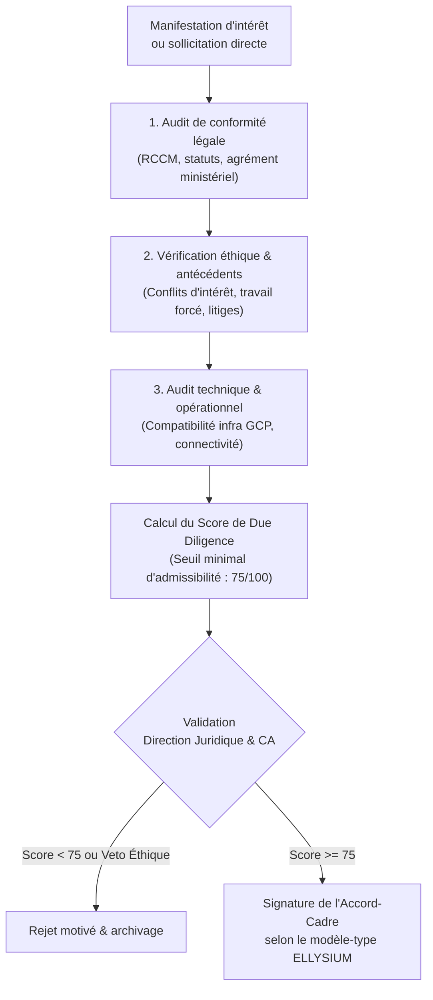
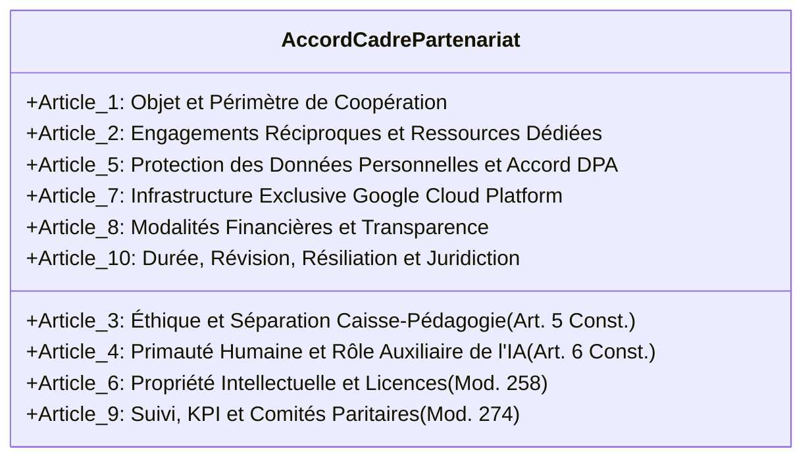

# Module 273 — Critères de sélection des partenaires et modèle d'accord-type (fusionné)

> **Positionnement :** Tome 15 — Partenariats, Accréditation et Reconnaissance Institutionnelle
> Module 11 sur 15 | Référence : ELLYSIUM-T15-M273
> **Autorité :** Direction Juridique / Direction des Partenariats
> **Liaison amont :** Module 272 — Partenariats avec les ONG éducatives et la diaspora
> **Liaison aval :** Module 274 — Suivi et évaluation des partenariats (KPI, revues)

---

## 1. Objet

Pour protéger l'intégrité de son écosystème, la réputation de ses diplômes et les données de ses utilisateurs, ELLYSIUM ne peut s'associer qu'avec des entités rigoureusement auditées et alignées sur ses valeurs éthiques. Ce module, conçu de façon **fusionnée**, unifie :
1. La **méthodologie de sélection et de notation préalable (Due Diligence)** des partenaires potentiels (académiques, industriels, techniques, associatifs).
2. Le **modèle contractuel type (Accord-Cadre de Partenariat)** intégrant les clauses constitutionnelles non négociables d'ELLYSIUM.

---

## 2. Processus d'Instruction et de Due Diligence



---

## 3. Grille de Notation Préalable (Scoring Partner)

| Pilier d'Évaluation | Critères Précis | Barème | Seuil Éliminatoire |
|---|---|---|---|
| **Légalité et Gouvernance** | Existence juridique certifiée, gouvernance transparente, immatriculation fiscale | /25 | < 18/25 |
| **Alignement Constitutionnel** | Adhésion formelle à l'accès universel, neutralité politique, pas de blocage financier | /25 | < 22/25 |
| **Capacité Opérationnelle** | Équipements, stabilité financière, ressources humaines dédiées | /25 | < 15/25 |
| **Sécurité & Protection Données** | Capacité à respecter le RGPD / Loi sur le numérique congolaise, DPA signé | /25 | < 20/25 |
| **Total Général** | **Score pondéré sur 100 points** | **/100** | **< 75/100** |

---

## 4. Modèle d'Accord-Cadre Type (Clauses Essentielles)

Tout accord de partenariat conclu par ELLYSIUM intègre obligatoirement l'ossature contractuelle suivante :



### 4.1 Clauses Constitutionnelles Inaltérables

- **Clause de Séparation Pédagogique (Art. 3 de l'Accord) :** Le Partenaire reconnaît que l'évaluation, la délivrance des notes et la diplomation relèvent de la compétence souveraine exclusive d'ELLYSIUM. Aucun manquement financier ou différend commercial ne pourra justifier l'interruption du parcours pédagogique d'un apprenant.
- **Clause d'Hébergement Souverain Google (Art. 7 de l'Accord) :** Les données, API et services applicatifs échangés doivent s'exécuter exclusivement au sein du périmètre certifié Google Cloud Platform d'ELLYSIUM.

---

## 5. Schéma de Données — Due Diligence et Registre des Accords

```sql
-- Cloud SQL PostgreSQL 16
CREATE TABLE due_diligence_partenaires (
    id UUID PRIMARY KEY DEFAULT gen_random_uuid(),
    nom_entite VARCHAR(255) NOT NULL,
    type_entite VARCHAR(50) NOT NULL,
    score_legal INTEGER CHECK (score_legal BETWEEN 0 AND 25),
    score_constitutionnel INTEGER CHECK (score_constitutionnel BETWEEN 0 AND 25),
    score_operationnel INTEGER CHECK (score_operationnel BETWEEN 0 AND 25),
    score_securite INTEGER CHECK (score_securite BETWEEN 0 AND 25),
    score_total INTEGER GENERATED ALWAYS AS (score_legal + score_constitutionnel + score_operationnel + score_securite) STORED,
    rapporteur_nom VARCHAR(150) NOT NULL,
    avis_juridique VARCHAR(30) CHECK (avis_juridique IN ('FAVORABLE', 'RESERVES', 'DEFAVORABLE')),
    statut VARCHAR(30) DEFAULT 'EN_COURS' CHECK (statut IN ('EN_COURS', 'VALIDE', 'REJETE')),
    justification_decision TEXT,
    created_at TIMESTAMPTZ DEFAULT NOW()
);

CREATE TABLE conventions_accords_cadres (
    id UUID PRIMARY KEY DEFAULT gen_random_uuid(),
    due_diligence_id UUID NOT NULL REFERENCES due_diligence_partenaires(id),
    numero_contrat VARCHAR(100) UNIQUE NOT NULL,
    partenaire_signataire VARCHAR(255) NOT NULL,
    representant_legal_partenaire VARCHAR(150) NOT NULL,
    date_signature DATE NOT NULL,
    date_expiration DATE NOT NULL,
    clauses_constitutionnelles_validees BOOLEAN NOT NULL DEFAULT FALSE,
    dpa_signe BOOLEAN NOT NULL DEFAULT FALSE,
    contrat_pdf_hash_gcs VARCHAR(255) NOT NULL,
    statut VARCHAR(30) DEFAULT 'ACTIF' CHECK (statut IN ('ACTIF', 'SUSPENDU', 'RESILIE', 'ACHEVE')),
    created_at TIMESTAMPTZ DEFAULT NOW(),
    updated_at TIMESTAMPTZ DEFAULT NOW()
);

CREATE INDEX idx_accord_numero ON conventions_accords_cadres(numero_contrat);
CREATE INDEX idx_accord_statut ON conventions_accords_cadres(statut);
```

---

## 6. Verrous Fonctionnels

| ID | Règle | Niveau |
|---|---|---|
| VF-273-01 | Tout partenaire obtenant un score inférieur à 75/100 à la Due Diligence est automatiquement disqualifié | CRITIQUE |
| VF-273-02 | Aucun contrat ne peut être signé sans validation expresse des clauses inaltérables (Séparation caisse, RGPD, Infra GCP) | CRITIQUE |
| VF-273-03 | La Direction Juridique et le Directeur Général doivent co-signer tout Accord-Cadre de Partenariat | CRITIQUE |
| VF-273-04 | L'accord DPA (Data Processing Agreement) pour la protection des données doit être annexé et paraphé obligatoirement | CRITIQUE |
| VF-273-05 | L'exemplaire officiel numérisé doit être versé dans Google Cloud Storage avec empreinte SHA-256 scellée sous 48h | OBLIGATOIRE |
| VF-273-06 | Aucun partenariat commercial ne peut modifier les règles académiques de la plateforme | CONSTITUTIONNEL |

---

*Sous-tome rédigé conformément aux Normes documentaires ELLYSIUM — Fondations 04.*
