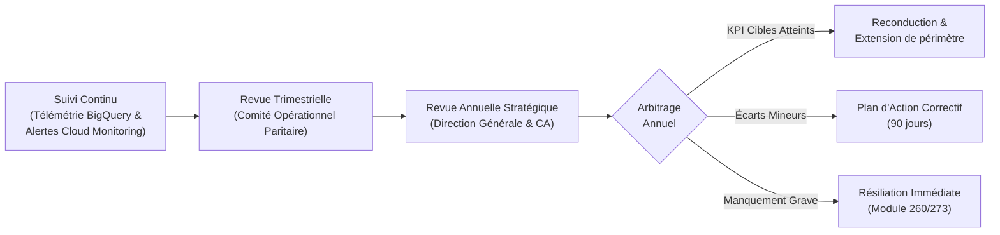
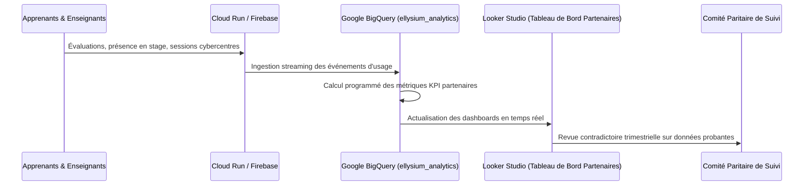
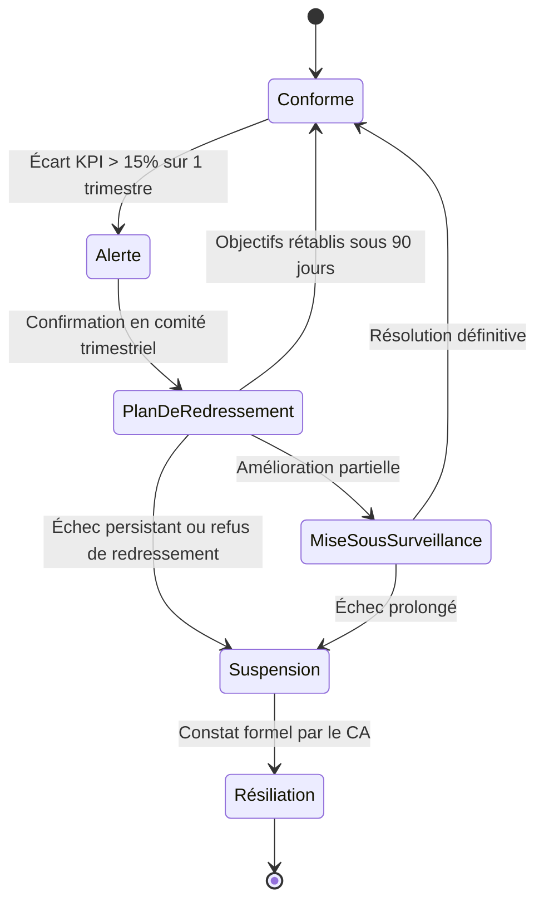

# Module 274 — Suivi et évaluation des partenariats : KPI, revues et amélioration continue

> **Positionnement :** Tome 15 — Partenariats, Accréditation et Reconnaissance Institutionnelle
> Module 12 sur 15 | Référence : ELLYSIUM-T15-M274
> **Autorité :** Direction de l'Assurance Qualité / Direction des Partenariats
> **Liaison amont :** Module 273 — Critères de sélection des partenaires et modèle d'accord-type
> **Liaison aval :** Module 275 — Processus de labellisation des établissements utilisateurs

---

## 1. Objet

La signature d'un accord-cadre ne constitue que le point de départ d'une alliance stratégique. Pour garantir que chaque partenariat apporte une valeur tangible aux apprenants et demeure en parfaite conformité avec les exigences de rigueur et d'éthique d'ELLYSIUM, un système rigoureux de **pilotage, de mesure d'impact et d'évaluation continue** est obligatoire.

Ce module définit le calendrier des revues partenariales, la matrice des indicateurs de performance (KPI), l'architecture de reporting automatisé sous Google Cloud Platform et les mécanismes d'arbitrage en cas de sous-performance ou de dérive contractuelle.

---

## 2. Cycle de Gouvernance et de Revue des Partenariats



---

## 3. Matrice des Indicateurs Clés de Performance (KPI)

Les partenariats sont évalués à travers un tableau de bord multidimensionnel pondéré :

| Dimension | Indicateur Clé | Mode de Calcul | Cible / Tolérance |
|---|---|---|---|
| **Impact Pédagogique** | Taux de réussite des apprenants affiliés | Admis / Inscrits au programme partenaire | >= 70 % |
| **Engagement & Assiduité** | Taux de présence aux sessions / stages | Heures effectives / Heures planifiées | >= 85 % |
| **Satisfaction Utilisateurs** | Net Promoter Score (NPS) apprenants | Enquêtes semestrielles post-intervention | >= +40 |
| **Conformité Constitutionnelle** | Incidents éthiques ou financiers signalés | Réclamations fondées (Art. 4, 5, 6) | 0 (Tolérance Zéro) |
| **Respect des Engagements** | Taux de réalisation des dotations/bourses | Montants décaissés / Montants contractualisés | 100 % |
| **Réactivité Opérationnelle** | Délai moyen de résolution des litiges | Jours ouvrés entre signalement et clôture | <= 5 jours |

---

## 4. Pipeline Analytique et Tableau de Bord Partenaire

Les données d'usage et d'évaluation sont centralisées sans intervention manuelle :



---

## 5. Gradation des Mesures Correctives

En cas de défaillance ou de non-atteinte récurrente des objectifs convenus :



---

## 6. Schéma SQL — Suivi des Évaluations Partenariales

```sql
-- Cloud SQL PostgreSQL 16
CREATE TABLE evaluations_partenariats (
    id UUID PRIMARY KEY DEFAULT gen_random_uuid(),
    accord_id UUID NOT NULL REFERENCES conventions_accords_cadres(id),
    periode_revue VARCHAR(20) NOT NULL, -- Ex: '2026-Q1', '2026-ANNUEL'
    date_revue DATE NOT NULL,
    score_pedagogique NUMERIC(5,2) NOT NULL,
    score_assiduite NUMERIC(5,2) NOT NULL,
    score_satisfaction_nps NUMERIC(5,2) NOT NULL,
    nb_incidents_conformite INTEGER DEFAULT 0,
    respect_engagements_pct NUMERIC(5,2) NOT NULL,
    synthese_recommandations TEXT NOT NULL,
    decision_comite VARCHAR(30) CHECK (decision_comite IN ('RECONDUCTION', 'PLAN_REDRESSEMENT', 'SUSPENSION', 'RESILIATION')),
    signataire_ellysium VARCHAR(150) NOT NULL,
    signataire_partenaire VARCHAR(150) NOT NULL,
    rapport_pdf_gcs_uri VARCHAR(255) NOT NULL,
    created_at TIMESTAMPTZ DEFAULT NOW()
);

CREATE INDEX idx_eval_accord ON evaluations_partenariats(accord_id);
CREATE INDEX idx_eval_periode ON evaluations_partenariats(periode_revue);
```

---

## 7. Verrous Fonctionnels

| ID | Règle | Niveau |
|---|---|---|
| VF-274-01 | Tout incident avéré de violation de l'Article 5 (séparation caisse/pédagogie) déclenche la suspension immédiate du partenariat sous 24h | CRITIQUE |
| VF-274-02 | Les KPI sont alimentés directement par les flux BigQuery ; aucune modification manuelle des notes ou pourcentages n'est autorisée | CRITIQUE |
| VF-274-03 | La revue annuelle conjointe est obligatoire pour toute convention tacitement reconductible | OBLIGATOIRE |
| VF-274-04 | Un partenaire sous Plan d'Action Correctif ne peut accueillir de nouveaux apprenants pendant la période probatoire de 90 jours | OBLIGATOIRE |
| VF-274-05 | Les procès-verbaux de comités paritaires et rapports d'évaluation sont archivés de façon immuable dans Google Cloud Storage | OBLIGATOIRE |
| VF-274-06 | Aucun partenariat commercial ne peut modifier les règles académiques de la plateforme | CONSTITUTIONNEL |

---

*Sous-tome rédigé conformément aux Normes documentaires ELLYSIUM — Fondations 04.*
