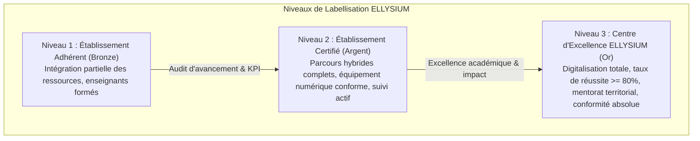
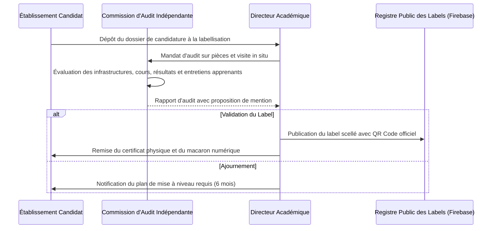

# Module 275 — Processus de labellisation des établissements utilisateurs

> **Positionnement :** Tome 15 — Partenariats, Accréditation et Reconnaissance Institutionnelle
> Module 13 sur 15 | Référence : ELLYSIUM-T15-M275
> **Autorité :** Direction de la Labellisation et des Normes Académiques / Direction Académique
> **Liaison amont :** Module 274 — Suivi et évaluation des partenariats
> **Liaison aval :** Module 276 — Feuille de route de reconnaissance à 3, 5 et 10 ans

---

## 1. Objet

Afin de valoriser les écoles secondaires, universités, instituts techniques et centres de formation professionnelle qui intègrent avec excellence les méthodes et contenus ELLYSIUM, la plateforme a institué le label officiel **« Établissement Partenaire d'Excellence ELLYSIUM »**.

Ce module formalise le référentiel de labellisation, les niveaux de certification décernés, les étapes d'audit indépendant, ainsi que le système de vérification cryptographique des labels délivrés aux établissements.

---

## 2. Niveaux et Référentiel de Labellisation

Le label est attribué selon trois échelons progressifs :



| Critère d'Évaluation | Niveau 1 (Bronze) | Niveau 2 (Argent) | Niveau 3 (Or) |
|---|---|---|---|
| **Pénétration des Curricula** | >= 25 % des cours via ELLYSIUM | >= 60 % des cours via ELLYSIUM | 100 % des filières homologuées |
| **Formation du Corps Enseignant** | >= 50 % certifiés ELLYSIUM | >= 85 % certifiés ELLYSIUM | 100 % certifiés + formateurs de pairs |
| **Équipement & Connectivité** | 1 PC pour 10 apprenants, 1 Mbps | 1 PC pour 4 apprenants, 5 Mbps | 1 PC pour 2 apprenants, fibre/VSAT + solaire |
| **Résultats Académiques** | Moyenne promo >= 55 % | Moyenne promo >= 65 % | Moyenne promo >= 75 %, réussite >= 85 % |
| **Respect de la Constitution** | Zéro manquement toléré | Zéro manquement toléré | Rôle de modèle éthique communautaire |

---

## 3. Processus d'Attribution et d'Audit



---

## 4. Vérification Publique et Sceau Cryptographique

Chaque établissement labellisé reçoit un identifiant unique et un badge numérique hébergé sur Firebase Hosting. Les familles, employeurs et autorités peuvent vérifier l'authenticité du label en temps réel :

```typescript
// ellysium/labels/verification.ts
export interface EtablissementLabel {
  etablissementId: string;
  nomOfficiel: string;
  codeNationalEPST_ESU: string;
  niveauLabel: 'BRONZE' | 'ARGENT' | 'OR';
  dateAttribution: string;
  dateExpiration: string;
  signatureDA: string;
  hashCertificatGCS: string;
  verificationUrl: string; // https://verify.ellysium.cd/label/{etablissementId}
}

export function genererUrlVerification(label: EtablissementLabel): string {
  return `https://verify.ellysium.cd/labels/${label.etablissementId}?sig=${label.signatureDA}`;
}
```

---

## 5. Schéma SQL — Gestion des Labels

```sql
-- Cloud SQL PostgreSQL 16
CREATE TABLE etablissements_labels (
    id UUID PRIMARY KEY DEFAULT gen_random_uuid(),
    etablissement_id UUID NOT NULL REFERENCES etablissements_partenaires(id),
    niveau_label VARCHAR(20) NOT NULL CHECK (niveau_label IN ('BRONZE', 'ARGENT', 'OR')),
    score_audit NUMERIC(5,2) NOT NULL,
    date_octroi DATE NOT NULL,
    date_expiration DATE NOT NULL,
    auditeur_responsable VARCHAR(150) NOT NULL,
    rapport_audit_gcs_uri VARCHAR(255) NOT NULL,
    signature_electronique_da VARCHAR(512) NOT NULL,
    statut VARCHAR(30) DEFAULT 'VALIDE' CHECK (statut IN ('VALIDE', 'SUSPENDU', 'REVOQUE', 'EXPIRE')),
    created_at TIMESTAMPTZ DEFAULT NOW(),
    updated_at TIMESTAMPTZ DEFAULT NOW()
);

CREATE INDEX idx_labels_etablissement ON etablissements_labels(etablissement_id);
CREATE INDEX idx_labels_statut ON etablissements_labels(statut);
```

---

## 6. Suspension et Retrait du Label

Le label n'est jamais acquis à titre définitif. Il fait l'objet d'une révocation immédiate dans les cas suivants :
- Exclusion ou brimade d'un apprenant pour des raisons financières (Article 5 Constitutionnel).
- Fraude avérée lors des examens certifiants ou manipulation des notes.
- Dégradation critique du matériel ou abandon des cursus numériques constatés lors de l'inspection annuelle.

---

## 7. Verrous Fonctionnels

| ID | Règle | Niveau |
|---|---|---|
| VF-275-01 | Le label ELLYSIUM est octroyé pour une durée maximale de 2 ans, renouvelable exclusivement après audit in situ complet | CRITIQUE |
| VF-275-02 | Tout établissement labellisé coupable d'avoir bloqué un apprenant pour non-paiement de frais locaux perd son label sous 48h | CRITIQUE |
| VF-275-03 | L'audit de labellisation doit comporter l'avis confidentiel d'un panel d'au moins 20 apprenants tirés au sort | OBLIGATOIRE |
| VF-275-04 | Les certificats de labellisation sont scellés cryptographiquement et vérifiables publiquement sur Firebase Hosting | OBLIGATOIRE |
| VF-275-05 | Aucun membre de l'équipe d'audit ne peut avoir d'intérêt financier ou de lien familial avec la direction de l'établissement audité | CRITIQUE |

---

*Sous-tome rédigé conformément aux Normes documentaires ELLYSIUM — Fondations 04.*
