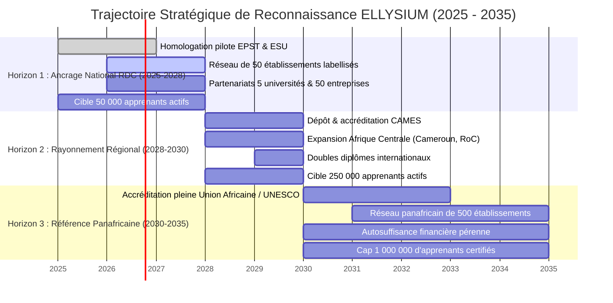
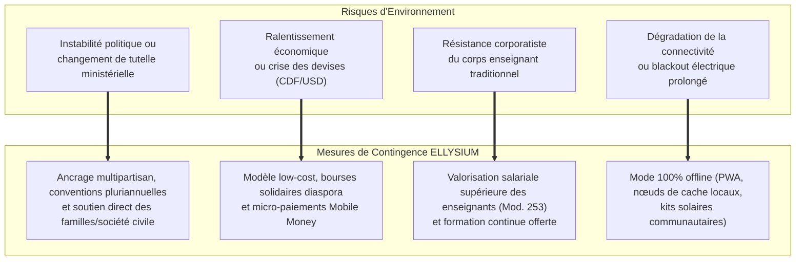

# Module 276 — Feuille de route de reconnaissance à 3, 5 et 10 ans

> **Positionnement :** Tome 15 — Partenariats, Accréditation et Reconnaissance Institutionnelle
> Module 14 sur 15 | Référence : ELLYSIUM-T15-M276
> **Autorité :** Conseil d'Administration / Direction Générale
> **Liaison amont :** Module 275 — Processus de labellisation des établissements utilisateurs
> **Liaison aval :** Module 277 — Dépendances du Tome 15

---

## 1. Objet

La conquête de la légitimité académique, de l'autorité morale et de la souveraineté éducative ne s'improvise pas : elle exige une trajectoire pluriannuelle rigoureuse, articulée autour de jalons mesurables et d'échéances réalistes. Ce module projette la vision stratégique d'ELLYSIUM sur trois horizons temporels (3, 5 et 10 ans), définissant les cibles d'homologation, d'expansion territoriale, de diplomation et de reconnaissance par les instances nationales, régionales et internationales.

---

## 2. Vue Synoptique des Trois Horizons Stratégiques

---

## 3. Matrice d'Évolution des Indicateurs Stratégiques

| Métrique Clé | Horizon 1 (3 ans : 2028) | Horizon 2 (5 ans : 2030) | Horizon 3 (10 ans : 2035) |
|---|---|---|---|
| **Apprenants Actifs Réguliers** | 50 000 | 250 000 | 1 000 000+ |
| **Part d'Apprenants Gratuits (AIS/AIU)** | >= 60 % | >= 50 % | >= 50 % (pérennisée) |
| **Établissements Labellisés** | 50 (RDC) | 150 (RDC + CEMAC) | 500+ (Panafricain) |
| **Universités Partenaires** | 5 nationales | 15 régionales | 40+ internationales |
| **Accréditation Officielle** | Agréments EPST & ESU | Label CAMES | Label Union Africaine / UNESCO |
| **Insertion Professionnelle (6 mois)** | >= 65 % | >= 75 % | >= 85 % |
| **Couverture Territoriale** | 10 provinces RDC | 26 provinces RDC + 4 pays | 15 pays africains |
| **Infrastructure Cloud** | GCP mono-région (europe-west1) | GCP multi-région + Edge PoP Afrique | GCP souverain + Cloud CDN Panafricain |

---

## 4. Analyse et Gestion des Risques Stratégiques

---

## 5. Jalons de Contrôle du Conseil d'Administration

Le franchissement d'un horizon vers le suivant est subordonné à un vote solennel du Conseil d'Administration sur la base d'un rapport de conformité indépendant :

1. **Jalon 2028 (Revue Horizon 1) :** Évaluation de la robustesse des diplômes et audits financiers Cloud SQL / BigQuery. Aucune expansion sous-régionale sans stabilité nationale avérée.
2. **Jalon 2030 (Revue Horizon 2) :** Audit de conformité aux standards CAMES et certification ISO 21001.
3. **Jalon 2035 (Revue Horizon 3) :** Bilan décennal d'impact sociétal et pérennité du modèle constitutionnel.

---

## 6. Verrous Fonctionnels

| ID | Règle | Niveau |
|---|---|---|
| VF-276-01 | L'expansion internationale ne peut être entreprise avant la stabilisation de l'ancrage national dans au moins 10 provinces congolaises | CRITIQUE |
| VF-276-02 | Quelle que soit la taille atteinte, le quota d'accès gratuit pour les apprenants vulnérables (AIS/AIU) ne peut descendre sous 50 % | CRITIQUE |
| VF-276-03 | La feuille de route stratégique fait l'objet d'un réalignement formel annuel au sein du Conseil d'Administration | OBLIGATOIRE |
| VF-276-04 | Aucun jalon d'expansion ne peut être validé si le SLA technique GCP descend en deçà de 99,5 % sur l'exercice écoulé | CRITIQUE |
| VF-276-05 | Les rapports décennaux d'impact éducatif et sociétal sont publiés en libre accès (Creative Commons) pour la recherche académique | OBLIGATOIRE |
| VF-276-06 | Aucun partenariat commercial ne peut modifier les règles académiques de la plateforme | CONSTITUTIONNEL |

---

*Sous-tome rédigé conformément aux Normes documentaires ELLYSIUM — Fondations 04.*
