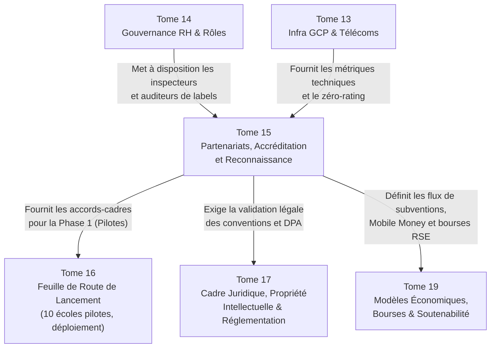

# Module 277 — Dépendances du Tome 15 avec les Tomes 16, 17 et 19

> **Positionnement :** Tome 15 — Partenariats, Accréditation et Reconnaissance Institutionnelle
> Module 15 sur 15 | Référence : ELLYSIUM-T15-M277
> **Autorité :** Direction générale ELLYSIUM
> **Liaison amont :** Module 276 — Feuille de route de reconnaissance à 3, 5 et 10 ans
> **Liaison aval :** Tome 16 — Feuille de Route de Lancement et Conduite du Changement (M278)

---

## 1. Objet

Ce module clôture solennellement le **Tome 15** d'ELLYSIUM en remplissant une double fonction :
1. **Cartographier les dépendances critiques** entre la stratégie partenariale et institutionnelle (Tome 15) et les tomes d'exécution opérationnelle, à savoir le **Tome 16** (Feuille de Route de Lancement et Déploiement Pilote), le **Tome 17** (Cadre Légal, Réglementaire et Éthique Approfondi) et le **Tome 19** (Viabilité Financière, Modèles Économiques et Soutenabilité).
2. **Certifier la complétude intégrale** des 15 modules constituant le Tome 15.

---

## 2. Matrice Synoptique des Interdépendances

---

## 3. Analyse Détaillée des Dépendances Fonctionnelles

### 3.1 Dépendances avec le Tome 16 (Lancement et Pilotes)

- **Sélection des 10 établissements pilotes (M282) :** Le déploiement de la Phase 1 du Tome 16 utilise directement les critères de sélection et de Due Diligence formalisés au **Module 273** et la typologie des établissements du **Module 252**.
- **Accords télécoms préalables au lancement (M270) :** Aucune rentrée académique pilote ne peut être ordonnée sans que les tests de zéro-rating et de passerelle Mobile Money ne soient certifiés avec au moins deux opérateurs majeurs (Vodacom/Airtel/Orange).

### 3.2 Dépendances avec le Tome 17 (Conformité Légale & Réglementation)

- **DPA et transfert de données (M264 / M273) :** Les conventions de double diplôme (M268) et de placement en entreprise (M269) s'appuient strictement sur le cadre de conformité aux lois congolaises et au RGPD détaillé dans le Tome 17.
- **Accréditations ministérielles (M265 / M266) :** Le montage des dossiers juridiques d'homologation EPST et d'agrément ESU s'effectue sous le patronage direct des protocoles du Tome 17.

### 3.3 Dépendances avec le Tome 19 (Modèle Économique & Viabilité)

- **Modélisation des bourses et subventions (M272) :** Les budgets alloués par les ONG et la diaspora sont modélisés dans le plan de trésorerie du Tome 19, avec étanchéité caisse/pédagogie (Article 5 Constitutionnel).
- **Équilibre des coûts de zéro-rating (M270) :** La dépense liée au reverse-billing data est inscrite dans les charges d'exploitation prévisionnelles de T19.

---

## 4. Tableau Récapitulatif de Complétude — Tome 15

| N° | Titre du Module | Statut |
|---|---|---|
| 263 | Périmètre du Tome 15 – stratégie de reconnaissance progressive | ✅ COMPLET |
| 264 | Conformité avec la Constitution (ancrage local, exigence de qualité) | ✅ COMPLET |
| 265 | Relations avec le Ministère de l'EPST (secondaire) | ✅ COMPLET |
| 266 | Relations avec le Ministère de l'ESU (supérieur) | ✅ COMPLET |
| 267 | Relations avec le CAMES et les organismes d'assurance qualité | ✅ COMPLET |
| 268 | Partenariats avec des universités accréditées – doubles diplômes, reconnaissance de crédits | ✅ COMPLET |
| 269 | Partenariats avec les entreprises – stages, alternance, employabilité | ✅ COMPLET |
| 270 | Partenariats techniques – fournisseurs cloud, IA, opérateurs télécoms (Mobile Money, zéro-rating) | ✅ COMPLET |
| 271 | Partenariats d'accès physique – cybercentres, bibliothèques, antennes communautaires | ✅ COMPLET |
| 272 | Partenariats avec les ONG éducatives et la diaspora | ✅ COMPLET |
| 273 | Critères de sélection des partenaires et modèle d'accord type (fusionné) | ✅ COMPLET |
| 274 | Suivi et évaluation des partenariats (KPI, revues) | ✅ COMPLET |
| 275 | Processus de labellisation des établissements utilisateurs | ✅ COMPLET |
| 276 | Feuille de route de reconnaissance à 3, 5 et 10 ans | ✅ COMPLET |
| 277 | Dépendances – avec les Tomes 17, 19, 16 | ✅ COMPLET |

---

## 5. Prochaine Étape : Franchissement vers le Tome 16

Le Tome 15 étant intégralement achevé (15 modules sur 15), la documentation se poursuit naturellement avec :

> **TOME 16 — FEUILLE DE ROUTE DE LANCEMENT ET CONDUITE DU CHANGEMENT**
> Modules 278 à 288 (11 modules)
> Objectif : Transformer l'infrastructure doctrinale et technique ELLYSIUM en réalité opérationnelle sur le terrain (Phases 0, 1, 2 et 3, comités de pilotage, programme des ambassadeurs et conduite du changement).

---

## 6. Verrous Fonctionnels

| ID | Règle | Niveau |
|---|---|---|
| VF-277-01 | La mise en œuvre de la Phase 1 du Tome 16 ne peut démarrer sans la signature préalable d'au moins 10 conventions partenaires conformes au Tome 15 | CRITIQUE |
| VF-277-02 | Tout accord partenarial prévoyant des flux financiers doit être validé par la Direction Financière dans le cadre budgétaire du Tome 19 | CRITIQUE |
| VF-277-03 | Les dépendances croisées entre les Tomes 15, 16, 17 et 19 sont réévaluées à chaque jalon stratégique annuel par le Conseil d'Administration | OBLIGATOIRE |
| VF-277-04 | Aucune relation partenariale ne peut déroger aux exigences de sécurité et de conformité légale édictées dans le Tome 17 | CRITIQUE |
| VF-277-05 | L'intégrité de la cartographie des dépendances est préservée par un scellement documentaire immuable sous Google Cloud Storage | OBLIGATOIRE |

---

*Tome 15 — Partenariats, Accréditation et Reconnaissance Institutionnelle — COMPLET ✅ (15 modules, M263–M277)*

*Sous-tome rédigé conformément aux Normes documentaires ELLYSIUM — Fondations 04.*
