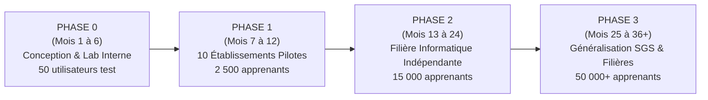
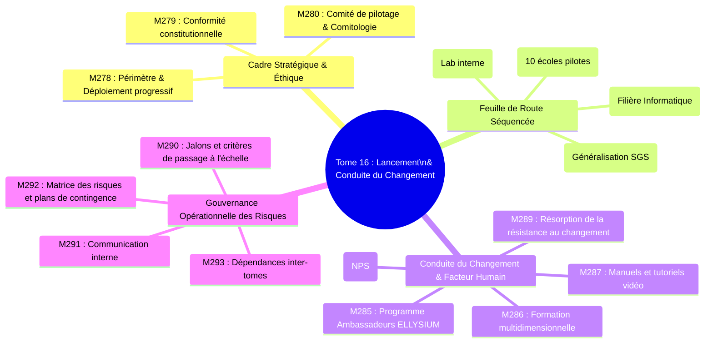
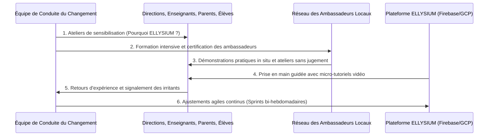

# Module 278 — Périmètre du Tome 16 : stratégie de déploiement progressif

> **Positionnement :** Tome 16 — Feuille de Route de Lancement et Conduite du Changement
> Module 1 sur 16 | Référence : ELLYSIUM-T16-M278
> **Autorité :** Comité de Pilotage / Direction Générale
> **Liaison amont :** Tome 15 complet (M263–M277)
> **Liaison aval :** Module 279 — Conformité constitutionnelle du déploiement

---

## 1. Objet

Un système éducatif numérique, aussi sophistiqué soit-il sur le plan technologique et doctrinal, est voué à l'échec s'il est imposé brutalement sans une stratégie d'appropriation humaine et une conduite du changement méticuleuse. Le **Tome 16** constitue le plan de bataille opérationnel qui transforme l'ensemble des spécifications des Tomes 1 à 15 en une institution vivante, utilisée quotidiennement par des dizaines de milliers d'apprenants, d'enseignants et d'administrateurs en République Démocratique du Congo.

Ce module d'ouverture délimite le périmètre du Tome 16, pose la philosophie du **déploiement itératif et progressif en 4 phases (Phases 0 à 3)** et explicite la méthodologie d'accompagnement humain au changement.

---

## 2. Philosophie du Déploiement Progressif

ELLYSIUM refuse catégoriquement l'approche « Big Bang » (déploiement massif simultané sans tests préalables). L'expansion suit une courbe d'apprentissage rigoureusement cadencée :

| Phase | Échéance | Objectif Principal | Périmètre Territorial | Seuil de Validation |
|---|---|---|---|---|
| **Phase 0** | M1 à M6 | Validation en environnement contrôlé (Laboratoire GCP) | Kinshasa (siège) | 0 bug critique P1, SLA 99,9% |
| **Phase 1** | M7 à M12 | Éprouver le modèle hybride dans 10 écoles partenaires | Kinshasa, Lubumbashi, Goma | Taux de rétention >= 75 % |
| **Phase 2** | M13 à M24 | Valider la première filière certifiante complète autonome | 5 provinces | Taux d'insertion/stage >= 65 % |
| **Phase 3** | M25+ | Extension industrielle et intégration nationale SGS | 26 provinces | Adoption institutionnelle pérenne |

---

## 3. Périmètre et Architecture des Modules du Tome 16

Le Tome 16 structure l'action collective à travers quatre sous-ensembles cohérents :

---

## 4. Méthodologie d'Accompagnement du Changement

Pour contrer la fracture numérique et l'inertie des habitudes scolaires traditionnelles, ELLYSIUM adapte le modèle **ADKAR (Conscience, Désir, Connaissance, Aptitude, Renforcement)** aux réalités africaines :

---

## 5. Verrous Fonctionnels

| ID | Règle | Niveau |
|---|---|---|
| VF-278-01 | Le passage d'une phase de déploiement à la suivante exige un vote formel du Comité de Pilotage sur critères quantifiés | CRITIQUE |
| VF-278-02 | Aucun établissement pilote ne peut être ouvert sans la désignation et la certification préalable de 2 Ambassadeurs ELLYSIUM | CRITIQUE |
| VF-278-03 | L'infrastructure technique supportant les déploiements successifs demeure 100% hébergée sur Google Cloud Platform | CRITIQUE |
| VF-278-04 | La durée minimale de la Phase 1 pilote est fixée à 6 mois scolaires pleins avant toute décision de généralisation | OBLIGATOIRE |
| VF-278-05 | Les manuels utilisateurs et capsules vidéo doivent être disponibles en mode déconnecté dans tous les terminaux pilotes | OBLIGATOIRE |

---

*Sous-tome rédigé conformément aux Normes documentaires ELLYSIUM — Fondations 04.*
