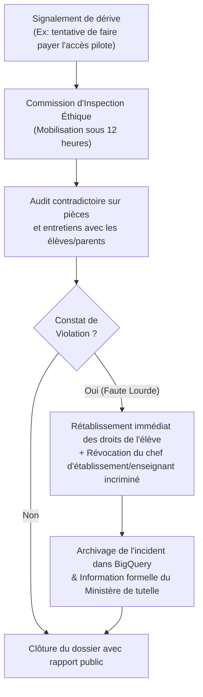

# Module 279 — Conformité avec la Constitution : déploiement éthique et inclusion territoriale

> **Positionnement :** Tome 16 — Feuille de Route de Lancement et Conduite du Changement
> Module 2 sur 16 | Référence : ELLYSIUM-T16-M279
> **Autorité :** Comité d'Éthique et de Conformité / Direction Générale
> **Liaison amont :** Module 278 — Périmètre du Tome 16
> **Liaison aval :** Module 280 — Comité de pilotage (composition, rythme des revues)

---

## 1. Objet

L'excitation opérationnelle du déploiement et la tentation d'une mise à l'échelle accélérée ne doivent en aucun cas diluer les principes fondateurs inaltérables de la **Constitution ELLYSIUM**. Lors des phases pilotes et de passage à l'échelle, les risques de dérive sont réels : privilégier les grands centres urbains au détriment des provinces, exclure insidieusement les apprenants les plus démunis, ou automatiser les décisions académiques sans supervision humaine.

Ce module verrouille le déploiement opérationnel dans le strict respect du pacte constitutionnel, formalise les quotas d'inclusion territoriale et sociale dès la Phase 1 et définit les garde-fous éthiques opposables à tous les acteurs du déploiement.

---

## 2. Déclinaison des Articles Constitutionnels dans le Déploiement

```mermaid
mindmap
  root((Conformité Déploiement\nConstitution ELLYSIUM))
    Article 1 & 4 : Inclusion Sociale
      Accès garanti pour les AIS/AIU dès la Phase 0
      Interdiction de restreindre les pilotes aux seules élites
      Mixité de genre obligatoire (>= 45% filles/femmes)
    Article 5 : Étanchéité Caisse / Pédagogie
      Zéro encaissement par les équipes pédagogiques
      Accès aux cours maintenu quelle que soit la situation financière
      Sanctions immédiates contre les dérives en milieu scolaire
    Article 6 : Primauté Humaine sur l'IA
      Les algorithmes Vertex AI ne décident d'aucun redoublement
      Validation humaine systématique des évaluations
      Droit de contestation de l'apprenant garanti
    Formule Officielle RDC
      Taux = (Total Points / Total Maxima) * 100
      Prohibition de la moyenne arithmétique simple
```

---

## 3. Quotas d'Inclusion Obligatoires en Phase Pilote

Pour éviter le piège classique d'un produit « testé uniquement dans les meilleures conditions », la sélection des établissements et apprenants pilotes obéit à des quotas constitutionnels stricts :

| Dimension d'Inclusion | Seuil Obligatoire (Phase 1) | Justification Constitutionnelle |
|---|---|---|
| **Typologie des Établissements** | 40 % écoles publiques / conventionnées<br>30 % instituts techniques / professionnels<br>30 % écoles privées d'excellence | Représentativité fidèle du tissu éducatif national |
| **Périmètre Géographique** | Au moins 3 provinces distinctes (Kinshasa, Haut-Katanga, Nord-Kivu) | Éprouver la variabilité de la connectivité et des infrastructures |
| **Parité de Genre** | Minimum 45 % d'apprenantes inscrites | Égalité d'accès aux filières scientifiques et informatiques |
| **Apprenants Indépendants (AIS/AIU)** | Au moins 20 % des effectifs de la cohorte pilote | Vérifier la viabilité de l'auto-apprentissage sans encadrement scolaire lourd |
| **Zones à Connectivité Dégradée** | Au moins 3 établissements fonctionnant à 80% en mode hors-ligne | Valider la résilience du Service Worker et des caches locaux |

---

## 4. Garde-Fous Anti-Dérives Opérationnelles



---

## 5. Schéma SQL — Registre des Audits de Conformité Déploiement

```sql
-- Cloud SQL PostgreSQL 16
CREATE TABLE audits_conformite_deploiement (
    id UUID PRIMARY KEY DEFAULT gen_random_uuid(),
    etablissement_id UUID NOT NULL REFERENCES etablissements_partenaires(id),
    phase_deploiement VARCHAR(20) NOT NULL CHECK (phase_deploiement IN ('PHASE_0', 'PHASE_1', 'PHASE_2', 'PHASE_3')),
    date_inspection DATE NOT NULL,
    auditeur_identifiant VARCHAR(150) NOT NULL,
    respect_quota_genre BOOLEAN NOT NULL DEFAULT FALSE,
    pct_filles_inscrites NUMERIC(5,2) NOT NULL,
    respect_etancheite_caisse BOOLEAN NOT NULL DEFAULT TRUE,
    nb_incidents_financiers_releves INTEGER DEFAULT 0,
    respect_formule_rdc BOOLEAN NOT NULL DEFAULT TRUE,
    mode_offline_operationnel BOOLEAN NOT NULL DEFAULT TRUE,
    avis_global VARCHAR(30) CHECK (avis_global IN ('CONFORME', 'RESERVES_MINEURES', 'NON_CONFORME_CRITIQUE')),
    rapport_audit_hash_gcs VARCHAR(255) NOT NULL,
    created_at TIMESTAMPTZ DEFAULT NOW()
);

CREATE INDEX idx_audit_etab ON audits_conformite_deploiement(etablissement_id);
CREATE INDEX idx_audit_phase ON audits_conformite_deploiement(phase_deploiement);
```

---

## 6. Verrous Fonctionnels

| ID | Règle | Niveau |
|---|---|---|
| VF-279-01 | La cohorte d'établissements de la Phase 1 doit impérativement comporter au moins 40 % d'établissements publics ou périurbains défavorisés | CRITIQUE |
| VF-279-02 | Aucun apprenant ne peut être exclu d'une phase pilote pour motif financier ; tout constat d'exclusion entraîne la disqualification de l'établissement | CRITIQUE |
| VF-279-03 | Le calcul des délibérations et bulletins scolaires pilotes doit exécuter exclusivement la Formule Constitutionnelle RDC non modifiée | CRITIQUE |
| VF-279-04 | L'audit de parité de genre (>= 45 % de filles) est un prérequis obligatoire pour valider la fin de la Phase 1 | OBLIGATOIRE |
| VF-279-05 | Les rapports de conformité constitutionnelle sont versés de manière inaltérable dans Google Cloud Storage avant chaque passage de phase | OBLIGATOIRE |
| VF-279-06 | Chaque jalon est validé par un vote formel du COPIL avant passage à l'étape suivante | OBLIGATOIRE |

---

*Sous-tome rédigé conformément aux Normes documentaires ELLYSIUM — Fondations 04.*
