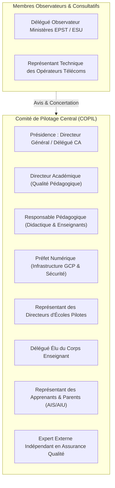
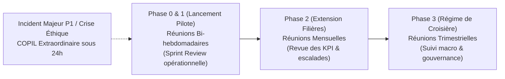
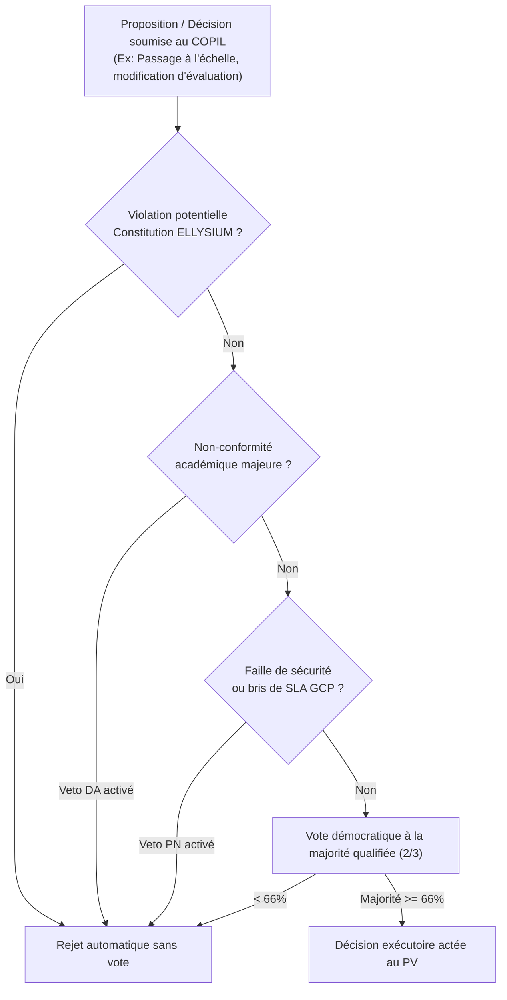

# Module 280 — Comité de pilotage : composition, rythme des revues et comitologie

> **Positionnement :** Tome 16 — Feuille de Route de Lancement et Conduite du Changement
> Module 3 sur 16 | Référence : ELLYSIUM-T16-M280
> **Autorité :** Conseil d'Administration / Direction Générale
> **Liaison amont :** Module 279 — Conformité constitutionnelle du déploiement
> **Liaison aval :** Module 281 — Phase 0 : conception et tests en laboratoire

---

## 1. Objet

Le **Comité de Pilotage (COPIL)** constitue l'organe souverain de gouvernance opérationnelle et tactique durant toutes les phases de déploiement et de transition d'ELLYSIUM. Il a pour mandat de coordonner les dimensions pédagogiques, technologiques, logistiques et humaines du lancement, de veiller au respect des jalons temporels, d'arbitrer les arbitrages critiques et de prononcer officiellement le passage d'une phase à la suivante.

Ce module fixe la composition paritaire du COPIL, ses instances satellites, le calendrier rigoureux de ses réunions et les protocoles décisionnels garantissant transparence et traçabilité.

---

## 2. Composition et Équilibre du Comité de Pilotage

Le COPIL rassemble l'ensemble des parties prenantes internes et externes sous une structure délibérative paritaire :



| Rôle au COPIL | Titulaire / Origine | Voix Délibérative | Responsabilité Spécifique |
|---|---|---|---|
| **Président** | Directeur Général d'ELLYSIUM | Oui (Prépondérante en cas d'égalité) | Arbitrage stratégique global et allocation des ressources |
| **Garant Académique** | Directeur Académique (DA) | Oui | Conformité des curricula et rigueur des examens |
| **Garant Didactique** | Responsable Pédagogique (RP) | Oui | Rythme des cours et accompagnement des formateurs |
| **Garant Numérique** | Préfet Numérique (PN) | Oui | Disponibilité SLA GCP, sécurité et réseau |
| **Voix du Terrain Scolaire** | Représentant des Directeurs Partenaires (DEP) | Oui | Faisabilité logistique locale et contraintes physiques |
| **Voix Enseignante** | Délégué élu des enseignants | Oui | Charge de travail et adéquation des outils |
| **Voix Bénéficiaire** | Représentant désigné des Apprenants/Parents | Oui | Accessibilité, inclusion et équité tarifaire |
| **Contrôle Indépendant** | Auditeur Qualité Externe | Oui | Respect des protocoles et conformité aux normes |
| **Observateurs Tutelle** | Délégués EPST & ESU | Consultative | Alignement avec les réformes nationales |

---

## 3. Rythme des Revues et Calendrier de Comitologie

Le COPIL adapte sa fréquence selon l'intensité des phases de déploiement :



### 3.1 Ordre du Jour Standardisé d'une Session Ordinaire
1. **Contrôle des Présences et Quorum (>= 6/8 votants).**
2. **Revue des KPI de la période :** Données en direct BigQuery / Looker Studio.
3. **Point Technique & SLA :** Disponibilité GCP, métriques de synchronisation hors-ligne.
4. **Point Pédagogique :** Taux de progression des cours, alertes de décrochage.
5. **Rapport d'Inclusion & Éthique :** Respect de l'étanchéité caisse/pédagogie (Article 5).
6. **Arbitrage des demandes de changement (RFC - Request For Change).**
7. **Adoption du Procès-Verbal et fixation des plans d'action.**

---

## 4. Matrice Décisionnelle et Droit de Veto Constitutionnel



---

## 5. Schéma SQL — Registre des Délibérations du COPIL

```sql
-- Cloud SQL PostgreSQL 16
CREATE TABLE copil_sessions (
    id UUID PRIMARY KEY DEFAULT gen_random_uuid(),
    numero_session INTEGER NOT NULL,
    type_session VARCHAR(30) NOT NULL CHECK (type_session IN ('ORDINAIRE_BIHEBDO', 'ORDINAIRE_MENSUEL', 'EXTRAORDINAIRE_CRISE')),
    date_tenue TIMESTAMPTZ NOT NULL,
    quorum_atteint BOOLEAN NOT NULL DEFAULT FALSE,
    nb_votants_presents INTEGER NOT NULL,
    synthese_discussions TEXT NOT NULL,
    phase_concernee VARCHAR(20) NOT NULL CHECK (phase_concernee IN ('PHASE_0', 'PHASE_1', 'PHASE_2', 'PHASE_3')),
    pv_scelle_hash_gcs VARCHAR(255) NOT NULL,
    created_at TIMESTAMPTZ DEFAULT NOW()
);

CREATE TABLE copil_decisions (
    id UUID PRIMARY KEY DEFAULT gen_random_uuid(),
    session_id UUID NOT NULL REFERENCES copil_sessions(id),
    intitule_decision VARCHAR(255) NOT NULL,
    votes_pour INTEGER NOT NULL,
    votes_contre INTEGER NOT NULL,
    abstentions INTEGER NOT NULL,
    veto_exerce VARCHAR(50), -- Ex: 'VETO_ETHIQUE', 'VETO_DA', 'VETO_PN' ou NULL
    statut_decision VARCHAR(30) CHECK (statut_decision IN ('ADOPTEE', 'REJETEE', 'AJOURNEE')),
    responsable_execution VARCHAR(150) NOT NULL,
    date_echeance DATE NOT NULL,
    created_at TIMESTAMPTZ DEFAULT NOW()
);

CREATE INDEX idx_copil_date ON copil_sessions(date_tenue);
CREATE INDEX idx_decision_statut ON copil_decisions(statut_decision);
```

---

## 6. Verrous Fonctionnels

| ID | Règle | Niveau |
|---|---|---|
| VF-280-01 | Aucune délibération du COPIL n'est valide si le quorum de 6 membres votants sur 8 n'est pas atteint | CRITIQUE |
| VF-280-02 | Le DA et le PN disposent chacun d'un droit de veto bloquant respectivement sur les questions pédagogiques et de sécurité GCP | CRITIQUE |
| VF-280-03 | Tout membre constatant une violation des Articles 4, 5 ou 6 de la Constitution peut invoquer un arrêt d'urgence suspensif de séance | CRITIQUE |
| VF-280-04 | Les procès-verbaux complets et relevés de décisions doivent être publiés et scellés sous Cloud Storage sous 48h | OBLIGATOIRE |
| VF-280-05 | Les représentants des apprenants et des enseignants bénéficient d'une voix délibérative entière sans restriction d'accès aux débats | OBLIGATOIRE |

---

*Sous-tome rédigé conformément aux Normes documentaires ELLYSIUM — Fondations 04.*
