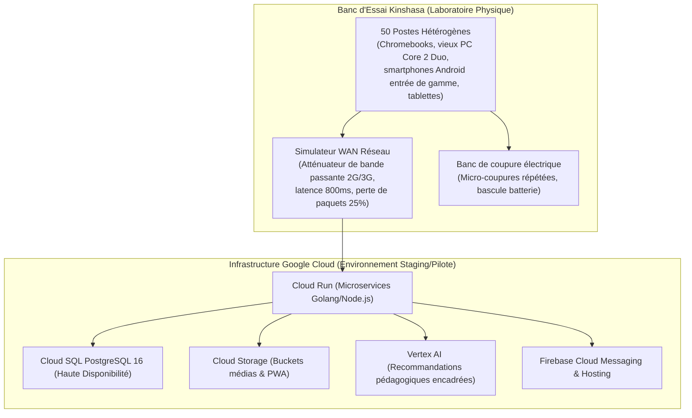
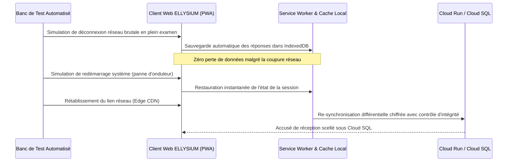
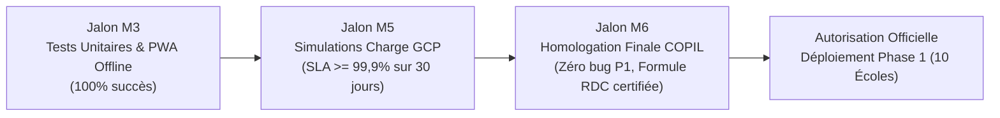

# Module 281 — Phase 0 : conception, tests en laboratoire et pilote interne

> **Positionnement :** Tome 16 — Feuille de Route de Lancement et Conduite du Changement
> Module 4 sur 16 | Référence : ELLYSIUM-T16-M281
> **Autorité :** Préfet Numérique / Directeur Académique
> **Liaison amont :** Module 280 — Comité de pilotage : composition et rythme des revues
> **Liaison aval :** Module 282 — Phase 1 : sélection et déploiement dans 10 établissements pilotes

---

## 1. Objet

Avant toute exposition à des apprenants réels au sein d'écoles partenaires, la plateforme ELLYSIUM doit franchir l'épreuve impérative de la **Phase 0 (Conception, Tests en Laboratoire et Pilote Interne)**. Cette phase préparatoire de six mois a pour objectif de valider l'intégralité de la chaîne logicielle, didactique et matérielle dans un environnement contrôlé, d'éprouver la résistance de l'infrastructure Google Cloud Platform face à des scénarios de crise et de certifier l'exactitude des algorithmes d'évaluation.

Ce module fixe les protocoles d'essai en laboratoire, la composition de la cohorte d'utilisateurs testeurs internes et les critères stricts d'autorisation de sortie vers la Phase 1.

---

## 2. Environnement de Laboratoire et Banc d'Essai

Les essais de Phase 0 sont exécutés depuis le **Laboratoire Central ELLYSIUM à Kinshasa**, adossé à un banc de test simulant les conditions d'infrastructure les plus dégradées du territoire congolais :



---

## 3. Cohorte Testeur et Programme d'Épreuves Internes

La cohorte de test de la Phase 0 rassemble 50 profils rigoureusement sélectionnés :

| Groupe d'Utilisateurs | Effectif | Mission de Test Spécifique |
|---|---|---|
| **Élèves Témoins (Kinshasa)** | 25 apprenants (12 filles, 13 garçons) | Ergonomie, clarté des consignes, temps d'attention, fluidité sur mobile |
| **Enseignants Concepteurs** | 15 professeurs de secondaire/supérieur | Saisie des cours, conception de quiz, notation, vérification didactique |
| **Ingénieurs QA & Sécurité** | 10 développeurs & auditeurs GCP | Injection de pannes, chaos engineering, sécurité des API, audit IAM |

---

## 4. Campagne de Tests Techniques Approfondis



### 4.1 Épreuves de Certification Obligatoires en Phase 0

1. **Test de la Formule Constitutionnelle RDC :** Simulation de 100 000 combinaisons de notes scolaires pour vérifier que l'équation `Taux = (ΣPointsObtenus / ΣMaxima) × 100` ne produit aucune dérive d'arrondi ou erreur de division par zéro.
2. **Chaos Engineering GCP :** Extinction forcée d'une zone Cloud Run et bascule automatique de réplica Cloud SQL sous charge simulée (1 000 requêtes/seconde concurrentes).
3. **Audit d'Étanchéité Caisse/Pédagogie :** Tentative de corrélation logicielle entre les tables financières et les tables de délibération académique pour prouver leur indépendance absolue.
4. **Validation du Mode Hors-Ligne :** Consultation de 10 modules complets et passation de 5 évaluations en mode avion 100% déconnecté.

---

## 5. Schéma SQL — Journal des Campagnes de Test Phase 0

```sql
-- Cloud SQL PostgreSQL 16
CREATE TABLE phase0_test_runs (
    id UUID PRIMARY KEY DEFAULT gen_random_uuid(),
    nom_suite_test VARCHAR(150) NOT NULL,
    domaine VARCHAR(50) CHECK (domaine IN ('PEDAGOGIE', 'OFFLINE_PWA', 'SCALABILITE_GCP', 'SECURITE_IAM', 'FORMULE_RDC')),
    nb_cas_test_executes INTEGER NOT NULL,
    nb_succes INTEGER NOT NULL,
    nb_echecs INTEGER NOT NULL,
    temps_moyen_reponse_ms INTEGER NOT NULL,
    sla_observe_pct NUMERIC(5,3) NOT NULL,
    bugs_bloquants_p1 INTEGER DEFAULT 0,
    bugs_majeurs_p2 INTEGER DEFAULT 0,
    validateur_identifiant VARCHAR(150) NOT NULL,
    statut_suite VARCHAR(30) CHECK (statut_suite IN ('EN_COURS', 'SUCCES_HOMOLOGUE', 'ECHEC_REVISION')),
    rapport_test_gcs_uri VARCHAR(255) NOT NULL,
    date_execution TIMESTAMPTZ DEFAULT NOW()
);

CREATE INDEX idx_phase0_domaine ON phase0_test_runs(domaine);
CREATE INDEX idx_phase0_statut ON phase0_test_runs(statut_suite);
```

---

## 6. Jalons Datés et Critères de Sortie de la Phase 0

Pour obtenir l'autorisation de passage en Phase 1 (Module 282), la plateforme doit afficher un tableau de bord vierge de tout écueil critique :



---

## 7. Verrous Fonctionnels

| ID | Règle | Niveau |
|---|---|---|
| VF-281-01 | La sortie de la Phase 0 est strictement conditionnée à un nombre absolu de zéro bug bloquant (P1) non résolu | CRITIQUE |
| VF-281-02 | L'algorithme de calcul du bulletin selon la Formule RDC doit obtenir 100 % de conformité sur le jeu de 100 000 tests | CRITIQUE |
| VF-281-03 | La synchronisation asynchrone hors-ligne ne doit tolérer aucune perte de données lors d'une rupture inopinée de session | CRITIQUE |
| VF-281-04 | L'infrastructure GCP doit maintenir un SLA d'au moins 99,9 % sans interruption de service pendant 30 jours continus de test | CRITIQUE |
| VF-281-05 | Le procès-verbal d'homologation de la Phase 0 doit être co-signé à l'unanimité par le DA, le RP et le PN | CRITIQUE |
| VF-281-06 | Chaque jalon est validé par un vote formel du COPIL avant passage à l'étape suivante | OBLIGATOIRE |

---

*Sous-tome rédigé conformément aux Normes documentaires ELLYSIUM — Fondations 04.*
