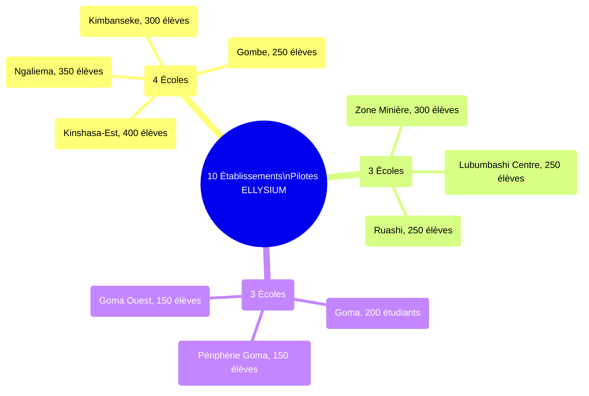
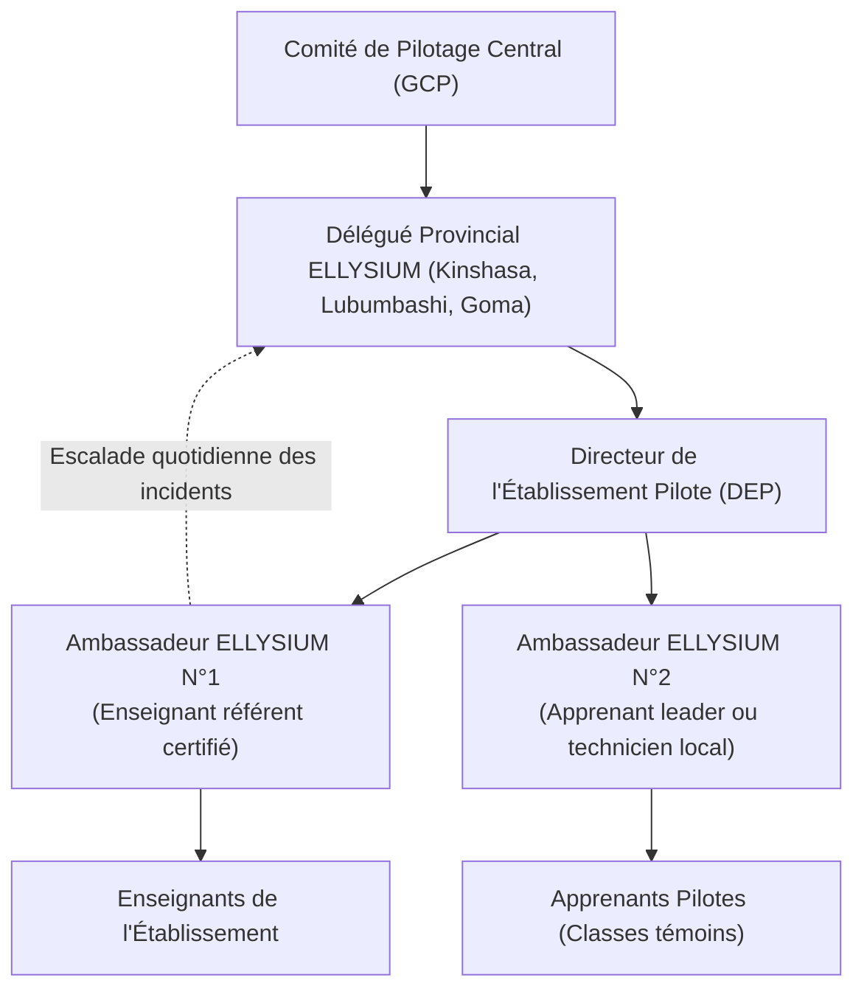

# Module 282 — Phase 1 : sélection et déploiement dans 10 établissements pilotes

> **Positionnement :** Tome 16 — Feuille de Route de Lancement et Conduite du Changement
> Module 5 sur 16 | Référence : ELLYSIUM-T16-M282
> **Autorité :** Direction des Partenariats / Direction Académique
> **Liaison amont :** Module 281 — Phase 0 : conception et tests en laboratoire
> **Liaison aval :** Module 283 — Phase 2 : lancement de la filière Informatique indépendante

---

## 1. Objet

Après la validation scientifique et technique de la Phase 0 en laboratoire, la **Phase 1 (Déploiement Pilote dans 10 Établissements)** marque le premier contact opérationnel d'ELLYSIUM avec le monde scolaire réel. D'une durée incompressible de 6 mois scolaires (un semestre complet), cette phase vise à tester en conditions authentiques l'adoption pédagogique, la robustesse logistique, la résistance culturelle au changement et l'efficacité des protocoles de synchronisation hors-ligne.

Ce module détaille la sélection équilibrée des 10 établissements partenaires, la cartographie géographique, le rétroplanning de déploiement et les dispositifs d'encadrement sur le terrain.

---

## 2. Cartographie et Typologie des 10 Établissements Pilotes

Conformément aux exigences constitutionnelles d'inclusion (Module 279), la cohorte pilote couvre 3 provinces contrastées et des profils institutionnels diversifiés :



| N° | Établissement | Ville / Province | Catégorie | Effectif Pilote | Connectivité Principale |
|---|---|---|---|---|---|
| **EP-01** | Lycée Matonge | Kinshasa | Public conventionné | 400 élèves | Filaire ADSL + 4G Vodacom |
| **EP-02** | Institut Technique de Ngaliema | Kinshasa | Technique public | 350 élèves | Fibre optique dédiée |
| **EP-03** | CS La Bénédiction (Kimbanseke) | Kinshasa | Privé solidaire | 300 élèves | 4G Airtel + Mode 80% Offline |
| **EP-04** | Collège Saint-Joseph | Kinshasa | Conventionné catholique | 250 élèves | Faisceau hertzien |
| **EP-05** | ITI Manika | Lubumbashi (Haut-Katanga) | Technique industriel | 300 élèves | VSAT + Solaire |
| **EP-06** | Collège Méthodiste Katuba | Lubumbashi (Haut-Katanga) | Conventionné protestant | 250 élèves | 4G Orange |
| **EP-07** | École Publique Ruashi | Lubumbashi (Haut-Katanga) | Public défavorisé | 250 élèves | Nœud Cache Local + 3G épisodique |
| **EP-08** | ISP Pilote Goma | Goma (Nord-Kivu) | Supérieur public | 200 étudiants | Fibre urbaine |
| **EP-09** | CS Espoir des Déplacés | Goma (Nord-Kivu) | Humanitaire / ONG | 150 élèves | Kit Solaire autonome + Clés USB |
| **EP-10** | Centre Métier Digital | Goma (Nord-Kivu) | Professionnel technique | 150 élèves | 4G Africell |
| **TOTAL** | **10 Établissements** | **3 Provinces** | **Mixité 100% conforme** | **2 600 Apprenants** | **Diversité d'accès totale** |

---

## 3. Rétroplanning du Déploiement Terrain (J-60 à J+180)

```mermaid
gantt
    title Chronogramme d'Exécution de la Phase 1 (Pilote 10 Écoles)
    dateFormat  X
    axisFormat  J%+d

    section Préparation In Situ
    Audit technique & équipement des salles (J-60 à J-45)    :done, prep1, 0, 15
    Installation Nœuds de Cache & Onduleurs (J-45 à J-30)    :done, prep2, 15, 30
    section Formation & Ambassadeurs
    Formation intensive des 20 Ambassadeurs (J-30 à J-15)    :active, form1, 30, 45
    Ateliers enseignants et directions (J-15 à J-5)          :active, form2, 45, 55
    Distribution des identifiants élèves/parents (J-5 à J0)  :crit, form3, 55, 60
    section Exploitation Pilote (6 mois)
    Lancement officiel & Rentrée ELLYSIUM (J0)              :milestone, j0, 60, 0
    Semestre académique pilote & suivi continu               :crit, exp, 60, 240
    Revue intermédiaire mi-parcours (J+90)                  :milestone, rev_mi, 150, 0
    Audit final, examens témoins & bilan COPIL (J+180)      :milestone, bilan, 240, 0
```



---

## 4. Dispositif Humain d'Accompagnement dans Chaque Établissement

Pour assurer une réussite totale, chaque école pilote est dotée d'une cellule de proximité :



---

## 5. Schéma SQL — Suivi des Établissements Pilotes

```sql
-- Cloud SQL PostgreSQL 16
CREATE TABLE phase1_etablissements_pilotes (
    id UUID PRIMARY KEY DEFAULT gen_random_uuid(),
    code_pilote VARCHAR(20) UNIQUE NOT NULL, -- Ex: 'EP-01' à 'EP-10'
    etablissement_id UUID NOT NULL REFERENCES etablissements_partenaires(id),
    province VARCHAR(100) NOT NULL,
    effectif_eleves_inscrits INTEGER NOT NULL,
    effectif_enseignants_formes INTEGER NOT NULL,
    nb_ambassadeurs_actifs INTEGER DEFAULT 2,
    presence_noeud_cache BOOLEAN NOT NULL DEFAULT FALSE,
    source_energie_principale VARCHAR(50) NOT NULL,
    date_demarrage DATE NOT NULL,
    taux_assiduite_moyen_pct NUMERIC(5,2) DEFAULT 0.00,
    taux_completion_cours_pct NUMERIC(5,2) DEFAULT 0.00,
    statut_pilote VARCHAR(30) DEFAULT 'ACTIF' CHECK (statut_pilote IN ('PREPARATION', 'ACTIF', 'SUSPENDU', 'CLOTURE_REUSSIE', 'ECHEC')),
    created_at TIMESTAMPTZ DEFAULT NOW(),
    updated_at TIMESTAMPTZ DEFAULT NOW()
);

CREATE INDEX idx_phase1_code ON phase1_etablissements_pilotes(code_pilote);
CREATE INDEX idx_phase1_province ON phase1_etablissements_pilotes(province);
```

---

## 6. Critères de Réussite de la Phase 1

Le passage à la Phase 2 (Module 283) ne peut être décrété par le COPIL que si les seuils de performance suivants sont collectivement franchis à J+180 :
- **Taux de Rétention des Élèves :** >= 75 % d'assiduité continue sur le semestre.
- **Taux de Réussite aux Évaluations Pilotes :** >= 65 % de validation des compétences fondamentales.
- **Indice de Satisfaction Enseignants & Parents (CSAT) :** Score moyen >= 7,5/10.
- **Fiabilité Technique :** Zéro incident d'effacement de données lors des bascules hors-ligne.
- **Respect de l'Éthique :** Zéro réclamation fondée au titre de l'Article 5 (séparation caisse/pédagogie).

---

## 7. Verrous Fonctionnels

| ID | Règle | Niveau |
|---|---|---|
| VF-282-01 | La convention pilote doit être signée par le chef d'établissement et le Délégué Provincial avant toute livraison de matériel | CRITIQUE |
| VF-282-02 | Aucun établissement ne peut ouvrir la session pilote sans au moins 2 Ambassadeurs ELLYSIUM formés et certifiés présents sur place | CRITIQUE |
| VF-282-03 | L'accès à la plateforme et aux équipements pour les apprenants de la cohorte pilote est strictement gratuit | CRITIQUE |
| VF-282-04 | Une visite de contrôle physique bimensuelle par le Délégué Provincial est obligatoire pour chaque établissement pilote | OBLIGATOIRE |
| VF-282-05 | Les résultats scolaires du pilote sont délibérés sous le contrôle de la Formule Constitutionnelle RDC et scellés dans Cloud SQL | CRITIQUE |

---

*Sous-tome rédigé conformément aux Normes documentaires ELLYSIUM — Fondations 04.*
