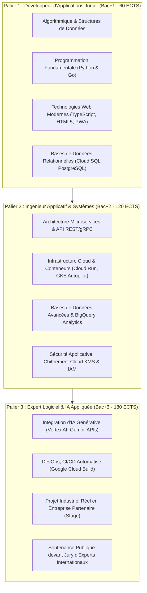
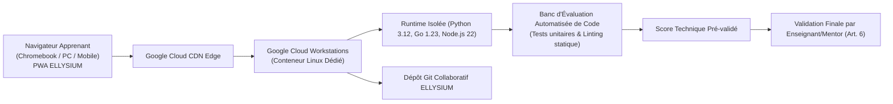

# Module 283 — Phase 2 : lancement de la filière Informatique indépendante

> **Positionnement :** Tome 16 — Feuille de Route de Lancement et Conduite du Changement
> Module 6 sur 16 | Référence : ELLYSIUM-T16-M283
> **Autorité :** Directeur Académique / Direction de la Filière Informatique
> **Liaison amont :** Module 282 — Phase 1 : sélection et déploiement dans 10 établissements pilotes
> **Liaison aval :** Module 284 — Phase 3 : généralisation du SGS et extension des filières

---

## 1. Objet

À l'issue de la consolidation de la Phase 1 dans les 10 établissements pilotes, ELLYSIUM engage la **Phase 2 (Mois 13 à 24)** : l'ouverture de sa **première filière certifiante complète et autonome**, dédiée à l'**Informatique et au Génie Logiciel**.

Le choix de l'informatique comme tête de pont stratégique répond à un triple impératif :
1. **Adéquation marché :** Pénurie aiguë de développeurs, d'administrateurs cloud et d'analystes de données en RDC et sur le continent africain.
2. **Faisabilité numérique totale :** Les cours, travaux pratiques, laboratoires de code et projets sont 100 % dématérialisables et exécutables directement dans l'environnement Google Cloud Platform.
3. **Preuve d'autonomie pour les apprenants indépendants (AIS/AIU) :** Démontrer qu'un apprenant sans tuteur physique permanent peut acquérir des compétences techniques de standard mondial.

---

## 2. Architecture Pédagogique de la Filière Informatique

Le cursus est structuré en trois paliers certifiants cumulant 180 crédits ECTS équivalents (Niveau Bac+3 / Licence professionnelle) :



---

## 3. Environnement de Pratique de Code Hébergé sur GCP

Pour affranchir les apprenants du besoin de posséder une machine coûteuse, ELLYSIUM intègre un environnement de développement en ligne (Cloud Workstations / Web IDE) :



---

## 4. Cohorte de Phase 2 et Modalités d'Inclusion

La Phase 2 vise le passage à l'échelle sur 5 provinces clés :

| Province | Villes Couvertes | Apprenants Scolarisés | Apprenants Indépendants (AIS/AIU) | Total Province |
|---|---|---|---|---|
| **Kinshasa** | Kinshasa (24 communes) | 3 500 | 2 500 | 6 000 |
| **Haut-Katanga** | Lubumbashi, Likasi | 2 000 | 1 500 | 3 500 |
| **Nord-Kivu** | Goma, Butembo | 1 500 | 1 000 | 2 500 |
| **Kasaï-Central** | Kananga | 1 000 | 500 | 1 500 |
| **Sud-Kivu** | Bukavu | 1 000 | 500 | 1 500 |
| **TOTAL** | **7 Pôles Urbains & Périurbains** | **9 000 (60%)** | **6 000 (40%)** | **15 000 Apprenants** |

---

## 5. Schéma SQL — Inscription et Cursus de la Filière Informatique

```sql
-- Cloud SQL PostgreSQL 16
CREATE TABLE filiere_informatique_cursus (
    id UUID PRIMARY KEY DEFAULT gen_random_uuid(),
    apprenant_id UUID NOT NULL,
    palier_actuel INTEGER DEFAULT 1 CHECK (palier_actuel IN (1, 2, 3)),
    statut_apprenant VARCHAR(20) NOT NULL CHECK (statut_apprenant IN ('SCOLAIRE_PARTENAIRE', 'AIS_AUTONOME', 'AIU_UNIVERSITAIRE')),
    date_admission DATE NOT NULL,
    credits_ects_valides INTEGER DEFAULT 0 CHECK (credits_ects_valides BETWEEN 0 AND 180),
    quota_heures_cloud_utilisees INTEGER DEFAULT 0,
    depot_git_url VARCHAR(255),
    tuteur_referent_id UUID REFERENCES enseignants(id),
    mention_globale VARCHAR(30) DEFAULT 'EN_COURS',
    diplome_delivre BOOLEAN DEFAULT FALSE,
    hash_diplome_gcs VARCHAR(255),
    created_at TIMESTAMPTZ DEFAULT NOW(),
    updated_at TIMESTAMPTZ DEFAULT NOW()
);

CREATE INDEX idx_info_apprenant ON filiere_informatique_cursus(apprenant_id);
CREATE INDEX idx_info_palier ON filiere_informatique_cursus(palier_actuel);
CREATE INDEX idx_info_statut ON filiere_informatique_cursus(statut_apprenant);
```

---

## 6. Dispositif de Diplomation et Débouchés Professionnels

À l'issue des 180 crédits ECTS et de la soutenance :
- **Diplôme Co-Certifié :** Délivré sous le sceau ELLYSIUM et des universités partenaires conventionnées (Module 268).
- **Passerelle Emploi Direct :** Accès prioritaire au vivier d'entreprises partenaires (Module 269) pour des postes de développeur junior, technicien d'exploitation cloud ou testeur QA.
- **Portefeuille de Projets Publics :** Chaque lauréat dispose d'une vitrine numérique sur Firebase Hosting démontrant son code source vérifié.

---

## 7. Verrous Fonctionnels

| ID | Règle | Niveau |
|---|---|---|
| VF-283-01 | Au moins 40 % des effectifs de la filière Informatique doivent être réservés aux apprenants indépendants gratuits (AIS/AIU) | CRITIQUE |
| VF-283-02 | L'évaluation automatisée de code ne peut en aucun cas attribuer la note finale sans revue et validation d'un enseignant humain | CRITIQUE |
| VF-283-03 | Les environnements de développement et dépôts de code s'exécutent strictement au sein du périmètre sécurisé Google Cloud Platform | CRITIQUE |
| VF-283-04 | Aucun apprenant ne peut valider le Palier 3 sans avoir réalisé un projet en conditions réelles d'au moins 200 heures de code | OBLIGATOIRE |
| VF-283-05 | La diplomation finale requiert une soutenance devant un jury paritaire comprenant au moins un professionnel externe en activité | OBLIGATOIRE |

---

*Sous-tome rédigé conformément aux Normes documentaires ELLYSIUM — Fondations 04.*
