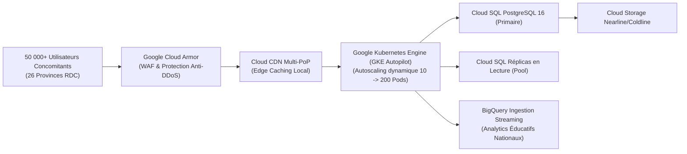

# Module 284 — Phase 3 : généralisation du SGS et extension des filières

> **Positionnement :** Tome 16 — Feuille de Route de Lancement et Conduite du Changement
> Module 7 sur 16 | Référence : ELLYSIUM-T16-M284
> **Autorité :** Direction Générale / Comité de Pilotage
> **Liaison amont :** Module 283 — Phase 2 : lancement de la filière Informatique indépendante
> **Liaison aval :** Module 285 — Programme « Ambassadeurs ELLYSIUM »

---

## 1. Objet

Après avoir éprouvé la robustesse de l'écosystème sur les 10 écoles pilotes (Phase 1) et démontré la puissance de son modèle pédagogique sur la filière Informatique (Phase 2), ELLYSIUM franchit le cap de son **industrialisation à l'échelle nationale : la Phase 3 (Mois 25 à 36+)**.

Cette phase pivot réalise deux accomplissements majeurs :
1. **La généralisation du Système de Gestion Scolaire (SGS) :** Déploiement de l'ERP éducatif complet d'ELLYSIUM (gestion des effectifs, emplois du temps, assiduité, notes, délibérations et bulletins officiels) auprès de centaines d'établissements partenaires.
2. **L'extension multisectorielle des filières :** Ouverture simultanée des filières scientifiques, économiques, pédagogiques et professionnelles.

---

## 2. Architecture de la Phase 3 : Le Système de Gestion Scolaire (SGS)

Le SGS fédère l'ensemble des modules administratifs et pédagogiques au sein d'une interface unifiée hébergée sur Google Cloud Platform :


---

## 3. Matrice d'Ouverture des Nouvelles Filières (Phase 3)

L'offre de formation s'élargit pour couvrir l'ensemble des besoins de développement de la RDC :

| Filière Nouvelle | Paliers Ouverts | Public Cible | Débouchés & Équivalences |
|---|---|---|---|
| **Sciences & Mathématiques Fondamentales** | Secondaire (1re à 6e) & Bac+1 | Candidats EXETAT & Étudiants Sciences | Préparation concours, facultés polytechniques |
| **Sciences Économiques & Gestion Commerciale** | Bac+1 à Bac+3 (Licence Pro) | PME, banques, auto-entrepreneurs | Comptables, gestionnaires financiers, auditeurs |
| **Sciences de l'Éducation & Didactique** | Bac+2 à Bac+3 | Enseignants du primaire et secondaire | Titularisation, qualification professorale |
| **Génie Électrique & Énergies Renouvelables** | Professionnel (Certificats techniques) | Électriciens, installateurs solaires | Maintenance industrielle, parcs photovoltaïques |
| **Santé Publique & Soins Communautaires** | Bac+1 à Bac+2 | Agents de santé, cliniques de brousse | Infirmiers auxiliaires, relais communautaires |

---

## 4. Dimensionnement de l'Infrastructure GCP en Phase 3

Pour absorber le passage à l'échelle (50 000 à 250 000 apprenants simultanés), l'architecture Google Cloud s'adapte automatiquement :



---

## 5. Schéma SQL — Délibération et Bulletins SGS Phase 3

```sql
-- Cloud SQL PostgreSQL 16
CREATE TABLE sgs_deliberations_bulletins (
    id UUID PRIMARY KEY DEFAULT gen_random_uuid(),
    apprenant_id UUID NOT NULL,
    etablissement_id UUID NOT NULL REFERENCES etablissements_partenaires(id),
    annee_scolaire VARCHAR(10) NOT NULL, -- Ex: '2026-2027'
    periode VARCHAR(20) NOT NULL, -- Ex: 'SEMESTRE_1', 'ANNUEL'
    total_points_obtenus NUMERIC(8,2) NOT NULL,
    total_points_maxima NUMERIC(8,2) NOT NULL CHECK (total_points_maxima > 0),
    -- Application obligatoire de la Formule Constitutionnelle RDC :
    taux_reussite_pct NUMERIC(5,2) GENERATED ALWAYS AS (ROUND((total_points_obtenus / total_points_maxima) * 100, 2)) STORED,
    mention VARCHAR(30) NOT NULL,
    decision_jury VARCHAR(50) NOT NULL CHECK (decision_jury IN ('ADMIS', 'ADMIS_AVEC_RESERVES', 'AJOURNE', 'NON_DELIBERE')),
    bulletin_pdf_hash_gcs VARCHAR(255) NOT NULL,
    signature_prefet_etab VARCHAR(512) NOT NULL,
    signature_da_ellysium VARCHAR(512) NOT NULL,
    date_deliberation DATE NOT NULL,
    created_at TIMESTAMPTZ DEFAULT NOW()
);

CREATE INDEX idx_sgs_apprenant ON sgs_deliberations_bulletins(apprenant_id);
CREATE INDEX idx_sgs_etab ON sgs_deliberations_bulletins(etablissement_id);
CREATE INDEX idx_sgs_annee ON sgs_deliberations_bulletins(annee_scolaire);
```

---

## 6. Verrous Fonctionnels

| ID | Règle | Niveau |
|---|---|---|
| VF-284-01 | Le moteur de calcul des bulletins SGS applique impérativement la formule constitutionnelle officielle `Taux = (ΣPoints / ΣMaxima) × 100` | CRITIQUE |
| VF-284-02 | Aucun bulletin scolaire officiel ne peut être édité ou imprimé sans la double signature électronique scellée du chef d'établissement et du DA | CRITIQUE |
| VF-284-03 | L'infrastructure GKE Autopilot et Cloud SQL doit être dimensionnée pour garantir un temps de réponse p95 inférieur à 800 ms sous pic de charge | CRITIQUE |
| VF-284-04 | L'ouverture de toute nouvelle filière en Phase 3 exige la validation préalable de ses référentiels par le Conseil Académique | OBLIGATOIRE |
| VF-284-05 | L'intégrité de tous les bulletins d'élèves est garantie par un horodatage cryptographique vérifiable publiquement par QR Code | OBLIGATOIRE |
| VF-284-06 | Chaque jalon est validé par un vote formel du COPIL avant passage à l'étape suivante | OBLIGATOIRE |

---

*Sous-tome rédigé conformément aux Normes documentaires ELLYSIUM — Fondations 04.*
