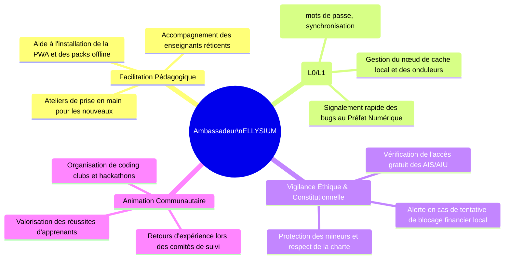
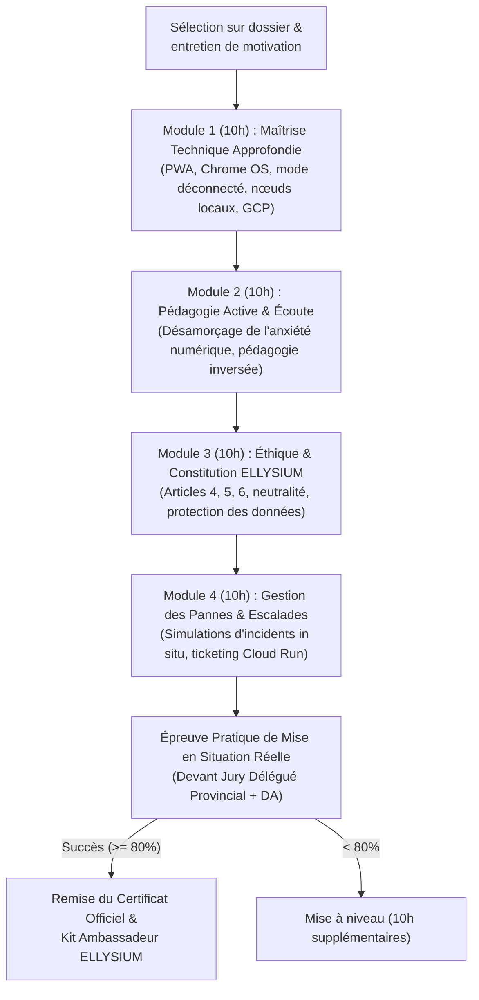

# Module 285 — Programme « Ambassadeurs ELLYSIUM » : formation, certification et réseau de pairs

> **Positionnement :** Tome 16 — Feuille de Route de Lancement et Conduite du Changement
> Module 8 sur 16 | Référence : ELLYSIUM-T16-M285
> **Autorité :** Direction de la Conduite du Changement / Direction Pédagogique
> **Liaison amont :** Module 284 — Phase 3 : généralisation du SGS et extension des filières
> **Liaison aval :** Module 286 — Formation des directions, enseignants, apprenants et parents

---

## 1. Objet

Le facteur déterminant de l'adoption d'un écosystème éducatif numérique ne réside pas dans le code informatique, mais dans la présence humaine sur le terrain. Face à l'anxiété technologique, aux coupures d'électricité et aux hésitations culturelles, les apprenants et les enseignants ont besoin d'interlocuteurs bienveillants, proches d'eux et immédiatement disponibles.

Le **Programme « Ambassadeurs ELLYSIUM »** structure ce réseau d'élite de pionniers locaux (enseignants passionnés, étudiants moteurs, médiateurs associatifs). Ce module encadre leur sélection, leur parcours d'habilitation certifiante, leur trousseau d'intervention et les règles éthiques régissant leur mission de soutien de proximité.

---

## 2. Rôle et Missions de l'Ambassadeur ELLYSIUM

L'Ambassadeur est le point d'ancrage vivant de la plateforme dans chaque établissement et communauté :



---

## 3. Cursus de Formation Certifiant des Ambassadeurs (40 Heures)

Avant de recevoir son accréditation officielle, tout candidat ambassadeur suit un parcours intensif sanctionné par un examen pratique :



---

## 4. Trousseau d'Intervention et Dotation Matérielle

Chaque Ambassadeur certifié reçoit une dotation officielle garantissant son autonomie sur le terrain :
1. **Identifiant Unique et Badge Cryptographique :** Carte officielle avec QR Code vérifiable sur Firebase Hosting.
2. **Terminal de Supervision Réseau :** Smartphone durci ou tablette basse consommation doté de l'application mobile de monitoring ELLYSIUM.
3. **Clé de Secours d'Urgence (Master USB Key) :** Clé USB 128 Go chiffrée contenant les packs d'installation PWA, les derniers correctifs logiciels et les manuels complets hors-ligne.
4. **Kit Vestimentaire d'Identification :** Polo et gilet officiels ELLYSIUM pour être immédiatement identifiable dans les enceintes scolaires.

---

## 5. Schéma SQL — Registre Officiel des Ambassadeurs

```sql
-- Cloud SQL PostgreSQL 16
CREATE TABLE programme_ambassadeurs (
    id UUID PRIMARY KEY DEFAULT gen_random_uuid(),
    matricule_ambassadeur VARCHAR(30) UNIQUE NOT NULL, -- Ex: 'AMB-KIN-2026-0042'
    utilisateur_id UUID NOT NULL,
    nom_complet VARCHAR(150) NOT NULL,
    telephone_contact VARCHAR(50) NOT NULL,
    etablissement_attache_id UUID REFERENCES etablissements_partenaires(id),
    province VARCHAR(100) NOT NULL,
    profil_origine VARCHAR(50) CHECK (profil_origine IN ('ENSEIGNANT', 'APPRENANT_LEADER', 'TECHNICIEN_LOCAL', 'ASSOCIATIF')),
    date_certification DATE NOT NULL,
    score_examen_pct NUMERIC(5,2) NOT NULL CHECK (score_examen_pct >= 80.00),
    statut VARCHAR(30) DEFAULT 'ACTIF' CHECK (statut IN ('ACTIF', 'SUSPENDU', 'HONORAIRE', 'REVOQUE')),
    nb_ateliers_animes INTEGER DEFAULT 0,
    nb_incidents_resolus INTEGER DEFAULT 0,
    badge_verification_url VARCHAR(255) NOT NULL,
    created_at TIMESTAMPTZ DEFAULT NOW(),
    updated_at TIMESTAMPTZ DEFAULT NOW()
);

CREATE INDEX idx_amb_matricule ON programme_ambassadeurs(matricule_ambassadeur);
CREATE INDEX idx_amb_province ON programme_ambassadeurs(province);
CREATE INDEX idx_amb_statut ON programme_ambassadeurs(statut);
```

---

## 6. Code de Déontologie de l'Ambassadeur

L'exercice du rôle d'Ambassadeur impose des devoirs stricts :
- **Bénévolat ou Rétribution Forfaitaire Transparente :** Interdiction totale d'exiger une rémunération, un pourboire ou un avantage direct auprès des élèves ou des familles.
- **Obligation de Neutralité :** Interdiction de faire du prosélytisme politique, tribal ou religieux dans l'exercice de ses fonctions.
- **Devoir d'Alerte Constitutionnelle :** Obligation de signaler sous 12h toute tentative de racket, d'exclusion d'élève ou de dérive commerciale observée dans son périmètre.

---

## 7. Verrous Fonctionnels

| ID | Règle | Niveau |
|---|---|---|
| VF-285-01 | Tout candidat doit obtenir au moins 80 % à l'épreuve pratique pour obtenir le statut d'Ambassadeur Certifié | CRITIQUE |
| VF-285-02 | L'Ambassadeur n'a aucun pouvoir de modification des notes ou des délibérations académiques des élèves | CRITIQUE |
| VF-285-03 | Tout ambassadeur recevant de l'argent d'un apprenant ou d'une famille est révoqué immédiatement et radié du registre | CRITIQUE |
| VF-285-04 | Chaque établissement partenaire doit compter au moins 2 ambassadeurs certifiés actifs en permanence | OBLIGATOIRE |
| VF-285-05 | Le certificat d'ambassadeur a une validité d'un an, renouvelable après évaluation continue des actions menées | OBLIGATOIRE |
| VF-285-06 | Chaque jalon est validé par un vote formel du COPIL avant passage à l'étape suivante | OBLIGATOIRE |

---

*Sous-tome rédigé conformément aux Normes documentaires ELLYSIUM — Fondations 04.*
