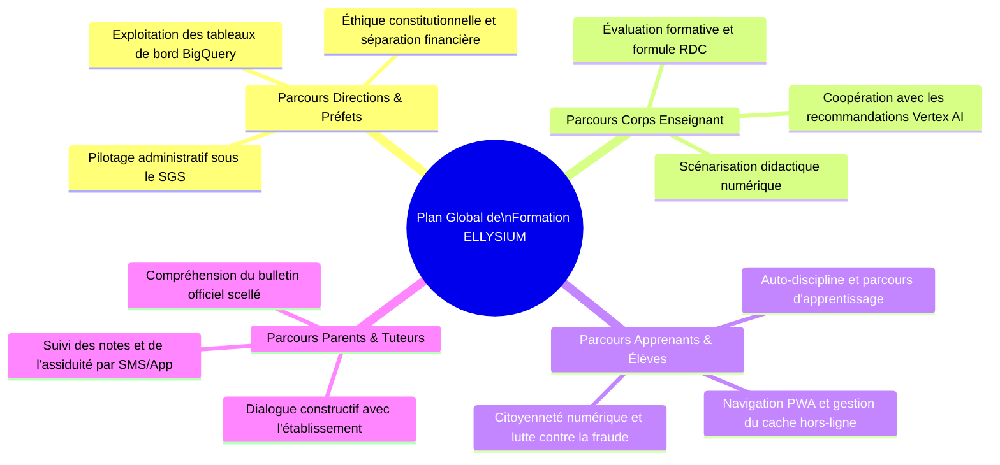
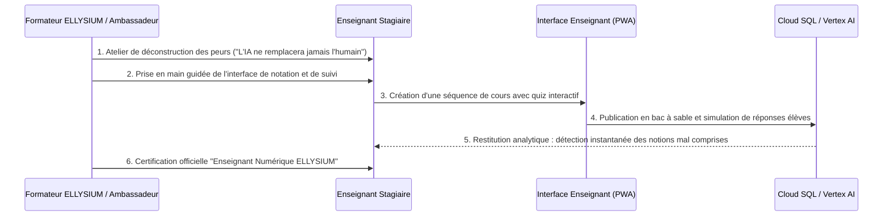

# Module 286 — Formation des directions, des enseignants, des apprenants et des parents

> **Positionnement :** Tome 16 — Feuille de Route de Lancement et Conduite du Changement
> Module 9 sur 16 | Référence : ELLYSIUM-T16-M286
> **Autorité :** Direction de la Formation / Direction Pédagogique
> **Liaison amont :** Module 285 — Programme « Ambassadeurs ELLYSIUM »
> **Liaison aval :** Module 287 — Élaboration des manuels utilisateurs et tutoriels vidéo

---

## 1. Objet

L'inclusion numérique et la transformation pédagogique ne peuvent s'opérer en formant isolément un seul maillon de la chaîne éducative. L'écosystème scolaire congolais forme un tout solidaire : si les chefs d'établissement ne comprennent pas les outils de gestion, ils feront obstruction ; si les enseignants se sentent menacés dans leur magistère, ils boycotteront la plateforme ; si les parents sont tenus à l'écart, ils refuseront que leurs enfants manipulent des écrans.

Ce module détaille le **Plan Quinquennal de Formation Multidimensionnelle d'ELLYSIUM**, articulé en 4 parcours ciblés adaptés aux contraintes cognitives, temporelles et logistiques de chaque public.

---

## 2. Matrice des 4 Parcours de Formation



| Public Cible | Durée | Modalités Pédagogiques | Compétence Clé Visée |
|---|---|---|---|
| **Directions d'Écoles (DEP, Préfets)** | 16 heures (2 jours) | Séminaire présentiel immersif + cas pratiques | Maîtrise de l'ERP scolaire SGS et respect constitutionnel |
| **Enseignants & Formateurs** | 30 heures (1 semaine) | Ateliers hybrides, simulations de cours et labs | Création de contenus, suivi d'élèves et notation officielle |
| **Apprenants (Élèves & Étudiants)** | 6 heures (fractionnées) | Modules immersifs gamifiés intégrés dans la PWA | Autonomie d'apprentissage et maîtrise du mode déconnecté |
| **Parents d'Élèves & Tuteurs** | 2 heures (ateliers du samedi) | Réunions communautaires de quartier + démos SMS | Suivi bienveillant de la scolarité sur smartphone basique |

---

## 3. Dispositif Pédagogique d'Immersion pour les Enseignants

Le parcours enseignant est conçu pour valoriser le professeur en le positionnant comme un architecte de l'apprentissage :



---

## 4. Stratégie d'Inclusion des Parents à Faible Littératie Numérique

Pour les parents ne disposant pas de smartphone ou éprouvant des difficultés avec les interfaces écrites :
1. **Notifications Vocales et SMS en Langues Nationales :** Alertes d'absence et résumés de notes transmis par SMS courts ou messages vocaux automatisés en lingala, swahili, tshiluba ou kikongo.
2. **Permanences du Samedi Matin :** Les Ambassadeurs ELLYSIUM tiennent une permanence hebdomadaire dans chaque établissement pour expliquer physiquement les résultats aux parents.

---

## 5. Schéma SQL — Suivi des Sessions de Formation

```sql
-- Cloud SQL PostgreSQL 16
CREATE TABLE formations_cohortes (
    id UUID PRIMARY KEY DEFAULT gen_random_uuid(),
    session_code VARCHAR(30) UNIQUE NOT NULL, -- Ex: 'FORM-ENS-LSH-2026-01'
    public_cible VARCHAR(30) NOT NULL CHECK (public_cible IN ('DIRECTIONS', 'ENSEIGNANTS', 'APPRENANTS', 'PARENTS')),
    etablissement_id UUID REFERENCES etablissements_partenaires(id),
    formateur_responsable VARCHAR(150) NOT NULL,
    date_debut DATE NOT NULL,
    date_fin DATE NOT NULL,
    nb_inscrits INTEGER NOT NULL,
    nb_certifies INTEGER NOT NULL,
    taux_reussite_pct NUMERIC(5,2) GENERATED ALWAYS AS (ROUND((nb_certifies::numeric / nb_inscrits::numeric) * 100, 2)) STORED,
    evaluation_satisfaction_csat NUMERIC(3,2), -- Sur 5.00
    rapport_emargement_gcs VARCHAR(255) NOT NULL,
    created_at TIMESTAMPTZ DEFAULT NOW()
);

CREATE INDEX idx_form_public ON formations_cohortes(public_cible);
CREATE INDEX idx_form_etab ON formations_cohortes(etablissement_id);
```

---

## 6. Verrous Fonctionnels

| ID | Règle | Niveau |
|---|---|---|
| VF-286-01 | Aucun enseignant ne peut enseigner sur la plateforme sans avoir validé son parcours de formation de 30 heures | CRITIQUE |
| VF-286-02 | La formation des chefs d'établissement doit obligatoirement comporter un module sur l'interdiction constitutionnelle du blocage financier | CRITIQUE |
| VF-286-03 | L'intégralité des sessions de formation pour les enseignants et directeurs d'écoles partenaires est gratuite | CRITIQUE |
| VF-286-04 | Les ateliers parents doivent être proposés au minimum en français et dans la langue nationale dominante de la province | OBLIGATOIRE |
| VF-286-05 | Les listes d'émargement et évaluations de compétences post-formation sont scellées dans Google Cloud Storage | OBLIGATOIRE |

---

*Sous-tome rédigé conformément aux Normes documentaires ELLYSIUM — Fondations 04.*
