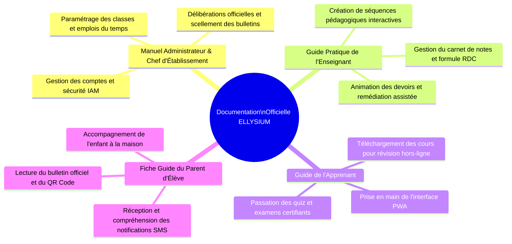
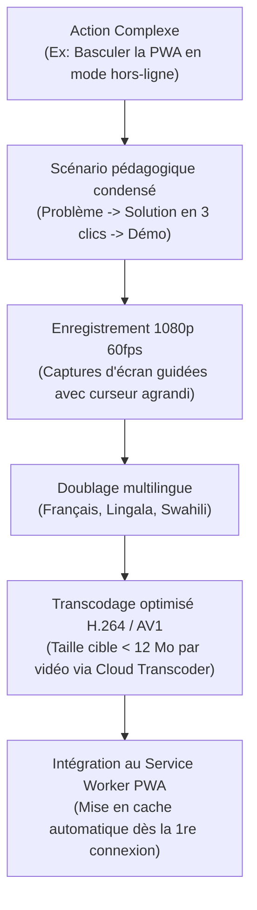
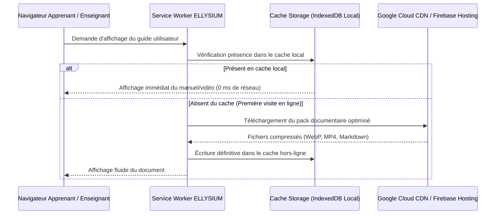

# Module 287 — Élaboration des manuels utilisateurs et tutoriels vidéo intégrés

> **Positionnement :** Tome 16 — Feuille de Route de Lancement et Conduite du Changement
> Module 10 sur 16 | Référence : ELLYSIUM-T16-M287
> **Autorité :** Direction Éditoriale / Préfet Numérique
> **Liaison amont :** Module 286 — Formation des directions, enseignants, apprenants et parents
> **Liaison aval :** Module 288 — Boucle de retour d'expérience (sondages NPS, ajustements agiles)

---

## 1. Objet

L'appropriation durable d'un dispositif technologique exige une documentation claire, vivante, toujours accessible et dépouillée de tout jargon hermétique. Dans un contexte où la connectivité est intermittente et les niveaux d'alphabétisation numérique inégaux, la documentation doit se décliner sous des formes variées : manuels papier plastifiés pour les salles informatiques, fiches de synthèse, guides interactifs en ligne sur Firebase Hosting et capsules vidéo de micro-apprentissage.

Ce module fixe les standards de rédaction des 4 manuels officiels, les protocoles de production audiovisuelle et les mécanismes de mise en cache automatique des tutoriels dans l'application PWA.

---

## 2. Bibliothèque des 4 Manuels Utilisateurs Officiels

| Manuel | Volume | Formats Disponibles | Langues |
|---|---|---|---|
| **Manuel de Direction (DEP/Préfet)** | 60 pages | PDF haute définition + Web Markdown | Français |
| **Guide Enseignant** | 45 pages | PDF + Fiches mémo plastifiées + Web | Français |
| **Guide Apprenant** | 24 pages (illustré) | PWA intégrée + Livret de poche | Français + Lingala / Swahili |
| **Fiche Parent** | 4 pages dépliant | Dépliant cartonné + SMS/Audio | Français, Lingala, Swahili, Tshiluba, Kikongo |

---

## 3. Stratégie Audiovisuelle : Les Capsules Vidéo de Micro-Learning

Pour chaque geste technique clé, une vidéo ultra-courte (< 3 minutes) est produite par le Studio Central (Module 257) :

---

## 4. Catalogue des Capsules Vidéo Essentielles (Pack Pilote)

| ID Vidéo | Titre de la Capsule | Durée | Public | Poids Cache |
|---|---|---|---|---|
| **VID-01** | *Première connexion et sécurisation de mon mot de passe* | 1 min 45 s | Tous | 6,5 Mo |
| **VID-02** | *Comment télécharger mes cours pour étudier sans Internet* | 2 min 10 s | Apprenants | 8,2 Mo |
| **VID-03** | *Passer un quiz et soumettre un devoir en mode hors-ligne* | 2 min 30 s | Apprenants | 9,5 Mo |
| **VID-04** | *Saisir les notes et clôturer une période selon la formule RDC* | 2 min 50 s | Enseignants | 11,0 Mo |
| **VID-05** | *Valider les délibérations et générer les bulletins officiels SGS* | 2 min 45 s | Directeurs | 10,8 Mo |
| **VID-06** | *Comprendre le bulletin et vérifier le QR Code d'authenticité* | 1 min 30 s | Parents | 5,5 Mo |

---

## 5. Schéma de Déploiement et d'Accès Hors-Ligne des Manuels

---

## 6. Verrous Fonctionnels

| ID | Règle | Niveau |
|---|---|---|
| VF-287-01 | Tout manuel utilisateur doit être disponible en téléchargement PDF ultra-léger (taille totale <= 2,5 Mo) | CRITIQUE |
| VF-287-02 | Les capsules vidéo tutorielles ne doivent jamais excéder 15 Mo pour être compatibles avec le stockage des terminaux d'entrée de gamme | CRITIQUE |
| VF-287-03 | Les manuels et tutoriels doivent être pré-chargés dans le cache Service Worker dès l'onboarding pour garantir un accès 100% hors-ligne | CRITIQUE |
| VF-287-04 | Les dépliants destinés aux parents doivent impérativement comporter une version traduite dans la langue nationale locale | OBLIGATOIRE |
| VF-287-05 | Toute mise à jour fonctionnelle de la plateforme entraîne la révision obligatoire sous 15 jours des manuels et vidéos associés | OBLIGATOIRE |
| VF-287-06 | Chaque jalon est validé par un vote formel du COPIL avant passage à l'étape suivante | OBLIGATOIRE |

---

*Sous-tome rédigé conformément aux Normes documentaires ELLYSIUM — Fondations 04.*
