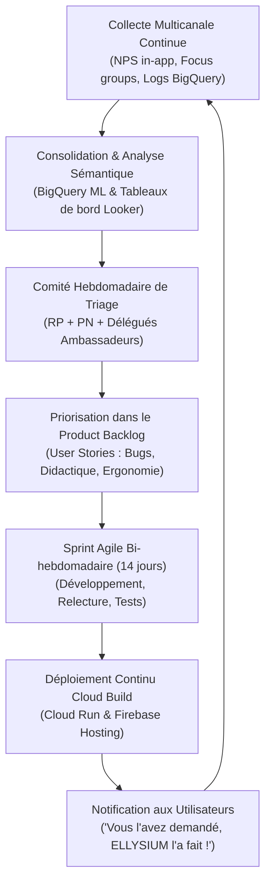
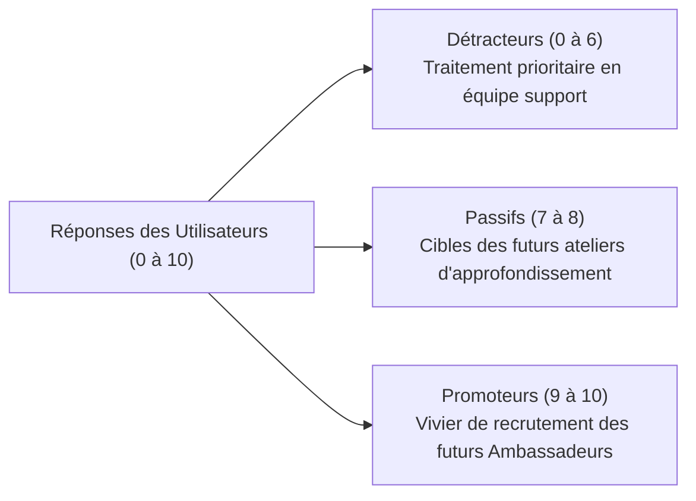

# Module 288 — Boucle de retour d'expérience : sondages NPS, interviews et ajustements agiles

> **Positionnement :** Tome 16 — Feuille de Route de Lancement et Conduite du Changement
> Module 11 sur 16 | Référence : ELLYSIUM-T16-M288
> **Autorité :** Direction de l'Assurance Qualité / Équipe Agile
> **Liaison amont :** Module 287 — Élaboration des manuels utilisateurs et tutoriels vidéo intégrés
> **Liaison aval :** Module 289 — Gestion de la résistance au changement

---

## 1. Objet

L'ingénierie éducative moderne repose sur un postulat fondamental : **aucun plan ne résiste intact au premier contact avec les apprenants et les enseignants**. Pour éviter que les frustrations d'usage ne se transforment en rejet silencieux de la plateforme, ELLYSIUM implémente une boucle d'amélioration continue ultra-courte (Feedback Loop Agile).

Ce module structure les mécanismes de collecte des retours d'expérience (mesure automatisée du Net Promoter Score, entretiens qualitatifs in situ, télémétrie BigQuery) et encadre le cycle de développement agile en sprints bi-hebdomadaires permettant d'adapter les cours et les interfaces en quasi-temps réel.

---

## 2. Architecture de la Boucle de Rétroaction Continue



---

## 3. Dispositif de Collecte Multidimensionnel

Pour capter les signaux faibles sur le terrain, trois canaux complémentaires sont activés :

| Canal de Collecte | Mécanisme & Fréquence | Données Recueillies | Cible / Seuil Alerte |
|---|---|---|---|
| **Micro-Sondage In-App** | Déclenché à la fin de chaque module (1 clic : 1 à 5 étoiles) | Clarté perçue du cours, difficulté des quiz | Alerte si note moyenne < 3,8/5 |
| **Campagne NPS Trimestrielle** | Formulaire court (0 à 10 : « Recommanderiez-vous ELLYSIUM ? ») | Score Net Promoter Score par public | Cible globale >= +45 |
| **Entretiens Qualitatifs Terrain** | 5 entretiens semi-directifs par école pilote chaque mois | Récits d'usage, blocages culturels, irritants | Analyse thématique par les ambassadeurs |
| **Télémétrie d'Usage BigQuery** | Événements streaming anonymisés | Taux d'abandon à la minute 3 d'une vidéo, temps d'examen | Détection automatique des goulets d'étranglement |

---

## 4. Mesure et Formule du Net Promoter Score (NPS)

Le NPS est calculé automatiquement dans BigQuery selon la formule standard :

$$\text{NPS} = \% \text{ Promoteurs (Notes 9-10)} - \% \text{ Détracteurs (Notes 0-6)}$$



---

## 5. Schéma SQL — Tables des Retours et Événements NPS

```sql
-- Cloud SQL PostgreSQL 16
CREATE TABLE retours_experience_nps (
    id UUID PRIMARY KEY DEFAULT gen_random_uuid(),
    utilisateur_id UUID NOT NULL,
    profil_utilisateur VARCHAR(30) NOT NULL CHECK (profil_utilisateur IN ('ELEVE', 'ETUDIANT', 'ENSEIGNANT', 'DIRECTION', 'PARENT')),
    etablissement_id UUID REFERENCES etablissements_partenaires(id),
    campagne_periode VARCHAR(20) NOT NULL, -- Ex: '2026-Q1'
    score_nps INTEGER NOT NULL CHECK (score_nps BETWEEN 0 AND 10),
    categorie_nps VARCHAR(20) GENERATED ALWAYS AS (
        CASE 
            WHEN score_nps >= 9 THEN 'PROMOTEUR'
            WHEN score_nps >= 7 THEN 'PASSIF'
            ELSE 'DETRACTEUR'
        END
    ) STORED,
    commentaire_libre TEXT,
    tag_thematique VARCHAR(50), -- Ex: 'OFFLINE_BUG', 'COURS_TROP_DIFFICILE', 'INTERFACE'
    date_reponse TIMESTAMPTZ DEFAULT NOW()
);

CREATE INDEX idx_nps_campagne ON retours_experience_nps(campagne_periode);
CREATE INDEX idx_nps_cat ON retours_experience_nps(categorie_nps);
CREATE INDEX idx_nps_profil ON retours_experience_nps(profil_utilisateur);
```

---

## 6. Sprints d'Ajustement Agile en Phase Pilote

Les cycles d'amélioration en Phase 1 et 2 suivent une cadence immuable de 14 jours :
- **Lundi S1 (Sprint Planning) :** Analyse des 10 plus gros irritants remontés la semaine précédente.
- **S1 à S2 (Développement & Correction Pédagogique) :** Amélioration des textes, re-tournage de séquences vidéo confuses, optimisation du code PWA.
- **Jeudi S2 (Sprint Review & Tests Automatisés) :** Recette conjointe par les enseignants ambassadeurs.
- **Vendredi S2 (Déploiement CI/CD) :** Déploiement sans coupure sur Cloud Run et purge sélective du Cloud CDN.

---

## 7. Verrous Fonctionnels

| ID | Règle | Niveau |
|---|---|---|
| VF-288-01 | Tout module de cours recevant une note moyenne inférieure à 3,5/5 sur 30 avis consécutifs est suspendu pour révision | CRITIQUE |
| VF-288-02 | Les enquêtes NPS sont strictement anonymes ; aucune sanction ou représailles ne peut viser un détracteur | CRITIQUE |
| VF-288-03 | Les retours d'expérience sont traités en direct sous BigQuery sans aucune altération ou falsification des scores | CRITIQUE |
| VF-288-04 | Le délai maximal de correction d'un bug ergonomique critique signalé par les ambassadeurs est de 14 jours ouvrés | OBLIGATOIRE |
| VF-288-05 | Un rapport consolidé de satisfaction trimestriel est soumis obligatoirement au Comité de Pilotage (COPIL) | OBLIGATOIRE |

---

*Sous-tome rédigé conformément aux Normes documentaires ELLYSIUM — Fondations 04.*
