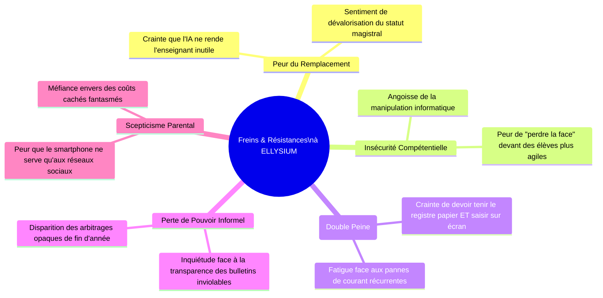
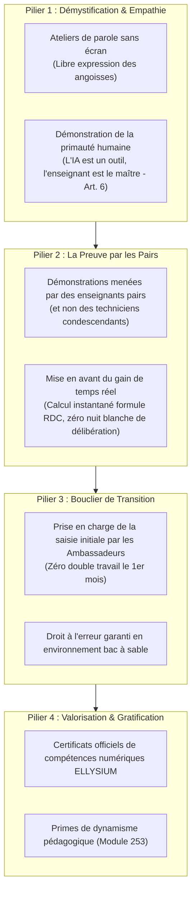
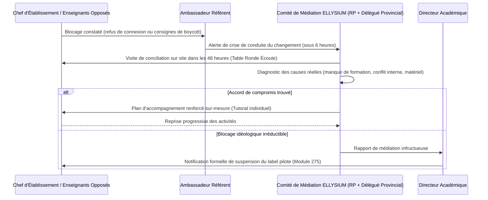

# Module 289 — Gestion de la résistance au changement : ateliers, démonstrations et médiation

> **Positionnement :** Tome 16 — Feuille de Route de Lancement et Conduite du Changement
> Module 12 sur 16 | Référence : ELLYSIUM-T16-M289
> **Autorité :** Direction de la Conduite du Changement / Comité de Médiation
> **Liaison amont :** Module 288 — Boucle de retour d'expérience : sondages NPS et ajustements agiles
> **Liaison aval :** Module 290 — Jalons datés de la phase pilote et critères de passage à l'échelle

---

## 1. Objet

L'introduction du numérique dans les établissements scolaires congolais suscite inévitablement des résistances psychologiques, sociologiques et corporatistes légitimes. Les enseignants redoutent d'être supplantés par les algorithmes ou d'être humiliés devant leurs élèves s'ils maîtrisent mal l'outil ; les directeurs craignent une perte d'autorité et une transparence réduisant leurs marges de manœuvre informelles ; les parents s'inquiètent de la distraction des écrans.

Ce module formalise la doctrine d'ELLYSIUM pour **transformer la résistance en alliance active**. Il proscrit toute approche autoritaire ou punitive au profit d'une démarche d'écoute bienveillante, de démonstration par la preuve, d'allègement de la charge mentale et de médiation constructive.

---

## 2. Typologie et Racines de la Résistance au Changement



---

## 3. Stratégie en 4 Piliers : De la Défiance à l'Adhésion



---

## 4. Protocole d'Intervention en Cas de Blocage Institutionnel

Lorsqu'un foyer de résistance active paralyse le déploiement dans un établissement pilote (ex: refus concerté de saisie des évaluations) :



---

## 5. Schéma SQL — Suivi des Incidents de Conduite du Changement

```sql
-- Cloud SQL PostgreSQL 16
CREATE TABLE incidents_conduite_changement (
    id UUID PRIMARY KEY DEFAULT gen_random_uuid(),
    etablissement_id UUID NOT NULL REFERENCES etablissements_partenaires(id),
    date_signalement DATE NOT NULL,
    typologie_resistance VARCHAR(50) NOT NULL CHECK (typologie_resistance IN (
        'REFUS_ENSEIGNANTS_COLLECTIF', 'ANXIETE_INDIVIDUELLE', 'OBSTRUCTION_DIRECTION',
        'HOSTILITE_PARENTS', 'DEGRADATION_MATERIEL', 'RUMEUR_FAUSSE'
    )),
    description_faits TEXT NOT NULL,
    mediateur_designe VARCHAR(150) NOT NULL,
    actions_correctives_engagees TEXT,
    delai_resolution_jours INTEGER,
    statut_incident VARCHAR(30) DEFAULT 'EN_COURS' CHECK (statut_incident IN ('SIGNALE', 'EN_MEDIATION', 'RESOLU_ADHESION', 'ECHEC_SUSPENSION')),
    rapport_mediation_gcs VARCHAR(255),
    created_at TIMESTAMPTZ DEFAULT NOW(),
    updated_at TIMESTAMPTZ DEFAULT NOW()
);

CREATE INDEX idx_changement_etab ON incidents_conduite_changement(etablissement_id);
CREATE INDEX idx_changement_statut ON incidents_conduite_changement(statut_incident);
```

---

## 6. Verrous Fonctionnels

| ID | Règle | Niveau |
|---|---|---|
| VF-289-01 | Il est formellement interdit d'appliquer une sanction administrative ou financière contre un enseignant réticent durant les 90 premiers jours | CRITIQUE |
| VF-289-02 | Tout blocage signalé doit faire l'objet d'une médiation physique in situ dans un délai maximal de 48 heures ouvrées | CRITIQUE |
| VF-289-03 | L'assistance technique de saisie par les Ambassadeurs doit être mobilisée dès qu'un risque d'épuisement ou de surcharge est détecté | OBLIGATOIRE |
| VF-289-04 | Les démonstrations de prise en main doivent impérativement valoriser l'autonomie et le pouvoir de décision de l'enseignant (Art. 6) | OBLIGATOIRE |
| VF-289-05 | L'évaluation semestrielle de climat scolaire doit mesurer la réduction du niveau d'anxiété technologique déclaré | OBLIGATOIRE |

---

*Sous-tome rédigé conformément aux Normes documentaires ELLYSIUM — Fondations 04.*
