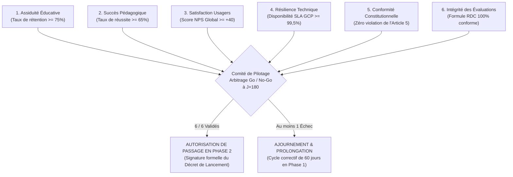

# Module 290 — Jalons datés de la phase pilote et critères de passage à l'échelle

> **Positionnement :** Tome 16 — Feuille de Route de Lancement et Conduite du Changement
> Module 13 sur 16 | Référence : ELLYSIUM-T16-M290
> **Autorité :** Comité de Pilotage / Direction Générale
> **Liaison amont :** Module 289 — Gestion de la résistance au changement : ateliers et médiation
> **Liaison aval :** Module 291 — Plan de communication interne pendant le déploiement

---

## 1. Objet

L'expérimentation pilote ne peut s'éterniser indéfiniment sans conclusions fermes, pas plus qu'elle ne saurait autoriser un passage prématuré à l'échelle sans vérification méticuleuse de ses résultats. Pour concilier rigueur scientifique et impératif de livraison, la Phase 1 est encadrée par un **calendrier de jalons datés incompressibles (J0 à J+180)** et une **grille de critères d'arbitrage (Gatekeeping Go/No-Go)**.

Ce module fixe les échéances temporelles précises de l'expérimentation pilote dans les 10 établissements partenaires et formalise les seuils quantitatifs que la plateforme doit obligatoirement franchir avant tout déploiement de masse.

---

## 2. Chronogramme Détaillé des Jalons Datés (J0 à J+180)

```mermaid
gantt
    title Rétroplanning Cadencé de la Phase Pilote (6 Mois Scolaires)
    dateFormat X
    axisFormat J%+d

    section Lancement & Stabilisation
    J0 : Rentrée Pilote & Début des Cours            :milestone, j0, 0, 0
    J+30 : Revue de Stabilisation Technique         :crit, j30, 0, 30
    section Évaluations Continues
    J+60 : 1er Bilan d'Assiduité & Devoirs          :active, j60, 30, 60
    J+90 : Revue Mi-Parcours COPIL & Audit Éthique  :crit, j90, 60, 90
    section Épreuves de Résilience
    J+120 : Épreuve de Crash Réseau 72h Sans Fil    :crit, j120, 90, 120
    J+150 : Session Témoin d'Examens Semestriels    :active, j150, 120, 150
    section Clôture & Arbitrage
    J+180 : Délibérations Formule RDC & Bilan COPIL :milestone, j180, 150, 180
```

| Jalon | Échéance | Objectif Vérifiable | Livrable Probant |
|---|---|---|---|
| **J0** | Rentrée officielle | 100 % des 2 600 élèves et 100 enseignants connectés au moins une fois | Registre d'activation Cloud SQL |
| **J+30** | Stabilisation initiale | Taux d'assiduité >= 80 %, 0 perte de données en mode hors-ligne | Rapport d'audit de synchronisation PWA |
| **J+60** | Premier bilan académique | Au moins 3 devoirs formateurs complétés par classe pilote | Tableau de bord de complétion BigQuery |
| **J+90** | Revue de mi-parcours | Audit in situ de la parité filles/garçons (>= 45%) et de la séparation caisse | Procès-verbal contradictoire du COPIL |
| **J+120** | Test de résilience extrême | Simulation de 72 heures de coupure totale d'Internet dans 3 écoles | Rapport de résistance des nœuds locaux |
| **J+150** | Examens finaux pilotes | Passation de l'examen de fin de semestre sous supervision mixte | Relevé des scores bruts chiffrés |
| **J+180** | Délibérations & Clôture | Délibération paritaire selon la formule officielle RDC et décision Go/No-Go | Décret d'autorisation du COPIL |

---

## 3. Matrice des Critères Infranchissables de Passage à l'Échelle (Gatekeeping)

Le passage de la Phase 1 (10 écoles) à la Phase 2 (filière Informatique et 15 000 apprenants) est conditionné à l'obtention simultanée de **6 feux verts absolus** :



---

## 4. Schéma SQL — Registre de Validation des Jalons

```sql
-- Cloud SQL PostgreSQL 16
CREATE TABLE jalons_deploiement_pilote (
    id UUID PRIMARY KEY DEFAULT gen_random_uuid(),
    code_jalon VARCHAR(20) UNIQUE NOT NULL, -- Ex: 'J-0', 'J-30', 'J-90', 'J-180'
    date_theorique DATE NOT NULL,
    date_effective DATE,
    assiduite_reelle_pct NUMERIC(5,2),
    reussite_academique_pct NUMERIC(5,2),
    nps_observe NUMERIC(5,2),
    sla_technique_pct NUMERIC(5,3),
    incidents_ethiques_releves INTEGER DEFAULT 0,
    decision_copil VARCHAR(30) CHECK (decision_copil IN ('VALIDE_GO', 'AJOURNE_RESERVES', 'REFUSE_NOGO')),
    rapport_evaluation_hash_gcs VARCHAR(255) NOT NULL,
    signataire_copil_nom VARCHAR(150) NOT NULL,
    created_at TIMESTAMPTZ DEFAULT NOW()
);

CREATE INDEX idx_jalon_code ON jalons_deploiement_pilote(code_jalon);
CREATE INDEX idx_jalon_decision ON jalons_deploiement_pilote(decision_copil);
```

---

## 5. Verrous Fonctionnels

| ID | Règle | Niveau |
|---|---|---|
| VF-290-01 | Le passage en Phase 2 est strictement interdit si l'un des 6 critères de Gatekeeping n'atteint pas son seuil minimal | CRITIQUE |
| VF-290-02 | Aucun jalon ne peut être validé sans la tenue préalable de la session d'audit contradictoire du COPIL | CRITIQUE |
| VF-290-03 | L'épreuve de résilience hors-ligne de 72h doit prouver une intégrité parfaite des données à 100 % sous Cloud SQL | CRITIQUE |
| VF-290-04 | En cas d'ajournement à J+180, une période de remédiation de 60 jours maximum est octroyée avant réévaluation finale | OBLIGATOIRE |
| VF-290-05 | Les procès-verbaux de passage de jalon sont signés électroniquement par l'ensemble des membres votants du COPIL | OBLIGATOIRE |

---

*Sous-tome rédigé conformément aux Normes documentaires ELLYSIUM — Fondations 04.*
