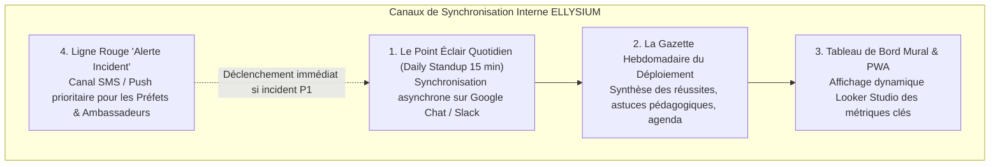
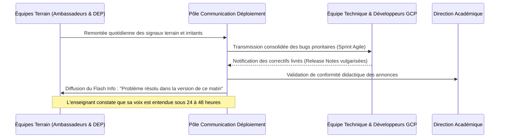
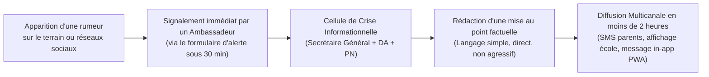

# Module 291 — Plan de communication interne pendant le déploiement

> **Positionnement :** Tome 16 — Feuille de Route de Lancement et Conduite du Changement
> Module 14 sur 16 | Référence : ELLYSIUM-T16-M291
> **Autorité :** Direction de la Communication / Secrétariat Général
> **Liaison amont :** Module 290 — Jalons datés de la phase pilote et critères de passage à l'échelle
> **Liaison aval :** Module 292 — Matrice de risques : identification, mitigation, suivi

---

## 1. Objet

Un déploiement institutionnel impliquant des milliers d'utilisateurs répartis sur plusieurs provinces génère un flux continu d'incidents, de réussites, d'interrogations et d'incompréhensions. Si l'information interne circule mal, les équipes de développement travaillent en déconnexion du terrain, les enseignants se sentent isolés, les directeurs s'inquiètent et les fausses rumeurs prospèrent.

Ce module fixe l'architecture de **communication interne pendant le déploiement**, définit les rituels de synchronisation entre équipes opérationnelles et arrête le protocole de réaction rapide face aux bruits et fausses informations.

---

## 2. Écosystème des Canaux de Communication Interne

L'alignement opérationnel repose sur 4 canaux hiérarchisés selon l'urgence et la granularité du message :

| Dispositif | Fréquence | Cible Principale | Contenu & Objectif |
|---|---|---|---|
| **Point Éclair (Daily Standup)** | Quotidien (8h30) | Équipes techniques, support, coordinateurs terrain | Blocages du jour, correctifs logiciels déployés, métriques de la veille |
| **La Gazette du Déploiement** | Hebdomadaire (Vendredi 16h) | Enseignants, directions, ambassadeurs | Témoignages d'usage, astuces didactiques, palmarès bienveillant |
| **Tableau de Bord Éducatif** | Temps réel (Looker) | Salles des professeurs, administration | Assiduité, nombre de modules complétés, disponibilité réseau |
| **Ligne Rouge Incident** | H24 / 7j/7 | Préfet Numérique, Délégués Provinciaux | Alerte panne électrique majeure, rupture réseau, crise éthique |

---

## 3. Matrice de Synchronisation entre les Pôles Opérationnels

---

## 4. Protocole de Gestion des Rumeurs et Fausses Informations

En milieu scolaire, les rumeurs se propagent à une vitesse critique (ex: *« La plateforme va devenir payante le mois prochain »*, *« Les ordinateurs scannent les messages privés des élèves »*). Pour étouffer toute panique :

---

## 5. Rétroaction et Expression Libre des Équipes

Pour éviter la frustration silencieuse, un canal anonymisé de suggestion est ouvert à tout le personnel enseignant et administratif via Google Forms / Cloud Run. Les questions les plus récurrentes reçoivent une réponse publique chaque semaine dans la section *« Question Franche »* de la Gazette du Déploiement.

---

## 6. Verrous Fonctionnels

| ID | Règle | Niveau |
|---|---|---|
| VF-291-01 | Toute rumeur menaçant la sérénité du déploiement doit recevoir une mise au point officielle en moins de 2 heures | CRITIQUE |
| VF-291-02 | Les notes de version technique (Release Notes) doivent être systématiquement traduites en langage pédagogique clair | CRITIQUE |
| VF-291-03 | Il est formellement interdit de censurer les avis critiques ou interrogations émises dans la boîte à suggestions | OBLIGATOIRE |
| VF-291-04 | La Gazette du Déploiement doit être consultable hors-ligne dans la PWA pour tous les enseignants et directeurs | OBLIGATOIRE |
| VF-291-05 | Les coordonnées d'urgence de la Ligne Rouge doivent être affichées en permanence dans chaque salle de commande pilote | OBLIGATOIRE |

---

*Sous-tome rédigé conformément aux Normes documentaires ELLYSIUM — Fondations 04.*
