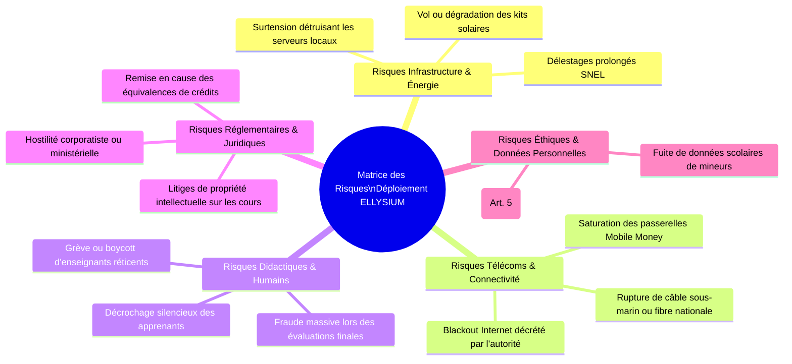
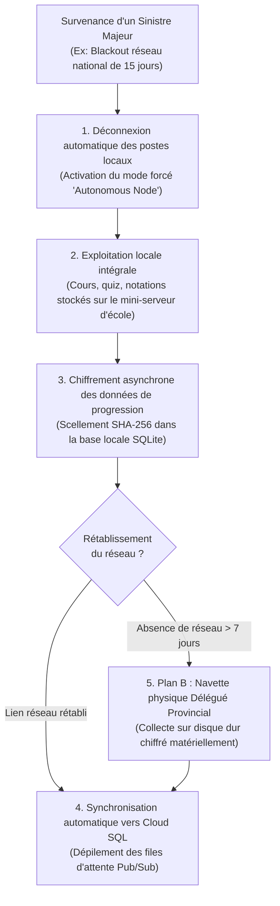

# Module 292 — Matrice de risques : identification, mitigation et suivi continu

> **Positionnement :** Tome 16 — Feuille de Route de Lancement et Conduite du Changement
> Module 15 sur 16 | Référence : ELLYSIUM-T16-M292
> **Autorité :** Direction de la Gestion des Risques / Préfet Numérique
> **Liaison amont :** Module 291 — Plan de communication interne pendant le déploiement
> **Liaison aval :** Module 293 — Dépendances du Tome 16

---

## 1. Objet

Le déploiement d'une infrastructure éducative hybride en République Démocratique du Congo évolue dans un environnement opérationnel à haut degré de volatilité : déficits chroniques d'électricité, connectivité erratique, fragilité logistique, tensions réglementaires et risques de sécurité physique. Ignorer ces périls reviendrait à condamner le projet dès sa première crise.

Ce module formalise la **Matrice Globale des Risques du Déploiement ELLYSIUM**, classe les menaces selon leur indice de criticité ($P \times G$), détaille les contre-mesures techniques et organisationnelles associées et définit les protocoles d'escalade vers le Comité de Pilotage.

---

## 2. Typologie et Cartographie des Risques du Déploiement



---

## 3. Grille de Cotation et Évaluation de la Criticité

L'indice de criticité $C$ est calculé par le produit de la Probabilité ($P \in [1..5]$) et de la Gravité ($G \in [1..5]$) :

$$C = P \times G \quad (\text{Seuil Critique } \ge 15)$$

| Code | Risque Identifié | Prob. (1-5) | Grav. (1-5) | Criticité | Mesure d'Atténuation (Mitigation) Prioritaire |
|---|---|---|---|---|---|
| **R-INF-01** | Coupure d'électricité générale pendant les examens | 5 | 4 | **20 (Critique)** | Onduleurs industriels + batteries solaires LiFePO4 sur tous les nœuds locaux (Module 271) |
| **R-TEL-01** | Coupure totale d'Internet dans une province | 4 | 4 | **16 (Critique)** | Mode 100 % hors-ligne PWA + synchronisation physique par clés chiffrées sécurisées |
| **R-ETH-01** | Prélèvement de frais illicites par un chef d'établissement | 3 | 5 | **15 (Critique)** | Ligne rouge d'alerte SMS parents + suspension immédiate de la convention pilote (Art. 5) |
| **R-DID-01** | Rejet de la plateforme par le corps enseignant local | 3 | 4 | **12 (Élevé)** | Présence permanente des Ambassadeurs + primes de dynamisme pédagogique (Module 289) |
| **R-SEC-01** | Vol de matériel dans une salle informatique pilote | 3 | 4 | **12 (Élevé)** | Blindage physique des salles, gardiennage communautaire et blocage à distance via Google Workspace |
| **R-REG-01** | Retard dans la signature des arrêtés ministériels EPST/ESU | 4 | 3 | **12 (Élevé)** | Déploiement sous statut expérimental conventionné établissement par établissement |
| **R-DAT-01** | Tentative de cyberattaque ou fuite de données élèves | 2 | 5 | **10 (Moyen)** | Chiffrement Cloud KMS, Cloud Armor WAF, isolation IAM stricte sous Google Cloud Platform |

---

## 4. Plan de Continuité d'Activité (PCA) sous Conditions Dégradées



---

## 5. Schéma SQL — Registre Opérationnel des Risques et Alertes

```sql
-- Cloud SQL PostgreSQL 16
CREATE TABLE registre_risques_deploiement (
    id UUID PRIMARY KEY DEFAULT gen_random_uuid(),
    code_risque VARCHAR(20) UNIQUE NOT NULL, -- Ex: 'R-INF-01'
    domaine VARCHAR(30) NOT NULL CHECK (domaine IN ('INFRASTRUCTURE', 'TELECOMS', 'ETHIQUE', 'PEDAGOGIQUE', 'SECURITE', 'REGLEMENTAIRE')),
    intitule_risque VARCHAR(200) NOT NULL,
    probabilite INTEGER NOT NULL CHECK (probabilite BETWEEN 1 AND 5),
    gravite INTEGER NOT NULL CHECK (gravite BETWEEN 1 AND 5),
    criticite INTEGER GENERATED ALWAYS AS (probabilite * gravite) STORED,
    plan_mitigation TEXT NOT NULL,
    responsable_suivi VARCHAR(150) NOT NULL,
    statut_risque VARCHAR(30) DEFAULT 'SURVEILLANCE' CHECK (statut_risque IN ('SURVEILLANCE', 'CRISE_OUVERTE', 'ATTENUE', 'SOLDE')),
    date_derniere_revue DATE NOT NULL,
    created_at TIMESTAMPTZ DEFAULT NOW(),
    updated_at TIMESTAMPTZ DEFAULT NOW()
);

CREATE INDEX idx_risque_criticite ON registre_risques_deploiement(criticite);
CREATE INDEX idx_risque_statut ON registre_risques_deploiement(statut_risque);
```

---

## 6. Verrous Fonctionnels

| ID | Règle | Niveau |
|---|---|---|
| VF-292-01 | Tout risque dont la criticité est >= 15 doit disposer d'un protocole de secours testé in situ avant ouverture d'école | CRITIQUE |
| VF-292-02 | Tout vol de matériel ou intrusion physique dans un établissement pilote doit être signalé au PN en moins de 4 heures | CRITIQUE |
| VF-292-03 | Le Plan de Continuité d'Activité (PCA) hors-ligne doit permettre un fonctionnement scolaire autonome d'au moins 14 jours | CRITIQUE |
| VF-292-04 | La matrice des risques est révisée mensuellement lors des sessions ordinaires du Comité de Pilotage (COPIL) | OBLIGATOIRE |
| VF-292-05 | Les sauvegardes chiffrées des bases de données locales sont répliquées chaque nuit sur un support physique amovible étanche | OBLIGATOIRE |

---

*Sous-tome rédigé conformément aux Normes documentaires ELLYSIUM — Fondations 04.*
