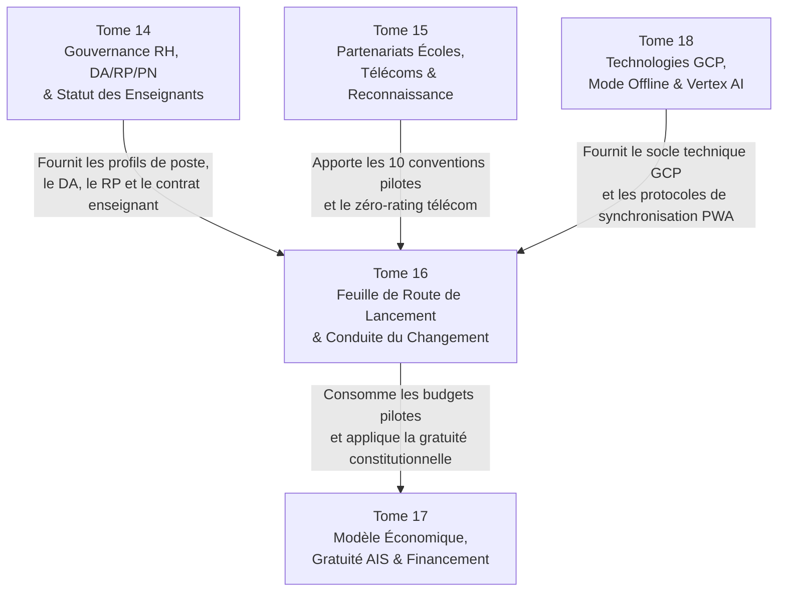

# Module 293 — Dépendances du Tome 16 avec les Tomes 14, 15 et 18

> **Positionnement :** Tome 16 — Feuille de Route de Lancement et Conduite du Changement
> Module 16 sur 16 | Référence : ELLYSIUM-T16-M293
> **Autorité :** Direction Générale ELLYSIUM / Comité de Pilotage
> **Liaison amont :** Module 292 — Matrice de risques : identification, mitigation, suivi
> **Liaison aval :** Tome 17 — Modèle Économique et Pérennité Financière (M294)

---

## 1. Objet

Ce module de synthèse et de clôture scelle l'achèvement complet du **Tome 16** en remplissant deux missions fondamentales :
1. **Établir la matrice des dépendances croisées** reliant la dynamique de lancement et de conduite du changement aux piliers de gouvernance RH (**Tome 14**), aux alliances institutionnelles et télécoms (**Tome 15**), à la souveraineté économique (**Tome 17**) et aux spécifications technologiques approfondies (**Tome 18**).
2. **Dresser le tableau récapitulatif solennel de complétude** des 16 modules constituant le Tome 16.

---

## 2. Matrice Synoptique des Dépendances Inter-Tomes

---

## 3. Analyse Détaillée des Interfaces Critiques

### 3.1 Dépendances avec le Tome 14 (Gouvernance RH et Corps Enseignant)
- **Chaîne de Commandement Opérationnelle (M251) :** Le Directeur Académique (DA), le Responsable Pédagogique (RP) et le Préfet Numérique (PN) siègent au COPIL (M280) et assurent la validation des jalons de passage à l'échelle (M290).
- **Gestion des Conflits et Médiation (M254 / M260) :** Les blocages observés lors de la conduite du changement (M289) sont résolus selon les procédures de médiation et le code de déontologie arrêtés au Tome 14.

### 3.2 Dépendances avec le Tome 15 (Partenariats et Établissements)
- **Conventionnement des Établissements Pilotes (M273 / M282) :** Les 10 écoles de la Phase 1 sont auditées selon la grille de Due Diligence du Module 273 et conventionnées selon l'Accord-Cadre officiel.
- **Accords Télécoms et Zéro-Rating (M270) :** La gratuité des données mobiles indispensables à la Phase 1 et 2 s'appuie directement sur les protocoles de whitelisting négociés au Tome 15.

### 3.3 Dépendances avec le Tome 17 (Modèle Économique)
- **Financement des Phases Pilotes :** Les investissements matériels (kits solaires, serveurs d'école, tablettes) sont budgétisés dans le modèle d'amortissement et de subventions du Tome 17.
- **Préservation de la Gratuité AIS/AIU (Article 4 & 5) :** L'ouverture de la filière Informatique (Phase 2) et des nouvelles filières (Phase 3) respecte rigoureusement l'étanchéité entre caisse et pédagogie.

---

## 4. Tableau Récapitulatif de Complétude — Tome 16

| N° | Titre du Module | Statut |
|---|---|---|
| 278 | Périmètre du Tome 16 – stratégie de déploiement progressif | ✅ COMPLET |
| 279 | Conformité avec la Constitution (déploiement éthique, inclusion) | ✅ COMPLET |
| 280 | Comité de pilotage – composition, rythme des revues | ✅ COMPLET |
| 281 | Phase 0 – conception, tests en laboratoire et pilote interne | ✅ COMPLET |
| 282 | Phase 1 – sélection et déploiement dans 10 établissements pilotes | ✅ COMPLET |
| 283 | Phase 2 – lancement de la filière Informatique indépendante | ✅ COMPLET |
| 284 | Phase 3 – généralisation du SGS et extension des filières | ✅ COMPLET |
| 285 | Programme « Ambassadeurs ELLYSIUM » – formation, certification | ✅ COMPLET |
| 286 | Formation des directions, des enseignants, des apprenants et des parents | ✅ COMPLET |
| 287 | Élaboration des manuels utilisateurs et tutoriels vidéo intégrés | ✅ COMPLET |
| 288 | Boucle de retour d'expérience – sondages NPS, interviews, ajustements agiles | ✅ COMPLET |
| 289 | Gestion de la résistance au changement – ateliers, démonstrations | ✅ COMPLET |
| 290 | Jalons datés de la phase pilote et critères de passage à l'échelle | ✅ COMPLET |
| 291 | Plan de communication interne pendant le déploiement | ✅ COMPLET |
| 292 | Matrice de risques – identification, mitigation, suivi | ✅ COMPLET |
| 293 | Dépendances – avec les Tomes 14, 18, 15 | ✅ COMPLET |

---

## 5. Prochaine Étape : Franchissement vers le Tome 17

Le Tome 16 étant achevé dans sa totalité (16 modules sur 16), l'élaboration de la documentation se poursuit naturellement avec le pilier de viabilité pérenne :

> **TOME 17 — MODÈLE ÉCONOMIQUE ET PÉRENNITÉ FINANCIÈRE**
> Modules 294 à 308 (15 modules)
> Objectif : Établir la doctrine financière, la structure des coûts, le modèle de gratuité pérenne pour les apprenants vulnérables (AIS/AIU), les mécanismes de subventions internationales, la monétisation B2B éthique et la soutenabilité décennale d'ELLYSIUM sans jamais compromettre l'Article 5 de la Constitution.

---

## 6. Verrous Fonctionnels

| ID | Règle | Niveau |
|---|---|---|
| VF-293-01 | Tout déploiement opérationnel doit respecter les interfaces définies avec les Tomes 14, 15, 17 et 18 | CRITIQUE |
| VF-293-02 | Aucune extension de phase ne peut être décidée sans l'accord express du Directeur Financier garantissant la couverture budgétaire | CRITIQUE |
| VF-293-03 | Les dépendances opérationnelles sont réévaluées à chaque réunion plénière trimestrielle du Comité de Pilotage | OBLIGATOIRE |
| VF-293-04 | L'intégrité de la feuille de route du Tome 16 est scellée de manière inaltérable sous Google Cloud Storage | OBLIGATOIRE |
| VF-293-05 | Ce module de dépendances constitue la référence opposable lors de tout audit institutionnel ou ministériel | OBLIGATOIRE |
| VF-293-06 | Chaque jalon est validé par un vote formel du COPIL avant passage à l'étape suivante | OBLIGATOIRE |

---

*Tome 16 — Feuille de Route de Lancement et Conduite du Changement — COMPLET ✅ (16 modules, M278–M293)*

*Sous-tome rédigé conformément aux Normes documentaires ELLYSIUM — Fondations 04.*
