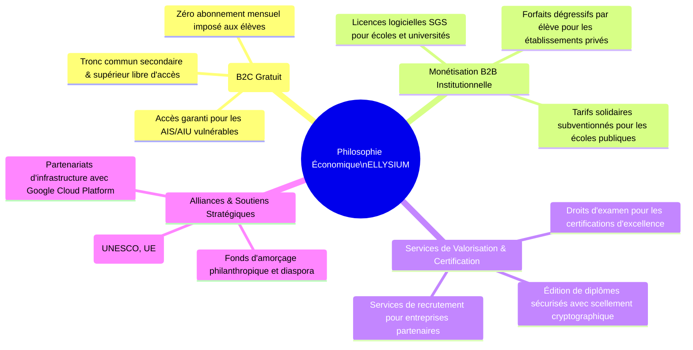
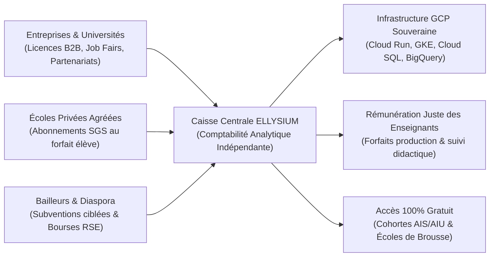

# Module 294 — Périmètre du Tome 17 : philosophie économique et principe de gratuité pour l'apprenant

> **Positionnement :** Tome 17 — Modèle Économique et Pérennité Financière
> Module 1 sur 15 | Référence : ELLYSIUM-T17-M294
> **Autorité :** Direction Financière / Conseil d'Administration
> **Liaison amont :** Tome 16 complet (M278–M293)
> **Liaison aval :** Module 295 — Conformité avec la Constitution (Art. 3 et 5)

---

## 1. Objet

L'écrasante majorité des initiatives numériques éducatives en Afrique subsaharienne échouent sur l'écueil de leur modèle économique : soit elles s'enferment dans une gratuité totale non financée qui s'effondre dès l'épuisement des subventions initiales, soit elles basculent dans une marchandisation prédatrice qui exclut 90 % de la jeunesse démunie par des frais d'abonnement prohibitifs.

Le **Tome 17** établit la doctrine financière et le plan de soutenabilité décennale d'ELLYSIUM. Ce module inaugural pose la **philosophie économique fondatrice de la plateforme** : sanctuariser l'accès gratuit à la connaissance pour tous les apprenants sans distinction, tout en bâtissant un modèle d'affaires hybride, résilient et autosuffisant alimenté par le secteur B2B, les services de certification à haute valeur ajoutée et les partenariats institutionnels.

---

## 2. La Philosophie Économique ELLYSIUM : Le Modèle Hybride Solidaire

---

## 3. Délimitation du Périmètre du Tome 17

Le Tome 17 analyse et encadre chaque flux monétaire de l'institution à travers 4 axes :

| Axe d'Analyse | Modules Concernés | Objectif Stratégique |
|---|---|---|
| **Cadre Doctrinal & Éthique** | M294, M295 | Respect des Articles 3, 4 et 5 constitutionnels et primauté de la mission publique |
| **Structure des Dépenses (OPEX/CAPEX)** | M296, M302 | Optimisation des coûts GCP, maîtrise de l'inférence Vertex AI et rémunération équitable |
| **Génération des Ressources (Revenus)** | M297, M298, M299, M300, M301 | Tarification B2B, grille SGS, services premium et tarification sociale dégressive |
| **Pilotage, Audit & Résilience** | M303, M304, M305, M306, M307, M308 | Projections à 5 ans, seuil de rentabilité, audit comptable et fonds de secours |

---

## 4. Flux Financiers Circulaires et Redistribution

L'économie d'ELLYSIUM fonctionne comme un circuit vertueux de péréquation : les recettes générées auprès des entités solvables subventionnent directement l'accès universel des plus pauvres :

---

## 5. Verrous Fonctionnels

| ID | Règle | Niveau |
|---|---|---|
| VF-294-01 | L'accès aux cours du tronc commun et aux ressources d'apprentissage de base est inconditionnellement gratuit pour tout apprenant | CRITIQUE |
| VF-294-02 | Aucun apprenant ne peut se voir refuser l'accès aux cours pour des raisons d'insolvabilité personnelle | CRITIQUE |
| VF-294-03 | Les revenus B2B issus des établissements privés solvables doivent financer au moins 40 % des coûts opérationnels d'infrastructure | CRITIQUE |
| VF-294-04 | L'intégralité des flux financiers entrants et sortants fait l'objet d'un suivi comptable analytique certifié sous Cloud SQL | OBLIGATOIRE |
| VF-294-05 | Tout excédent budgétaire annuel est obligatoirement réinvesti dans la dotation en matériel des zones scolaires défavorisées | OBLIGATOIRE |
| VF-294-06 | Aucun modèle économique ne peut introduire de barrière monétaire à l'accès aux connaissances fondamentales | CONSTITUTIONNEL |

---

*Sous-tome rédigé conformément aux Normes documentaires ELLYSIUM — Fondations 04.*
