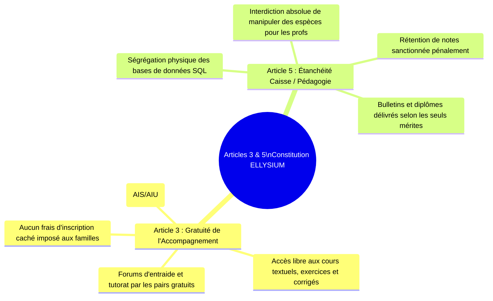
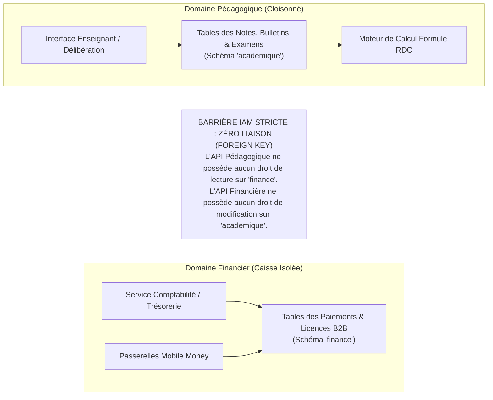

# Module 295 — Conformité avec la Constitution : gratuité de l'accompagnement et étanchéité financière (Articles 3 et 5)

> **Positionnement :** Tome 17 — Modèle Économique et Pérennité Financière
> Module 2 sur 15 | Référence : ELLYSIUM-T17-M295
> **Autorité :** Direction Juridique / Comité d'Éthique Financière
> **Liaison amont :** Module 294 — Périmètre du Tome 17 : philosophie économique
> **Liaison aval :** Module 296 — Structure des coûts (infrastructure, RH, développement)

---

## 1. Objet

Les dérives financières constituent le poison mortel de l'éducation en Afrique : marchandage des notes, frais arbitraires imposés aux familles à la veille des examens, rétention illégale des bulletins scolaires et exclusion brutale des enfants de la salle de classe pour des arriérés minimes de scolarité.

La **Constitution ELLYSIUM** a érigé deux verrous inaltérables pour briser définitivement cette spirale :
- **L'Article 3 :** La gratuité absolue de l'accès aux cours fondamentaux, de l'accompagnement didactique et des devoirs formatifs pour tout apprenant.
- **L'Article 5 :** La séparation étanche et inviolable entre la gestion financière (Caisse) et l'évaluation académique (Pédagogie).

Ce module détaille la traduction technique, juridique et algorithmique de ces deux impératifs dans le système d'information et les contrats d'ELLYSIUM.

---

## 2. Décomposition Constitutionnelle des Articles 3 et 5



---

## 3. Ségrégation Cryptographique et Cloisonnement des Données

Pour rendre la coercition financière techniquement impossible, le modèle de données applique une cloison étanche au niveau du moteur PostgreSQL Cloud SQL et de la gestion des identités Google Cloud IAM :



---

## 4. Politique de Tolérance Zéro contre la Rétention de Bulletins

Dans les établissements partenaires utilisant le Système de Gestion Scolaire (SGS) :
1. **Délivrance Automatique des Bulletins :** Dès la clôture de la délibération officielle, le bulletin numérique scellé est rendu accessible directement sur le portail de l'élève et de ses parents.
2. **Impossibilité de Blocage Manuel :** Aucun bouton ou paramètre d'administration ne permet au chef d'établissement de bloquer l'affichage d'un bulletin pour motif d'impayé.
3. **Poursuites Disciplinaires et Pénales :** Tout gestionnaire local exigeant des espèces sous la table ou confisquant un terminal d'élève est immédiatement exclu du réseau et déféré devant la justice compétente.

---

## 5. Schéma SQL — Sécurité d'Isolation par Rôles IAM (PostgreSQL)

```sql
-- Cloud SQL PostgreSQL 16
-- Création des schémas étanches
CREATE SCHEMA IF NOT EXISTS schema_academique;
CREATE SCHEMA IF NOT EXISTS schema_finance;

-- Rôles applicatifs distincts
CREATE ROLE role_service_pedagogique NOINHERIT;
CREATE ROLE role_service_finance NOINHERIT;

-- Attribution exclusive des privilèges
GRANT USAGE ON SCHEMA schema_academique TO role_service_pedagogique;
GRANT ALL PRIVILEGES ON ALL TABLES IN SCHEMA schema_academique TO role_service_pedagogique;

GRANT USAGE ON SCHEMA schema_finance TO role_service_finance;
GRANT ALL PRIVILEGES ON ALL TABLES IN SCHEMA schema_finance TO role_service_finance;

-- VERROU ABSOLU : Révocation formelle de tout accès croisé
REVOKE ALL PRIVILEGES ON SCHEMA schema_finance FROM role_service_pedagogique;
REVOKE ALL PRIVILEGES ON SCHEMA schema_academique FROM role_service_finance;
```

---

## 6. Verrous Fonctionnels

| ID | Règle | Niveau |
|---|---|---|
| VF-295-01 | Il est techniquement et contractuellement impossible de conditionner la remise d'un bulletin scolaire au paiement de frais locaux | CRITIQUE |
| VF-295-02 | Le schéma de données financier est hermétiquement séparé du schéma académique sous Cloud SQL avec interdiction de jointure directe | CRITIQUE |
| VF-295-03 | L'accès aux cours, exercices et examens du tronc commun est garanti à vie et sans frais pour tous les apprenants inscrits | CRITIQUE |
| VF-295-04 | Aucun enseignant ou membre du personnel académique n'a le droit de collecter des fonds ou de gérer des caisses locales | CRITIQUE |
| VF-295-05 | Tout établissement partenaire surpris en train de retenir un bulletin pour motif financier voit sa convention révoquée sous 24h | CRITIQUE |
| VF-295-06 | Aucun modèle économique ne peut introduire de barrière monétaire à l'accès aux connaissances fondamentales | CONSTITUTIONNEL |

---

*Sous-tome rédigé conformément aux Normes documentaires ELLYSIUM — Fondations 04.*
