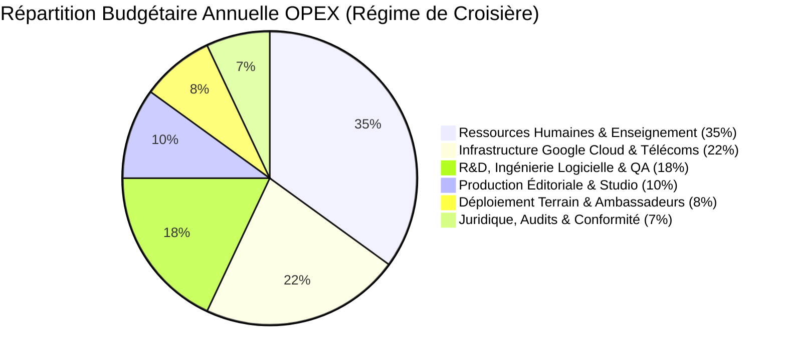
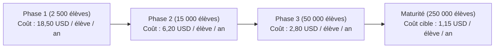
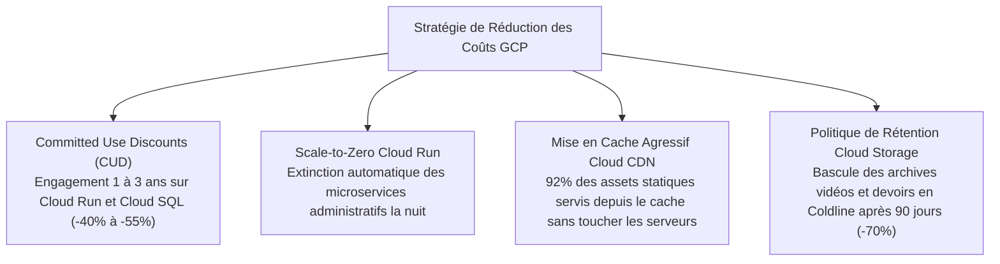

# Module 296 — Structure des coûts : infrastructure, RH, développement, marketing, juridique et contenus

> **Positionnement :** Tome 17 — Modèle Économique et Pérennité Financière
> Module 3 sur 15 | Référence : ELLYSIUM-T17-M296
> **Autorité :** Direction Financière / Direction des Opérations
> **Liaison amont :** Module 295 — Conformité avec la Constitution (Art. 3 et 5)
> **Liaison aval :** Module 297 — Sources de revenus : licences B2B aux établissements

---

## 1. Objet

Pour pérenniser le principe constitutionnel de gratuité absolue pour les apprenants vulnérables (AIS/AIU), ELLYSIUM doit maintenir une discipline budgétaire d'une rigueur chirurgicale. Chaque dollar dépensé doit être justifié par son impact pédagogique direct et son efficience technique.

Ce module détaille la **structure analytique intégrale des coûts d'ELLYSIUM**, segmente les investissements d'amorçage (CAPEX) et les charges récurrentes d'exploitation (OPEX) à travers 6 centres de coûts majeurs, modélise le coût de revient unitaire par apprenant actif et formalise les leviers d'optimisation financière au sein de l'environnement Google Cloud Platform.

---

## 2. Répartition Analytique des Charges d'Exploitation (OPEX)

La structure des coûts en régime de croisière (Phase 3) se répartit selon 6 centres de coûts équilibrés :



| Centre de Coûts | Composantes Principales | Nature | Facteur d'Échelle (Cost Driver) |
|---|---|---|---|
| **1. Ressources Humaines & Pédagogie** | Salaires DA, RP, PN, forfait de production enseignants, vacations, support L1/L2 | Fixe & Variable | Nombre de filières ouvertes & volume d'élèves |
| **2. Infrastructure GCP & Télécoms** | GKE Autopilot, Cloud SQL, BigQuery, Cloud Storage, Cloud Armor, CDN, reverse-billing data | Variable pur | Nombre de requêtes HTTP, stockage vidéo & bande passante |
| **3. R&D et Ingénierie Logicielle** | Développeurs backend/frontend, ingénieurs SRE, architectes cloud, maintenance PWA | Fixe | Complexité des fonctionnalités & feuille de route |
| **4. Production Éditoriale & Contenus** | Studio d'enregistrement, montage vidéo, licences logicielles créatives, validation scientifique | Semi-variable | Nombre de nouveaux modules rédigés chaque année |
| **5. Déploiement Terrain & Ambassadeurs** | Équipement kits solaires, serveurs d'école, indemnités de mission, manuels imprimés | Semi-variable | Nombre d'établissements partenaires actifs |
| **6. Juridique, Audits & Accréditation** | Frais d'homologation CAMES/ESU, commissariat aux comptes, dépôts de marques, DPA | Fixe | Jalons réglementaires annuels |

---

## 3. Modélisation du Coût Unitaire par Apprenant Actif

L'optimisation continue du socle logiciel permet de réaliser d'immenses économies d'échelle :



### 3.1 Décomposition du Coût Marginal par Apprenant (Phase 3)
- **Hébergement GCP & Base de Données :** 0,45 USD / an (grâce à la mise en cache PWA et au Cloud Run auto-scaling).
- **Consommation Inférence IA (Vertex AI) :** 0,25 USD / an (modèle hybride Gemini Flash avec mise en cache de prompts).
- **Zéro-Rating Télécom Négocié :** 0,30 USD / an (volumes data négociés en gros avec les opérateurs).
- **Support & Encadrement de Proximité :** 0,15 USD / an (absorbé par le réseau des ambassadeurs bénévoles).
- **TOTAL MARGINAL :** **1,15 USD / an par apprenant actif**.

---

## 4. Leviers d'Optimisation des Coûts GCP

Pour maintenir l'infrastructure Google Cloud dans une enveloppe financière prévisible :



---

## 5. Schéma SQL — Suivi Budgétaire Analytique des Dépenses

```sql
-- Cloud SQL PostgreSQL 16 (Schéma finance)
CREATE TABLE schema_finance.centre_couts_depenses (
    id UUID PRIMARY KEY DEFAULT gen_random_uuid(),
    code_analytique VARCHAR(30) NOT NULL CHECK (code_analytique IN (
        'CC-01-RH-PEDAGOGIE', 'CC-02-INFRA-GCP', 'CC-03-RD-LOGICIEL',
        'CC-04-PRODUCTION-EDITORIALE', 'CC-05-TERRAIN-AMBASSADEURS', 'CC-06-JURIDIQUE-AUDIT'
    )),
    exercice_annee INTEGER NOT NULL,
    mois INTEGER NOT NULL CHECK (mois BETWEEN 1 AND 12),
    montant_prevu_usd NUMERIC(12,2) NOT NULL,
    montant_reel_usd NUMERIC(12,2) NOT NULL,
    ecart_usd NUMERIC(12,2) GENERATED ALWAYS AS (montant_reel_usd - montant_prevu_usd) STORED,
    justification_depassement TEXT,
    facture_gcs_hash VARCHAR(255) NOT NULL,
    valide_par_direction_financiere BOOLEAN NOT NULL DEFAULT FALSE,
    created_at TIMESTAMPTZ DEFAULT NOW()
);

CREATE INDEX idx_couts_code ON schema_finance.centre_couts_depenses(code_analytique);
CREATE INDEX idx_couts_exercice ON schema_finance.centre_couts_depenses(exercice_annee);
```

---

## 6. Verrous Fonctionnels

| ID | Règle | Niveau |
|---|---|---|
| VF-296-01 | Le coût marginal technique par apprenant actif ne doit jamais dépasser 1,50 USD / an en vitesse de croisière | CRITIQUE |
| VF-296-02 | Tout dépassement supérieur à 10 % sur un centre de coûts mensuel déclenche un gel immédiat des dépenses non essentielles | CRITIQUE |
| VF-296-03 | L'infrastructure d'hébergement doit exclusivement exploiter les services managés GCP à coût optimisé (CUD, Autoscaling) | CRITIQUE |
| VF-296-04 | La masse salariale pédagogique et les forfaits d'enseignants doivent représenter au minimum 30 % des dépenses globales OPEX | OBLIGATOIRE |
| VF-296-05 | L'audit analytique des coûts est réconcilié mensuellement avec la facturation réelle Google Cloud Billing sous BigQuery | OBLIGATOIRE |

---

*Sous-tome rédigé conformément aux Normes documentaires ELLYSIUM — Fondations 04.*
