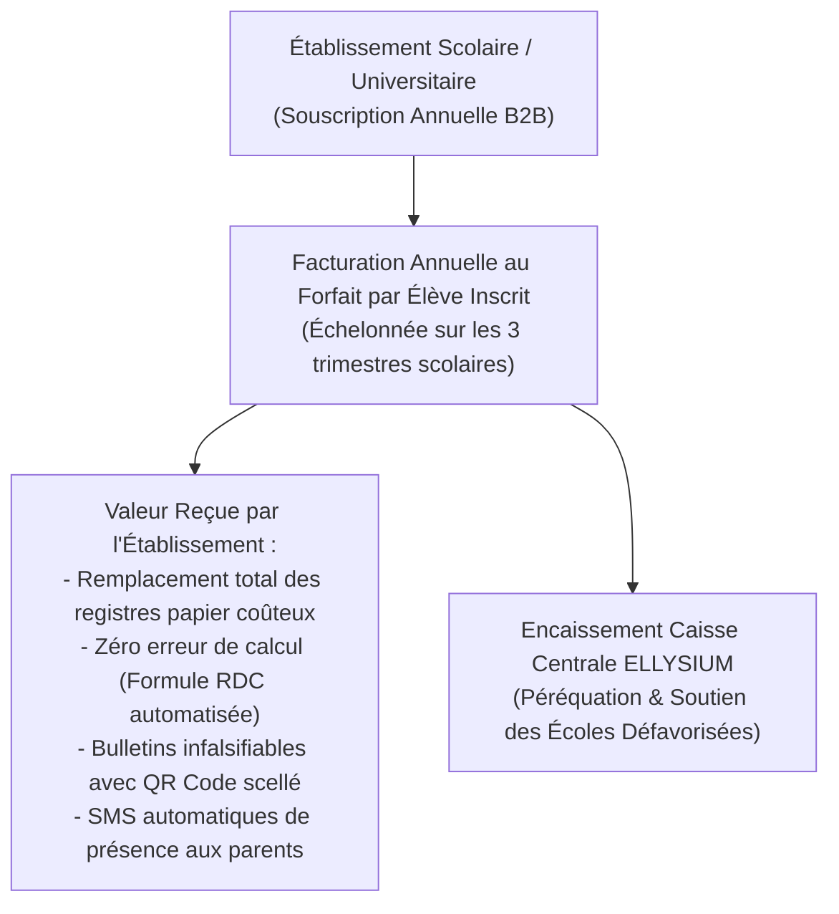
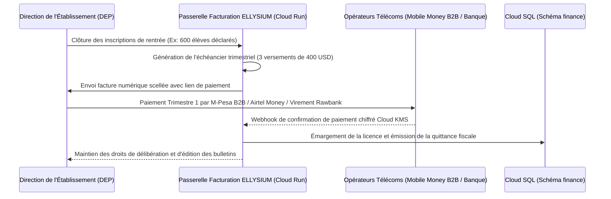

# Module 297 — Sources de revenus : licences B2B aux établissements (forfait par élève)

> **Positionnement :** Tome 17 — Modèle Économique et Pérennité Financière
> Module 4 sur 15 | Référence : ELLYSIUM-T17-M297
> **Autorité :** Direction Commerciale B2B / Direction Financière
> **Liaison amont :** Module 296 — Structure des coûts : infrastructure, RH et développement
> **Liaison aval :** Module 298 — Sources de revenus : services premium

---

## 1. Objet

L'architecture économique d'ELLYSIUM repose sur un principe cardinal : **faire payer les institutions solvables pour garantir la gratuité des apprenants vulnérables**. Plutôt que de prélever des micro-paiements anxiogènes auprès des familles d'élèves, ELLYSIUM commercialise son **Système de Gestion Scolaire (SGS)** directement auprès des directions d'écoles, collèges, lycées et universités sous forme de **licence logicielle annuelle B2B indexée sur l'effectif scolaire réel (forfait par élève)**.

Ce module définit la typologie des licences B2B, la grille tarifaire par catégorie d'établissement, les modalités de facturation dématérialisée et les garanties contractuelles interdisant aux écoles de répercuter des surfacturations indues sur les parents.

---

## 2. Le Modèle de Licence B2B au Forfait Élève

L'établissement ne paie pas pour le droit d'étudier de l'élève (qui demeure gratuit), mais pour le **service logiciel d'administration, de délibération automatisée, d'impression sécurisée des bulletins et de communication parentale** :



---

## 3. Grille Tarifaire B2B par Segment d'Établissement

| Formule de Licence | Profil d'Établissement | Tarif Annuel par Élève | Services Inclus |
|---|---|---|---|
| **Excellence & International** | Écoles privées de prestige, lycées consulaires, universités privées | 3,50 à 5,00 USD / an | SGS illimité, passerelle SMS parents dédiée, analytics Looker prédictifs, support VIP L2 sous 2h |
| **Privé Standard Urbain** | Complexes scolaires privés conventionnés des grandes villes | 1,50 à 2,50 USD / an | SGS complet, carnet de notes numérique, bulletins scellés, mode hors-ligne, support sous 24h |
| **Public & Conventionné Solidaire** | Écoles publiques EPST, collèges conventionnés confessionnels | 0,50 à 1,00 USD / an | SGS essentiel, bulletins officiels, nœud de cache local, subventionné par mécénat / ONG |
| **Inclusion Rurale / Urgence** | Écoles de brousse, zones de conflit, camps de réfugiés | **0,00 USD (Gratuité Totale)** | Pris en charge à 100 % par le fonds de péréquation ELLYSIUM (Module 301) |

---

## 4. Modalités de Facturation et Encaissement Dématérialisé

Pour s'adapter à la réalité de la trésorerie des écoles congolaises :



---

## 5. Schéma SQL — Gestion des Contrats et Licences B2B

```sql
-- Cloud SQL PostgreSQL 16 (Schéma finance)
CREATE TABLE schema_finance.contrats_licences_b2b (
    id UUID PRIMARY KEY DEFAULT gen_random_uuid(),
    numero_contrat VARCHAR(50) UNIQUE NOT NULL, -- Ex: 'LIC-B2B-KIN-2026-0182'
    etablissement_id UUID NOT NULL,
    segment_tarifaire VARCHAR(30) NOT NULL CHECK (segment_tarifaire IN ('EXCELLENCE', 'STANDARD_PRIVE', 'SOLIDAIRE_PUBLIC', 'EXEMPTION_RURALE')),
    effectif_eleves_declares INTEGER NOT NULL CHECK (effectif_eleves_declares > 0),
    tarif_unitaire_usd NUMERIC(6,2) NOT NULL,
    montant_total_annuel_usd NUMERIC(10,2) GENERATED ALWAYS AS (effectif_eleves_declares * tarif_unitaire_usd) STORED,
    annee_scolaire VARCHAR(10) NOT NULL, -- Ex: '2026-2027'
    date_signature DATE NOT NULL,
    statut_licence VARCHAR(30) DEFAULT 'ACTIVE' CHECK (statut_licence IN ('ACTIVE', 'ARRIERES', 'SUSPENDUE', 'GRACIEUSE')),
    conditions_particulieres TEXT,
    contrat_pdf_hash_gcs VARCHAR(255) NOT NULL,
    created_at TIMESTAMPTZ DEFAULT NOW(),
    updated_at TIMESTAMPTZ DEFAULT NOW()
);

CREATE TABLE schema_finance.echeances_b2b (
    id UUID PRIMARY KEY DEFAULT gen_random_uuid(),
    contrat_id UUID NOT NULL REFERENCES schema_finance.contrats_licences_b2b(id),
    numero_tranche INTEGER NOT NULL CHECK (numero_tranche IN (1, 2, 3)),
    montant_tranche_usd NUMERIC(10,2) NOT NULL,
    date_exigibilite DATE NOT NULL,
    statut_paiement VARCHAR(20) DEFAULT 'EN_ATTENTE' CHECK (statut_paiement IN ('EN_ATTENTE', 'PAYE', 'RETARD', 'EXONERE')),
    reference_transaction_mno VARCHAR(100),
    date_reglement TIMESTAMPTZ,
    created_at TIMESTAMPTZ DEFAULT NOW()
);

CREATE INDEX idx_licence_etab ON schema_finance.contrats_licences_b2b(etablissement_id);
CREATE INDEX idx_licence_annee ON schema_finance.contrats_licences_b2b(annee_scolaire);
```

---

## 6. Verrous Fonctionnels

| ID | Règle | Niveau |
|---|---|---|
| VF-297-01 | Il est formellement interdit à un établissement de facturer une ligne « Frais ELLYSIUM » distincte sur le minerval des parents | CRITIQUE |
| VF-297-02 | Le tarif de la licence par élève ne peut en aucun cas excéder 5,00 USD par an, quel que soit le prestige de l'établissement | CRITIQUE |
| VF-297-03 | Tout retard de paiement de la direction d'une école ne peut en aucun cas entraîner le blocage des accès des élèves ou la retenue de leurs notes | CRITIQUE |
| VF-297-04 | Les établissements situés en zone de grande précarité ou en milieu rural isolé bénéficient d'une licence gracieuse à 0 USD | CRITIQUE |
| VF-297-05 | 100 % des encaissements B2B sont centralisés sous Cloud SQL et réconciliés quotidiennement avec les relevés bancaires officiels | OBLIGATOIRE |

---

*Sous-tome rédigé conformément aux Normes documentaires ELLYSIUM — Fondations 04.*
