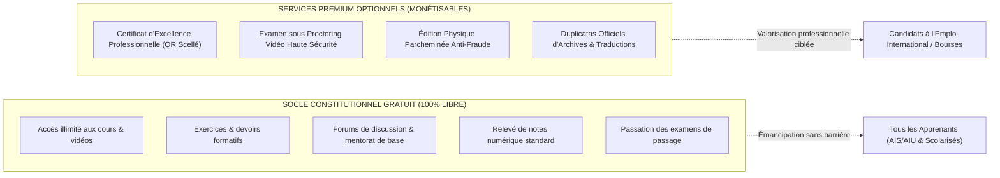
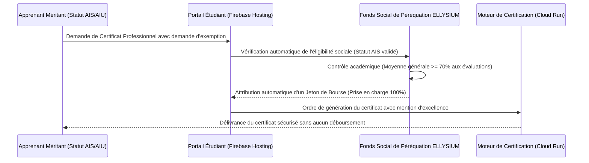

# Module 298 — Sources de revenus : services premium (certificats, proctoring avancé, duplicatas)

> **Positionnement :** Tome 17 — Modèle Économique et Pérennité Financière
> Module 5 sur 15 | Référence : ELLYSIUM-T17-M298
> **Autorité :** Direction des Certifications / Direction Financière
> **Liaison amont :** Module 297 — Sources de revenus : licences B2B aux établissements
> **Liaison aval :** Module 299 — Sources de revenus : partenariats, subventions, Mobile Money

---

## 1. Objet

Pour diversifier ses ressources sans violer le pacte de gratuité éducative de l'Article 3, ELLYSIUM a conçu une gamme de **services optionnels à haute valeur ajoutée (Services Premium)**. Ces prestations ne concernent jamais le droit d'apprendre, de suivre les cours ou de passer les évaluations ordinaires (qui demeurent gratuits pour tous), mais s'adressent aux apprenants et diplômés souhaitant valoriser leurs compétences auprès d'employeurs internationaux ou d'universités étrangères.

Ce module fixe le catalogue des services premium monétisables, la structure tarifaire modérée, les modalités d'exemption sociale automatique et l'infrastructure technique de délivrance dématérialisée sous Google Cloud Platform.

---

## 2. Distinction Éthique : Socle Gratuit vs Services Premium



---

## 3. Catalogue et Grille Tarifaire des Services Premium

| Service Premium | Description & Valeur Ajoutée | Tarif Unitaire | Modalité d'Octroi |
|---|---|---|---|
| **Certificat Professionnel Numérique** | Certificat officiel de compétences avec empreinte SHA-256 et URL de vérification publique Firebase | 5,00 à 10,00 USD | Généré instantanément après soutenance ou réussite d'examen |
| **Session d'Examen sous Proctoring Avancé** | Surveillance vidéo et audio biométrique continue assistée par Vertex AI avec validation d'un surveillant humain | 15,00 USD | Obligatoire uniquement pour les doubles diplômes universitaires |
| **Parchemin Physique Sécurisé** | Diplôme cartonné grand format avec filigrane infalsifiable, sceau gaufré et livraison sécurisée | 12,00 USD | Expédié en point relais postal ou remis lors des collations de grades |
| **Duplicatas d'Archives Officiels** | Réédition certifiée conforme de relevés de notes anciens (au-delà du premier exemplaire gratuit) | 3,00 USD | Traitement sous 48h ouvrées |
| **Traduction Académique Anglais/Français** | Traduction officielle assermentée des relevés de notes pour les universités du Commonwealth | 15,00 USD | Réalisée par le pôle linguistique certifié |

---

## 4. Dispositif de Bourse d'Exemption Sociale (Gratuité Garantie)

Conformément à l'Article 4 de la Constitution, aucun apprenant ne doit être privé d'un certificat d'excellence en raison de sa précarité financière :



---

## 5. Schéma SQL — Commandes et Délivrance des Services Premium

```sql
-- Cloud SQL PostgreSQL 16 (Schéma finance)
CREATE TABLE schema_finance.commandes_services_premium (
    id UUID PRIMARY KEY DEFAULT gen_random_uuid(),
    numero_recu VARCHAR(50) UNIQUE NOT NULL, -- Ex: 'REC-PREM-2026-0941'
    apprenant_id UUID NOT NULL,
    type_service VARCHAR(40) NOT NULL CHECK (type_service IN (
        'CERTIFICAT_NUMERIQUE', 'PROCTORING_AVANCE', 'PARCHEMIN_PHYSIQUE',
        'DUPLICATA_ARCHIVE', 'TRADUCTION_OFFICIELLE'
    )),
    montant_nominal_usd NUMERIC(6,2) NOT NULL,
    montant_paye_usd NUMERIC(6,2) NOT NULL DEFAULT 0.00,
    est_bourse_sociale BOOLEAN NOT NULL DEFAULT FALSE,
    moyen_paiement VARCHAR(30) CHECK (moyen_paiement IN ('VODACOM_MPESA', 'AIRTEL_MONEY', 'ORANGE_MONEY', 'CARTE_BANCAIRE', 'BOURSE_SOLIDAIRE')),
    reference_transaction_mno VARCHAR(100),
    statut_commande VARCHAR(30) DEFAULT 'EN_TRAITEMENT' CHECK (statut_commande IN ('EN_ATTENTE', 'PAYE', 'LIVRE', 'REMBOURSE')),
    document_scelle_hash_gcs VARCHAR(255) NOT NULL,
    date_commande TIMESTAMPTZ DEFAULT NOW(),
    date_delivrance TIMESTAMPTZ
);

CREATE INDEX idx_premium_apprenant ON schema_finance.commandes_services_premium(apprenant_id);
CREATE INDEX idx_premium_type ON schema_finance.commandes_services_premium(type_service);
```

---

## 6. Verrous Fonctionnels

| ID | Règle | Niveau |
|---|---|---|
| VF-298-01 | La souscription aux services premium est strictement facultative et ne conditionne en rien la validation du cursus de base | CRITIQUE |
| VF-298-02 | Tout apprenant titulaire d'un statut AIS/AIU ayant une moyenne >= 70 % a droit à la gratuité intégrale de son certificat officiel | CRITIQUE |
| VF-298-03 | Les tarifs des services premium sont plafonnés et révisés annuellement par décision souveraine du Conseil d'Administration | OBLIGATOIRE |
| VF-298-04 | 100 % des certificats numériques émis sont enregistrés avec leur empreinte cryptographique SHA-256 dans Google Cloud Storage | OBLIGATOIRE |
| VF-298-05 | L'intégrité de la vérification publique d'un diplôme via QR Code doit être garantie H24 avec un SLA de 99,9 % sur Firebase Hosting | CRITIQUE |
| VF-298-06 | Aucun modèle économique ne peut introduire de barrière monétaire à l'accès aux connaissances fondamentales | CONSTITUTIONNEL |

---

*Sous-tome rédigé conformément aux Normes documentaires ELLYSIUM — Fondations 04.*
