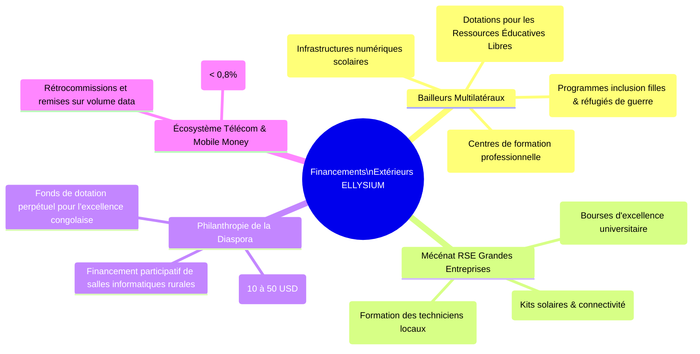
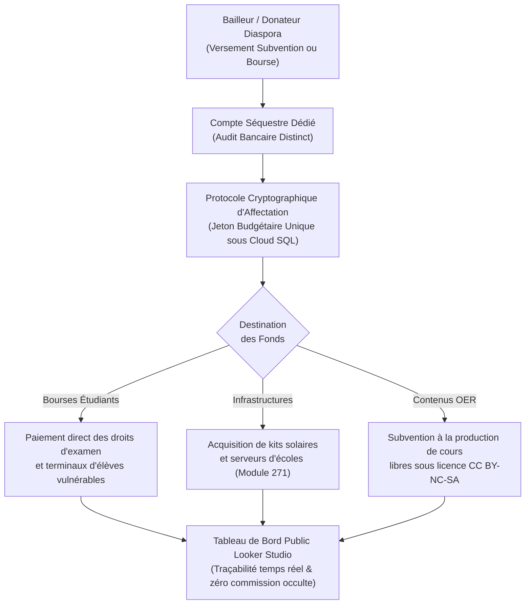

# Module 299 — Sources de revenus : partenariats institutionnels, subventions et écosystème Mobile Money

> **Positionnement :** Tome 17 — Modèle Économique et Pérennité Financière
> Module 6 sur 15 | Référence : ELLYSIUM-T17-M299
> **Autorité :** Direction des Partenariats Financiers / Trésorerie
> **Liaison amont :** Module 298 — Sources de revenus : services premium
> **Liaison aval :** Module 300 — Grille tarifaire du SGS : forfaits et options

---

## 1. Objet

Pour accélérer son expansion sans faire peser le coût des investissements matériels et de connectivité sur les écoles partenaires, ELLYSIUM mobilise un troisième pilier de financement majeur : **les subventions multilatérales, le mécénat d'entreprise (RSE), la philanthropie de la diaspora et les synergies économiques avec les opérateurs de Mobile Money**.

Ce module définit les règles d'acceptation éthique des fonds extérieurs, la structuration des programmes de bourses fléchées, les modèles d'accords télécoms négociés à tarification préférentielle et les mécanismes de traçabilité cryptographique garantissant une transparence absolue envers les bailleurs.

---

## 2. Typologie des Financements Institutionnels et Solidaires



---

## 3. Mécanisme de Fléchage et Étanchéité des Subventions

Pour respecter scrupuleusement la volonté des donateurs tout en interdisant toute dérive de captation d'intérêts :



---

## 4. Partenariats Mobile Money : Négociation de Tarifs Solidaires

Le Mobile Money (M-Pesa, Airtel Money, Orange Money, Afrimoney) représente plus de 85 % des transactions monétaires en RDC. ELLYSIUM négocie un statut institutionnel spécifique auprès de la Banque Centrale du Congo (BCC) et des opérateurs :

| Dimension Financière | Pratique Commerciale Standard | Accord Négocié ELLYSIUM | Impact pour la Plateforme |
|---|---|---|---|
| **Frais de Transaction C2B** | 2,5 % à 4,0 % du montant | **Plafonné à 0,8 %** | Économie annuelle de dizaines de milliers d'USD |
| **Reverse-Billing Data** | Facturation au mégaoctet public | **Tarif de gros subventionné (-60%)** | Démultiplication de la portée du zéro-rating |
| **Rétrocommission Opérateur** | 0 % | **Reversement RSE de 10% des flux** | Alimentation directe du fonds de bourses d'élèves |
| **Délai de Compensation (Settlement)** | J+3 à J+7 | **J+1 automatisé vers compte séquestre** | Fluidité optimale de la trésorerie opérationnelle |

---

## 5. Schéma SQL — Traçabilité des Bourses et Subventions Bailleurs

```sql
-- Cloud SQL PostgreSQL 16 (Schéma finance)
CREATE TABLE schema_finance.subventions_bailleurs_partenaires (
    id UUID PRIMARY KEY DEFAULT gen_random_uuid(),
    bailleur_nom VARCHAR(255) NOT NULL,
    type_bailleur VARCHAR(50) NOT NULL CHECK (type_bailleur IN ('MULTILATERAL', 'FONDATION_RSE', 'DIASPORA_COLLECTIF', 'GOUVERNEMENTAL')),
    intitule_convention VARCHAR(255) NOT NULL,
    montant_total_octroye_usd NUMERIC(12,2) NOT NULL,
    montant_disponible_usd NUMERIC(12,2) NOT NULL,
    date_signature DATE NOT NULL,
    date_cloture DATE NOT NULL,
    affectation_exclusive VARCHAR(50) NOT NULL CHECK (affectation_exclusive IN ('BOURSES_ELEVES', 'EQUIPEMENT_SOLAIRE', 'CONTENUS_LIBRES', 'CONNECTIVITE')),
    taux_frais_gestion_pct NUMERIC(4,2) DEFAULT 0.00 CHECK (taux_frais_gestion_pct <= 5.00), -- Plafond éthique à 5%
    rapport_audit_gcs_hash VARCHAR(255) NOT NULL,
    created_at TIMESTAMPTZ DEFAULT NOW(),
    updated_at TIMESTAMPTZ DEFAULT NOW()
);

CREATE TABLE schema_finance.allocations_bourses_eleves (
    id UUID PRIMARY KEY DEFAULT gen_random_uuid(),
    subvention_id UUID NOT NULL REFERENCES schema_finance.subventions_bailleurs_partenaires(id),
    apprenant_id UUID NOT NULL,
    montant_alloue_usd NUMERIC(8,2) NOT NULL,
    motif_allocation VARCHAR(100) NOT NULL, -- Ex: 'BOURSE_EXCELLENCE_FILLE', 'EXEMPTION_DEPLACE_GUERRE'
    date_attribution DATE NOT NULL,
    justification_sociale_hash_gcs VARCHAR(255) NOT NULL,
    created_at TIMESTAMPTZ DEFAULT NOW()
);

CREATE INDEX idx_subvention_bailleur ON schema_finance.subventions_bailleurs_partenaires(bailleur_nom);
CREATE INDEX idx_bourse_apprenant ON schema_finance.allocations_bourses_eleves(apprenant_id);
```

---

## 6. Verrous Fonctionnels

| ID | Règle | Niveau |
|---|---|---|
| VF-299-01 | Les frais administratifs prélevés sur une subvention bailleur ne peuvent en aucun cas excéder 5,00 % du montant total | CRITIQUE |
| VF-299-02 | Il est formellement interdit d'accepter une subvention assortie de clauses contraires à la Constitution ELLYSIUM | CRITIQUE |
| VF-299-03 | 100 % des fonds de parrainage de la diaspora doivent être traçables jusqu'à l'apprenant bénéficiaire réel sous Cloud SQL | CRITIQUE |
| VF-299-04 | Les taux de commission Mobile Money négociés avec les opérateurs télécoms ne doivent jamais excéder 1 % par transaction | CRITIQUE |
| VF-299-05 | Les rapports financiers destinés aux bailleurs de fonds sont audités annuellement par un commissaire aux comptes indépendant | OBLIGATOIRE |

---

*Sous-tome rédigé conformément aux Normes documentaires ELLYSIUM — Fondations 04.*
