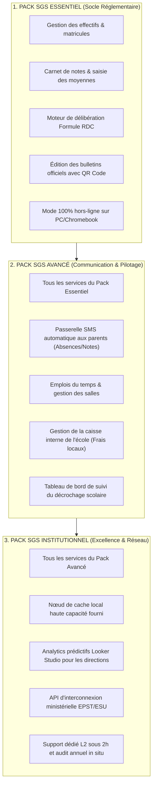

# Module 300 — Grille tarifaire du SGS : forfaits, options et catégories d'établissements

> **Positionnement :** Tome 17 — Modèle Économique et Pérennité Financière
> Module 7 sur 15 | Référence : ELLYSIUM-T17-M300
> **Autorité :** Direction Commerciale / Direction Financière
> **Liaison amont :** Module 299 — Sources de revenus : partenariats institutionnels et Mobile Money
> **Liaison aval :** Module 301 — Politique de tarification sociale et dégressive

---

## 1. Objet

Le **Système de Gestion Scolaire (SGS)** d'ELLYSIUM remplace l'intégralité des registres papier, livrets de notes manuels et logiciels obsolètes par une solution ERP moderne, infalsifiable et résiliente aux pannes réseau. Pour que chaque établissement (du prestigieux complexe scolaire privé de Kinshasa jusqu'à l'école conventionnée rurale) puisse y accéder sans compromettre son équilibre budgétaire, la grille tarifaire est modulaire, prévisible et transparente.

Ce module fixe la structure des **3 packs d'abonnement SGS (Base, Avancé, Institutionnel)**, le catalogue des options matérielles et logicielles complémentaires, ainsi que la différenciation tarifaire stricte entre établissements publics et privés.

---

## 2. Les 3 Paliers d'Abonnement SGS



---

## 3. Matrice Tarifaire Annuelle par Catégorie d'Établissement

La facturation s'effectue au forfait par élève inscrit et déclaré à la rentrée scolaire :

| Pack SGS | Écoles Privées Commerciales | Écoles Conventionnées (Confessionnelles) | Écoles Publiques Officielles EPST | Écoles Rurales & Urgences |
|---|---|---|---|---|
| **Pack Essentiel** | 1,50 USD / élève / an | 0,75 USD / élève / an | 0,40 USD / élève / an (subventionné) | **0,00 USD (Gratuité)** |
| **Pack Avancé** | 2,80 USD / élève / an | 1,50 USD / élève / an | 0,90 USD / élève / an (subventionné) | **0,00 USD (Gratuité)** |
| **Pack Institutionnel** | 4,50 USD / élève / an | 2,50 USD / élève / an | 1,60 USD / élève / an (subventionné) | **0,00 USD (Sur dossier)** |

---

## 4. Options Complémentaires à la Carte

Les établissements peuvent enrichir leur abonnement de modules matériels et techniques :

| Option Complémentaire | Nature du Service | Coût Forfaitaire | Bénéfice Opérationnel |
|---|---|---|---|
| **Kit Nœud de Cache Local (Mini-PC)** | Matériel prêt à l'emploi | 250 USD (achat) ou 25 USD/mois | Hébergement de 500 Go de vidéos et cours en local |
| **Pack SMS Parents Étendu** | Télécoms | 0,015 USD par SMS | Alertes de présence envoyées en direct sans forfait data parent |
| **Module Gestion de Bibliothèque** | Logiciel | 50 USD / an / école | Gestion des prêts d'ouvrages papier et manuels physiques |
| **Formation Personnalisée sur Site** | Pédagogie | 120 USD / session (2 jours) | Remise à niveau complète d'un corps professoral complet |

---

## 5. Schéma SQL — Paramétrage Tarifaire et Options SGS

```sql
-- Cloud SQL PostgreSQL 16 (Schéma finance)
CREATE TABLE schema_finance.grille_tarifs_sgs (
    id UUID PRIMARY KEY DEFAULT gen_random_uuid(),
    pack_nom VARCHAR(30) NOT NULL CHECK (pack_nom IN ('ESSENTIEL', 'AVANCE', 'INSTITUTIONNEL')),
    categorie_etablissement VARCHAR(30) NOT NULL CHECK (categorie_etablissement IN ('PRIVE_COMMERCIAL', 'CONVENTIONNE', 'PUBLIC_EPST', 'URGENCE_RURALE')),
    tarif_annuel_eleve_usd NUMERIC(5,2) NOT NULL,
    annee_application VARCHAR(10) NOT NULL, -- Ex: '2026-2027'
    description_fonctionnalites JSONB NOT NULL,
    actif BOOLEAN NOT NULL DEFAULT TRUE,
    created_at TIMESTAMPTZ DEFAULT NOW()
);

CREATE TABLE schema_finance.options_souscrites_etablissement (
    id UUID PRIMARY KEY DEFAULT gen_random_uuid(),
    contrat_id UUID NOT NULL REFERENCES schema_finance.contrats_licences_b2b(id),
    code_option VARCHAR(50) NOT NULL, -- Ex: 'OPT-NOEUD-CACHE-MINIPC', 'OPT-PACK-SMS-10K'
    quantite INTEGER DEFAULT 1,
    prix_facture_usd NUMERIC(10,2) NOT NULL,
    date_activation DATE NOT NULL,
    statut_option VARCHAR(20) DEFAULT 'ACTIVE' CHECK (statut_option IN ('ACTIVE', 'RESILIEE', 'EN_ATTENTE')),
    created_at TIMESTAMPTZ DEFAULT NOW()
);

CREATE INDEX idx_tarif_pack ON schema_finance.grille_tarifs_sgs(pack_nom, categorie_etablissement);
```

---

## 6. Verrous Fonctionnels

| ID | Règle | Niveau |
|---|---|---|
| VF-300-01 | Le Pack SGS Essentiel pour les écoles publiques ne peut jamais excéder 0,50 USD par élève et par an | CRITIQUE |
| VF-300-02 | Aucun frais d'option ne peut être imposé de manière obligatoire dans une convention SGS | CRITIQUE |
| VF-300-03 | La formule constitutionnelle RDC de calcul des délibérations est incluse sans surcoût dans tous les packs | CRITIQUE |
| VF-300-04 | Les prix de la grille tarifaire SGS sont garantis inaltérables pendant toute la durée de l'année scolaire en cours | OBLIGATOIRE |
| VF-300-05 | L'activation des options SMS doit comporter un filtre strict interdisant tout message publicitaire ou commercial | CRITIQUE |
| VF-300-06 | Aucun modèle économique ne peut introduire de barrière monétaire à l'accès aux connaissances fondamentales | CONSTITUTIONNEL |

---

*Sous-tome rédigé conformément aux Normes documentaires ELLYSIUM — Fondations 04.*
