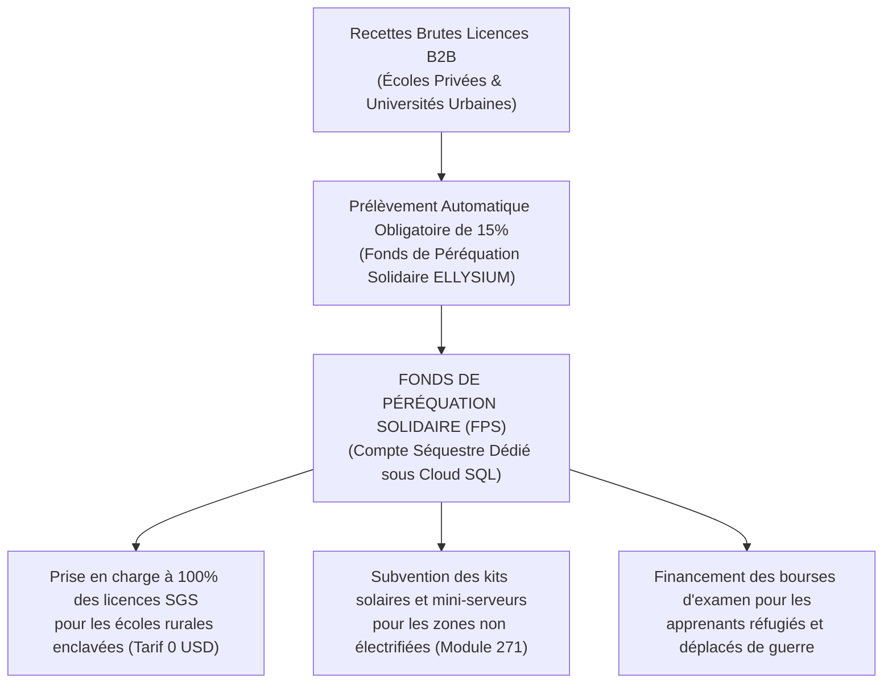
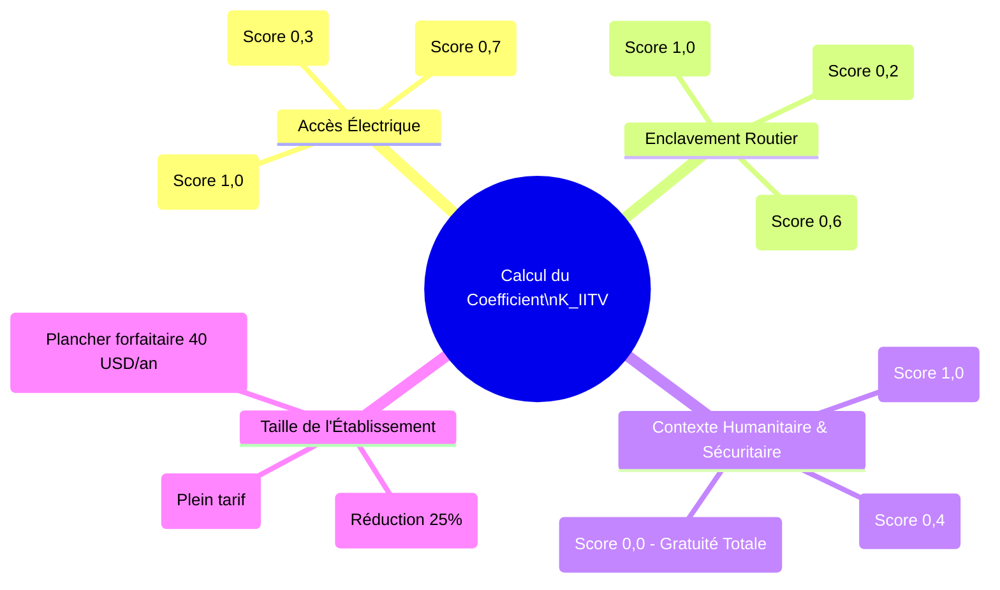

# Module 301 — Politique de tarification sociale et dégressive : petits établissements et zones défavorisées

> **Positionnement :** Tome 17 — Modèle Économique et Pérennité Financière
> Module 8 sur 15 | Référence : ELLYSIUM-T17-M301
> **Autorité :** Direction de l'Inclusion / Comité des Finances
> **Liaison amont :** Module 300 — Grille tarifaire du SGS : forfaits et options
> **Liaison aval :** Module 302 — Gestion des coûts variables liés à l'IA (inférence et tokens)

---

## 1. Objet

L'application d'un tarif uniforme dans un pays aux disparités économiques et territoriales aussi abyssales que la République Démocratique du Congo constituerait une injustice structurelle. Une école communautaire de 80 élèves en milieu rural enclavé dans le Maniema ou l'Équateur ne dispose pas du centième de la capacité financière d'un complexe scolaire de 2 000 élèves à Kinshasa-Gombe.

Ce module formalise la **politique de tarification sociale, dégressive et péréquée d'ELLYSIUM**. Il introduit le calcul de l'**Indice d'Isolement Territorial et de Vulnérabilité (IITV)**, encadre le **Fonds de Péréquation Solidaire (FPS)** alimenté par les grands comptes privés, et définit les règles d'exemption intégrale (tarif zéro) pour les zones de détresse humanitaire.

---

## 2. Le Mécanisme de Péréquation Solidaire

Le modèle financier d'ELLYSIUM fonctionne sur une solidarité organique automatisée :



---

## 3. L'Indice d'Isolement Territorial et de Vulnérabilité (IITV)

Le tarif final facturé à un établissement partenaire résulte de l'application d'un coefficient modérateur $K_{\text{IITV}} \in [0,0 \dots 1,0]$ calculé selon 4 critères objectifs :

$$\text{Tarif Réel} = \text{Tarif Théorique SGS} \times K_{\text{IITV}}$$



| Catégorie de Territoire | Valeur du Coefficient $K_{\text{IITV}}$ | Exemple Concret | Effet sur le Tarif Élève (Pack Base) |
|---|---|---|---|
| **Zone Urbaine Connectée** | $K = 1,0$ | Kinshasa, Lubumbashi, Kolwezi | 1,50 USD / élève / an (Tarif standard) |
| **Périurbain Défavorisé** | $K = 0,6$ | Périphérie Kimbanseke, Ruashi | 0,90 USD / élève / an (-40%) |
| **Milieu Rural Isolé** | $K = 0,2$ | Territoires ruraux sans route permanente | 0,30 USD / élève / an (-80%) |
| **Zone de Détresse / Conflit** | **$K = 0,0$** | Camps de réfugiés Goma, Ituri, Kasaï enclavé | **0,00 USD (Exonération Totale 100%)** |

---

## 4. Bouclier Financier pour les Petits Établissements (< 150 Élèves)

Pour éviter qu'une petite école rurale ne doive payer des frais d'ouverture de dossier disproportionnés :
1. **Suppression de tout plancher forfaitaire fixe :** La facturation s'effectue strictement au prorata du nombre réel d'élèves déclarés.
2. **Plafonnement Annuel Solidaire :** Pour tout établissement comptant moins de 150 élèves et justifiant d'un indice $K \le 0,5$, le coût global annuel d'utilisation du SGS est plafonné à **50 USD par an pour l'école entière**.

---

## 5. Schéma SQL — Calcul Automatisé du Coefficient Social

```sql
-- Cloud SQL PostgreSQL 16 (Schéma finance)
CREATE TABLE schema_finance.indices_vulnerabilite_etablissements (
    id UUID PRIMARY KEY DEFAULT gen_random_uuid(),
    etablissement_id UUID NOT NULL REFERENCES etablissements_partenaires(id),
    score_electricite NUMERIC(3,2) NOT NULL CHECK (score_electricite BETWEEN 0.0 AND 1.0),
    score_enclavement NUMERIC(3,2) NOT NULL CHECK (score_enclavement BETWEEN 0.0 AND 1.0),
    score_humanitaire NUMERIC(3,2) NOT NULL CHECK (score_humanitaire BETWEEN 0.0 AND 1.0),
    coefficient_iitv NUMERIC(3,2) GENERATED ALWAYS AS (
        ROUND((score_electricite * 0.3 + score_enclavement * 0.3 + score_humanitaire * 0.4), 2)
    ) STORED,
    est_exoneration_totale BOOLEAN GENERATED ALWAYS AS (
        (score_humanitaire = 0.0 OR (score_electricite + score_enclavement + score_humanitaire) < 0.3)
    ) STORED,
    justification_geographique TEXT NOT NULL,
    date_audit DATE NOT NULL,
    auditeur_social VARCHAR(150) NOT NULL,
    created_at TIMESTAMPTZ DEFAULT NOW()
);

CREATE INDEX idx_vulnerabilite_etab ON schema_finance.indices_vulnerabilite_etablissements(etablissement_id);
```

---

## 6. Verrous Fonctionnels

| ID | Règle | Niveau |
|---|---|---|
| VF-301-01 | 15 % de l'ensemble des encaissements B2B privés doivent être obligatoirement virés au Fonds de Péréquation Solidaire | CRITIQUE |
| VF-301-02 | Tout établissement situé dans une zone de conflit armé bénéficie automatiquement de l'exonération totale (K = 0,0) | CRITIQUE |
| VF-301-03 | Il est strictement interdit à une école bénéficiant d'un coefficient social de refacturer des frais SGS aux parents | CRITIQUE |
| VF-301-04 | Le calcul de l'indice IITV est révisé annuellement pour chaque établissement partenaire par le Comité des Finances | OBLIGATOIRE |
| VF-301-05 | Tout détournement d'une exonération sociale par un établissement solvable entraîne sa radiation et le remboursement des sommes | CRITIQUE |

---

*Sous-tome rédigé conformément aux Normes documentaires ELLYSIUM — Fondations 04.*
