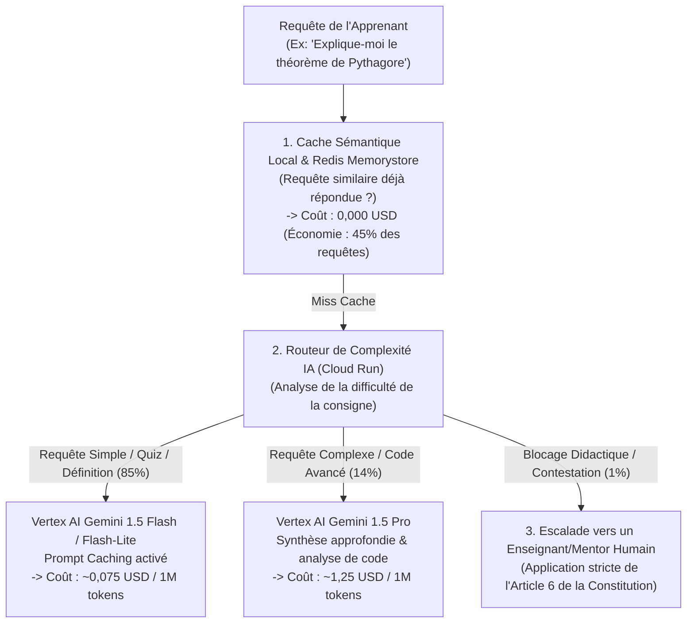
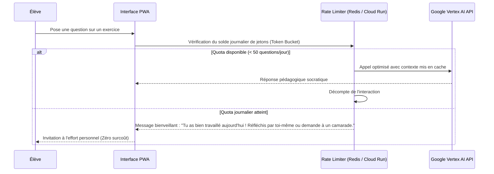

# Module 302 — Gestion des coûts variables liés à l'IA : inférence, tokens et optimisation Vertex AI

> **Positionnement :** Tome 17 — Modèle Économique et Pérennité Financière
> Module 9 sur 15 | Référence : ELLYSIUM-T17-M302
> **Autorité :** Préfet Numérique / Direction Financière
> **Liaison amont :** Module 301 — Politique de tarification sociale et dégressive
> **Liaison aval :** Module 303 — Comptabilité analytique et projections financières à 3 et 5 ans

---

## 1. Objet

L'intégration d'assistants pédagogiques intelligents basés sur de grands modèles de langage (LLM) représente une opportunité pédagogique extraordinaire, mais également le **risque financier le plus volatil** d'une plateforme EdTech. À l'échelle de dizaines de milliers d'apprenants soumettant chacun des dizaines de requêtes quotidiennes, une consommation non maîtrisée de jetons d'inférence (tokens) peut générer des factures de plusieurs dizaines de milliers de dollars par mois et anéantir la viabilité du projet.

Ce module formalise l'architecture d'**optimisation et de plafonnement des coûts d'intelligence artificielle sous Google Cloud Vertex AI**, détaille le routage hiérarchisé des modèles (Cascading Inference), la mise en cache sémantique et la politique d'usage équitable (Fair-Use Policy).

---

## 2. Le Piège Financier de l'IA et la Stratégie en 4 Niveaux

Pour empêcher toute dérive budgétaire, ELLYSIUM implémente un système de filtrage et d'aiguillage en entonnoir :



---

## 3. Leviers d'Économie d'Échelle sous Vertex AI

| Technique d'Optimisation | Mécanisme GCP Déployé | Réduction de Coût Constatée |
|---|---|---|
| **Context Caching (Mise en cache du contexte)** | Les référentiels de cours et manuels scolaires (100k+ tokens) sont mis en cache sous Vertex AI | **-75 % sur le coût des tokens d'entrée** |
| **Quantification & Modèles Compacts** | Priorité absolue à Gemini Flash-Lite pour l'aide aux devoirs de niveau primaire et secondaire | **-90 % par rapport à un grand modèle généraliste** |
| **Cache Sémantique Vectoriel** | Recherche de similarité cosinus sous Vertex AI Vector Search pour réutiliser les réponses types | **Zéro appel LLM pour les questions répétitives** |
| **Plafond Quotidien par Élève (Fair-Use)** | Limite glissante de 50 interactions IA d'aide par tranche de 24 heures | **Prévention absolue des abus ou dérives récréatives** |

---

## 4. Politique de Quotas et Gestion du Budget IA

Chaque apprenant bénéficie d'une allocation journalière d'assistance cognitive :



---

## 5. Schéma SQL — Suivi et Télémétrie de la Consommation IA

```sql
-- Cloud SQL PostgreSQL 16 (Schéma finance)
CREATE TABLE schema_finance.telemetrie_consommation_ia (
    id UUID PRIMARY KEY DEFAULT gen_random_uuid(),
    apprenant_id UUID NOT NULL,
    date_jour DATE NOT NULL DEFAULT CURRENT_DATE,
    modele_utilise VARCHAR(50) NOT NULL CHECK (modele_utilise IN ('CACHE_SEMANTIQUE', 'GEMINI_FLASH_LITE', 'GEMINI_FLASH', 'GEMINI_PRO')),
    tokens_entree INTEGER NOT NULL DEFAULT 0,
    tokens_sortie INTEGER NOT NULL DEFAULT 0,
    tokens_caches INTEGER NOT NULL DEFAULT 0,
    cout_estime_usd NUMERIC(8,5) NOT NULL,
    nb_requetes INTEGER DEFAULT 1,
    created_at TIMESTAMPTZ DEFAULT NOW()
);

CREATE TABLE schema_finance.budgets_ia_mensuels (
    id UUID PRIMARY KEY DEFAULT gen_random_uuid(),
    mois_annee VARCHAR(7) UNIQUE NOT NULL, -- Ex: '2026-09'
    budget_plafond_usd NUMERIC(10,2) NOT NULL,
    consommation_reelle_usd NUMERIC(10,2) DEFAULT 0.00,
    seuil_alerte_80pct_declenche BOOLEAN DEFAULT FALSE,
    seuil_alerte_95pct_declenche BOOLEAN DEFAULT FALSE,
    statut_cloture VARCHAR(20) DEFAULT 'EN_COURS' CHECK (statut_cloture IN ('EN_COURS', 'CLOTURE_NORMAL', 'CLOTURE_DEPASSEMENT')),
    created_at TIMESTAMPTZ DEFAULT NOW()
);

CREATE INDEX idx_telemetrie_apprenant_jour ON schema_finance.telemetrie_consommation_ia(apprenant_id, date_jour);
```

---

## 6. Verrous Fonctionnels

| ID | Règle | Niveau |
|---|---|---|
| VF-302-01 | Les alertes de facturation Google Cloud Billing pour Vertex AI doivent être configurées à 50%, 75% et 90% du budget mensuel | CRITIQUE |
| VF-302-02 | Le modèle Gemini Pro ne peut être sollicité que pour les cours de niveau supérieur (Bac+2 et plus) ou l'analyse de code complexe | CRITIQUE |
| VF-302-03 | L'IA ne doit en aucun cas être sollicitée pour des tâches administratives répétitives pouvant être résolues par du code standard | CRITIQUE |
| VF-302-04 | Le coût mensuel moyen d'inférence IA par apprenant actif ne doit pas dépasser 0,25 USD sous peine de restriction des modèles | OBLIGATOIRE |
| VF-302-05 | L'activation du Context Caching sous Vertex AI est obligatoire pour tout document de cours supérieur à 10 000 tokens | OBLIGATOIRE |

---

*Sous-tome rédigé conformément aux Normes documentaires ELLYSIUM — Fondations 04.*
