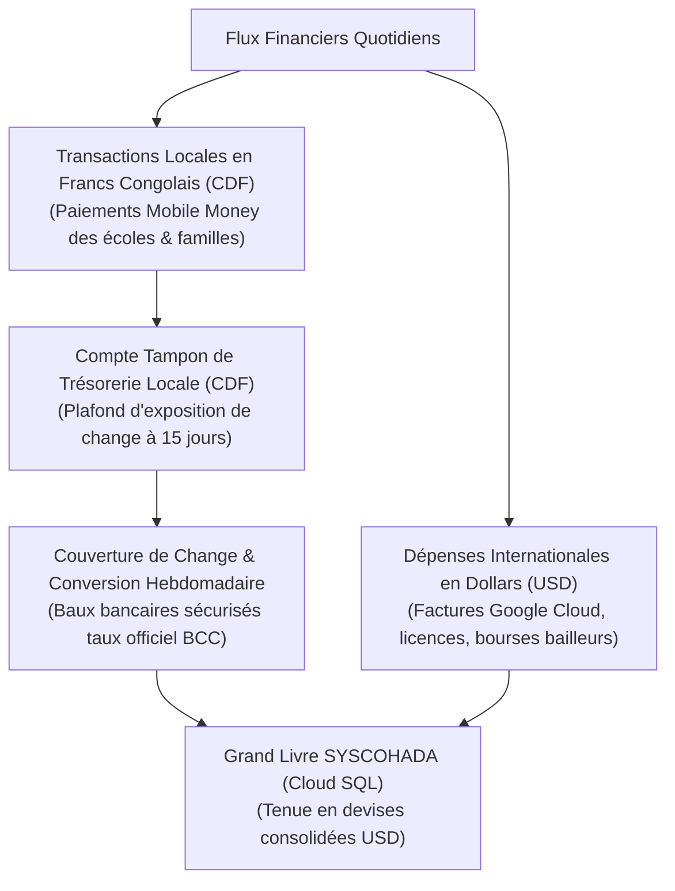
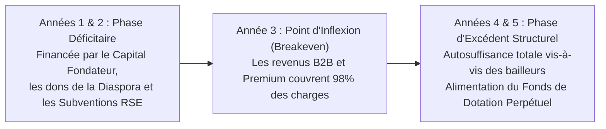

# Module 303 — Comptabilité analytique et projections financières à 3 et 5 ans

> **Positionnement :** Tome 17 — Modèle Économique et Pérennité Financière
> Module 10 sur 15 | Référence : ELLYSIUM-T17-M303
> **Autorité :** Direction Financière / Commissariat aux Comptes
> **Liaison amont :** Module 302 — Gestion des coûts variables liés à l'IA (inférence et tokens)
> **Liaison aval :** Module 304 — Seuil de rentabilité et stratégie de financement

---

## 1. Objet

Une organisation éducative à vocation pérenne ne peut naviguer à vue : elle doit s'appuyer sur des normes comptables d'une transparence absolue et sur des projections financières pluriannuelles réalistes. Évoluant en République Démocratique du Congo au sein de l'espace juridique OHADA, ELLYSIUM applique le **Système Comptable OHADA (SYSCOHADA révisé)** et gère une comptabilité bidevise rigoureuse (USD et Franc Congolais - CDF).

Ce module détaille la structure de la **comptabilité analytique d'ELLYSIUM**, présente les **projections financières quinquennales (2025–2030)** et démontre la trajectoire conduisant l'institution de sa phase d'amorçage subventionnée à sa pleine autosuffisance économique.

---

## 2. Normes Comptables et Gestion Bidevise (USD / CDF)



---

## 3. Projections Financières Quinquennales (P&L 2025–2030)

Le modèle démontre le franchissement du seuil de rentabilité opérationnelle à la fin de l'Année 3 :

| Indicateur Financier (en kUSD) | Année 1 (Pilote) | Année 2 (Filière Info) | Année 3 (SGS Généralisé) | Année 4 (Consolidation) | Année 5 (Maturité) |
|---|---|---|---|---|---|
| **Effectif Apprenants Actifs** | **2 500** | **15 000** | **50 000** | **120 000** | **250 000** |
| Établissements Partenaires | 10 | 45 | 180 | 380 | 750 |
| **PRODUITS D'EXPLOITATION** | | | | | |
| Licences B2B Établissements | 5,5 | 32,5 | 125,0 | 310,0 | 675,0 |
| Services Premium & Certifications | 2,0 | 18,0 | 65,0 | 160,0 | 340,0 |
| Subventions Bailleurs & RSE | 80,0 | 120,0 | 90,0 | 60,0 | 40,0 |
| Mécénat Diaspora & Bourses | 15,0 | 35,0 | 60,0 | 85,0 | 110,0 |
| **TOTAL REVENUS BRUTS** | **102,5** | **205,5** | **340,0** | **615,0** | **1 165,0** |
| **CHARGES D'EXPLOITATION (OPEX)** | | | | | |
| Infrastructure GCP & Réseau | 22,0 | 48,0 | 82,0 | 145,0 | 230,0 |
| Masse Salariale & Enseignants | 65,0 | 115,0 | 165,0 | 240,0 | 380,0 |
| R&D, Maintenance Logicielle | 30,0 | 38,0 | 45,0 | 55,0 | 70,0 |
| Déploiement Terrain & Ambassadeurs | 15,0 | 25,0 | 35,0 | 45,0 | 60,0 |
| Frais Généraux, Audit & Légal | 12,0 | 16,0 | 20,0 | 25,0 | 35,0 |
| **TOTAL CHARGES OPEX** | **144,0** | **242,0** | **347,0** | **510,0** | **775,0** |
| **RÉSULTAT D'EXPLOITATION (EBITDA)** | **-41,5** | **-36,5** | **-7,0 (Seuil atteint)** | **+105,0** | **+390,0** |
| *Marge Opérationnelle* | *Déficit d'amorçage* | *Transition* | *Équilibre (0%)* | *+17,1 %* | *+33,5 %* |

---

## 4. Trajectoire de l'Équilibre et Réinvestissement Social



---

## 5. Schéma SQL — Clôture Analytique et Compte de Résultat

```sql
-- Cloud SQL PostgreSQL 16 (Schéma finance)
CREATE TABLE schema_finance.etats_financiers_annuels (
    id UUID PRIMARY KEY DEFAULT gen_random_uuid(),
    annee_exercice INTEGER UNIQUE NOT NULL,
    total_revenus_b2b_usd NUMERIC(12,2) NOT NULL,
    total_revenus_premium_usd NUMERIC(12,2) NOT NULL,
    total_subventions_usd NUMERIC(12,2) NOT NULL,
    total_diaspora_usd NUMERIC(12,2) NOT NULL,
    total_charges_gcp_usd NUMERIC(12,2) NOT NULL,
    total_charges_rh_usd NUMERIC(12,2) NOT NULL,
    total_autres_opex_usd NUMERIC(12,2) NOT NULL,
    ebitda_resultat_usd NUMERIC(12,2) GENERATED ALWAYS AS (
        (total_revenus_b2b_usd + total_revenus_premium_usd + total_subventions_usd + total_diaspora_usd) -
        (total_charges_gcp_usd + total_charges_rh_usd + total_autres_opex_usd)
    ) STORED,
    taux_couverture_b2b_pct NUMERIC(5,2) GENERATED ALWAYS AS (
        ROUND((total_revenus_b2b_usd / (total_charges_gcp_usd + total_charges_rh_usd + total_autres_opex_usd)) * 100, 2)
    ) STORED,
    rapport_auditeur_externe_gcs VARCHAR(255) NOT NULL,
    statut_approbation VARCHAR(30) DEFAULT 'EN_AUDIT' CHECK (statut_approbation IN ('EN_AUDIT', 'APPROUVE_CA', 'REJETE')),
    created_at TIMESTAMPTZ DEFAULT NOW()
);
```

---

## 6. Verrous Fonctionnels

| ID | Règle | Niveau |
|---|---|---|
| VF-303-01 | Les états financiers annuels doivent être tenus selon les normes SYSCOHADA et certifiés par un commissaire aux comptes | CRITIQUE |
| VF-303-02 | L'exposition de trésorerie en Francs Congolais (CDF) ne doit jamais dépasser 15 jours d'exploitation courante | CRITIQUE |
| VF-303-03 | Dès l'Année 4, au moins 70 % des coûts opérationnels récurrents doivent être couverts par les revenus B2B et Premium | CRITIQUE |
| VF-303-04 | Tout excédent d'exercice dégagé à partir de l'Année 4 est réaffecté au Fonds de Dotation sans distribution de dividendes | CRITIQUE |
| VF-303-05 | Les projections financières sont actualisées semestriellement et présentées en session plénière du Conseil d'Administration | OBLIGATOIRE |

---

*Sous-tome rédigé conformément aux Normes documentaires ELLYSIUM — Fondations 04.*
