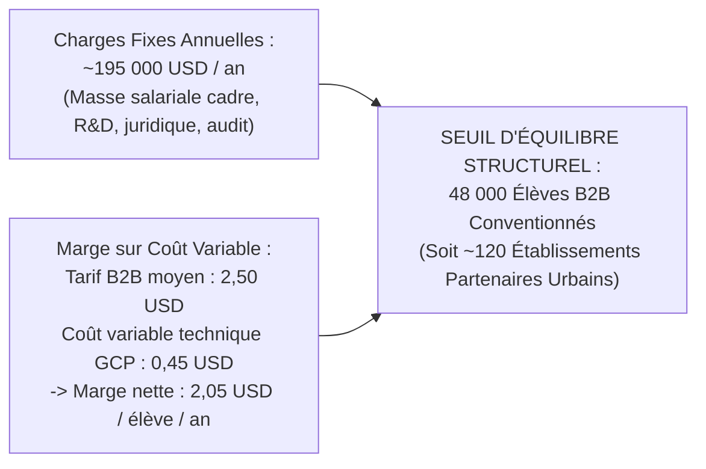
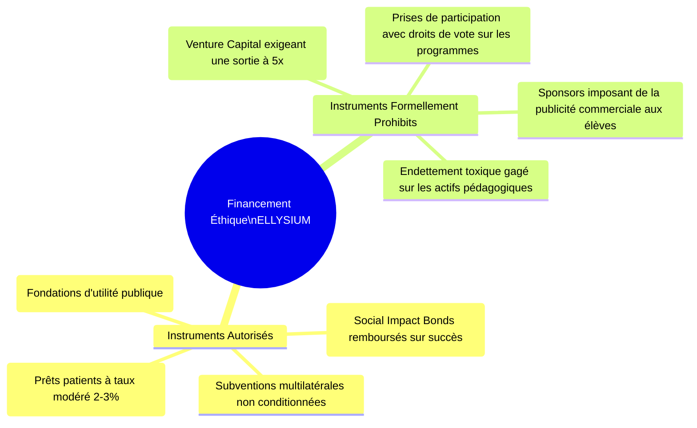

# Module 304 — Seuil de rentabilité et stratégie de financement : levée de fonds éthique et dons

> **Positionnement :** Tome 17 — Modèle Économique et Pérennité Financière
> Module 11 sur 15 | Référence : ELLYSIUM-T17-M304
> **Autorité :** Conseil d'Administration / Direction Financière
> **Liaison amont :** Module 303 — Comptabilité analytique et projections financières à 3 et 5 ans
> **Liaison aval :** Module 305 — Gestion de la trésorerie et audit financier annuel

---

## 1. Objet

L'indépendance intellectuelle et la souveraineté pédagogique d'ELLYSIUM dépendent directement de sa capacité à s'émanciper des subventions précaires et des pressions de capitaux spéculatifs. Une plateforme d'éducation publique ne peut se structurer comme une startup prédatrice recherchant un profit court-termiste aux dépens de l'accessibilité sociale.

Ce module calcule le **seuil de rentabilité d'exploitation (Point Mort)** d'ELLYSIUM, encadre les modalités d'une **levée de fonds éthique non dilutive** (obligations à impact social, titres associatifs, dons fléchés) et érige un verrou infranchissable contre toute prise de contrôle privée susceptible de corrompre la Constitution ELLYSIUM.

---

## 2. Détermination Mathématique du Seuil de Rentabilité (Point Mort)

Le seuil de rentabilité opérationnelle (Breakeven) représente le volume d'apprenants scolarisés dans les écoles payantes nécessaire pour que les recettes B2B couvrent l'intégralité des charges fixes et variables de la plateforme :

$$\text{Point Mort (Nombre d'Élèves B2B)} = \frac{\text{Charges Fixes Annuelles (OPEX Fixes)}}{\text{Tarif B2B Moyen Net} - \text{Coût Marginal Variable par Élève}}$$



> **Constat Stratégique :** Dès que le réseau ELLYSIUM fédère 48 000 apprenants payants dans des écoles partenaires urbaines (atteint au cours de l'Année 3), **l'infrastructure devient 100 % autosuffisante** et peut supporter gratuitement 100 000 apprenants indépendants (AIS/AIU) supplémentaires sans aucun besoin de don extérieur.

---

## 3. Stratégie de Financement Éthique Non Dilutif

Pour financer les investissements initiaux (CAPEX) des Années 1 et 2 sans vendre l'âme du projet :



---

## 4. La Règle Inaltérable de Souveraineté Institutionnelle

Tout investisseur, donateur ou mécène signataire d'une convention financière avec ELLYSIUM adhère formellement à la **Clause de Non-Ingérence Pédagogique** :
1. **Zéro Droit de Veto sur les Cours :** Aucun apport financier ne confère de pouvoir de décision sur les référentiels académiques, les nominations d'enseignants ou les sujets d'examen.
2. **Inaliénabilité des Articles 4, 5 et 6 :** Aucun don ne peut modifier la gratuité des AIS/AIU, l'étanchéité caisse/pédagogie ou la primauté humaine sur l'IA.
3. **Interdiction de Publicité Commerciale :** Aucune bannière publicitaire, pistage marketing ou revente de données d'élèves n'est autorisé.

---

## 5. Schéma SQL — Registre des Engagements et Titres Financiers

```sql
-- Cloud SQL PostgreSQL 16 (Schéma finance)
CREATE TABLE schema_finance.instruments_financement_ethique (
    id UUID PRIMARY KEY DEFAULT gen_random_uuid(),
    nom_souscripteur VARCHAR(255) NOT NULL,
    type_instrument VARCHAR(50) NOT NULL CHECK (type_instrument IN ('TITRE_PARTICIPATIF', 'OBLIGATION_IMPACT_SOCIAL', 'DON_PHILANTHROPIQUE', 'SUBVENTION_AMORCAGE')),
    montant_principal_usd NUMERIC(12,2) NOT NULL,
    taux_interet_annuel_pct NUMERIC(4,2) DEFAULT 0.00 CHECK (taux_interet_annuel_pct <= 3.50), -- Plafond éthique
    date_emission DATE NOT NULL,
    date_maturite DATE,
    clause_non_ingerence_signee BOOLEAN NOT NULL DEFAULT FALSE,
    statut_remboursement VARCHAR(30) DEFAULT 'EN_COURS' CHECK (statut_remboursement IN ('NON_APPLICABLE_DON', 'EN_COURS', 'SOLDE', 'REINVESTI')),
    convention_pdf_hash_gcs VARCHAR(255) NOT NULL,
    created_at TIMESTAMPTZ DEFAULT NOW()
);

CREATE INDEX idx_financement_type ON schema_finance.instruments_financement_ethique(type_instrument);
```

---

## 6. Verrous Fonctionnels

| ID | Règle | Niveau |
|---|---|---|
| VF-304-01 | Il est formellement interdit d'ouvrir le capital d'ELLYSIUM à des fonds spéculatifs à but lucratif (Venture Capital) | CRITIQUE |
| VF-304-02 | Aucun donateur ne peut acquérir de siège décisionnel ou de droit de regard sur les délibérations académiques | CRITIQUE |
| VF-304-03 | Le taux d'intérêt des instruments de dette éthique ne peut en aucun cas excéder le plafond strict de 3,50 % par an | CRITIQUE |
| VF-304-04 | Dès l'atteinte du seuil des 48 000 élèves payants, aucun recours à de nouvelles dettes d'exploitation n'est permis | OBLIGATOIRE |
| VF-304-05 | L'ensemble des contrats de levée de fonds éthique est validé par le Conseil d'Administration à la majorité des 3/4 | OBLIGATOIRE |

---

*Sous-tome rédigé conformément aux Normes documentaires ELLYSIUM — Fondations 04.*
