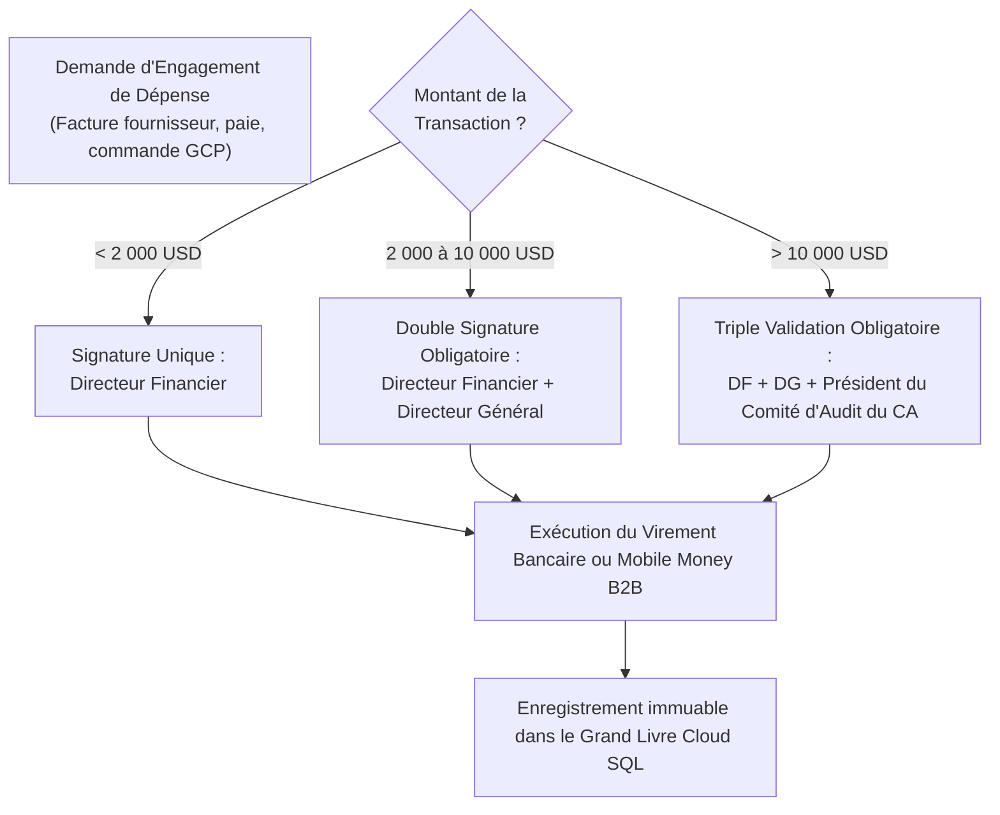

# Module 305 — Gestion de la trésorerie et audit financier annuel

> **Positionnement :** Tome 17 — Modèle Économique et Pérennité Financière
> Module 12 sur 15 | Référence : ELLYSIUM-T17-M305
> **Autorité :** Trésorerie Générale / Commissaires aux Comptes
> **Liaison amont :** Module 304 — Seuil de rentabilité et stratégie de financement
> **Liaison aval :** Module 306 — Politique de réinvestissement et plan de secours financier

---

## 1. Objet

Dans un environnement macro-économique exposé à de fortes tensions de liquidité, à des dévaluations monétaires et à des décalages de paiement scolaires, la gestion rigoureuse de la trésorerie au jour le jour est une condition vitale de survie. Une organisation peut être rentable sur le papier tout en s'effondrant brutalement faute de liquidités disponibles pour régler ses serveurs Google Cloud ou la paie de ses enseignants.

Ce module fixe les règles d'**équilibrage et de lissage de la trésorerie prévisionnelle**, instaure le protocole de **double signature électronique obligatoire** pour tout décaissement, impose la constitution d'un **coussin de sécurité de 3 mois d'OPEX** et encadre l'**audit financier externe annuel indépendant**.

---

## 2. Cycle Saisonnier de Trésorerie et Lissage des Flux

L'activité éducative obéit à une forte cyclicité annuelle qu'ELLYSIUM compense par un lissage contractuel :

```mermaid
gantt
    title Cycle Annuel des Encaissements et Décaissements de Trésorerie
    dateFormat  M
    axisFormat  M%m

    section Encaissements (Recettes)
    Pic Rentrée Scolaire (40% des recettes B2B)    :crit, r1, 1, 3
    Tranche 2 Trimestre (30% des recettes B2B)     :active, r2, 5, 2
    Tranche 3 Trimestre & Examens (30% recettes)   :active, r3, 8, 2
    Creux Estival (Vacances - Zéro encaissement)    :done, r4, 10, 2

    section Décaissements (Charges OPEX)
    Facturation GCP & Télécoms (Mensuelle Linéaire) :active, c1, 1, 12
    Rémunération Enseignants & Staff (Mensuelle)    :active, c2, 1, 12
    Maintenance Matérielle & Audit (Trimestrielle)  :c3, 1, 12
```



---

## 3. Le Coussin de Sécurité Opérationnelle (Trésorerie de Réserve)

Pour prémunir ELLYSIUM contre les retards de subventions ou les crises de liquidité bancaire :
1. **Règle des 90 Jours :** La trésorerie disponible en compte séquestre liquide doit équivaloir en permanence à **au moins 3 mois complets de charges opérationnelles récurrentes (OPEX)**.
2. **Placements Sécurisés à Court Terme :** Les excédents de trésorerie sont placés exclusivement sur des comptes à terme rémunérés auprès d'établissements bancaires congolais de premier rang agréés par la BCC (Banque Centrale du Congo) ou en bons du Trésor garantis.

---

## 4. Protocole de Décaissement à Double Signature Électronique

Pour éliminer tout risque de malversation ou d'ordre de virement frauduleux :



---

## 5. Audit Financier Externe Annuel et Certification des Comptes

Chaque exercice comptable est audité par un cabinet indépendant agréé par l'Ordre National des Experts-Comptables (ONEC RDC) :
- **Audit des Dépenses Cloud :** Rapprochement direct entre les factures Google Cloud Billing et les flux analytiques.
- **Audit de la Séparation Caisse/Pédagogie :** Vérification formelle qu'aucun compte académique n'a été lié à des transactions financières.
- **Publication en Open Data :** Le rapport financier certifié est rendu public sur Firebase Hosting dans une démarche de transparence totale.

---

## 6. Schéma SQL — Journal des Mouvements de Trésorerie et Décaissements

```sql
-- Cloud SQL PostgreSQL 16 (Schéma finance)
CREATE TABLE schema_finance.mouvements_tresorerie (
    id UUID PRIMARY KEY DEFAULT gen_random_uuid(),
    numero_virement VARCHAR(50) UNIQUE NOT NULL,
    compte_bancaire_emetteur VARCHAR(100) NOT NULL,
    beneficiaire_nom VARCHAR(200) NOT NULL,
    montant_usd NUMERIC(12,2) NOT NULL,
    motif_depense VARCHAR(255) NOT NULL,
    centre_couts_code VARCHAR(30) NOT NULL,
    signature_electronique_df VARCHAR(512) NOT NULL,
    signature_electronique_dg VARCHAR(512),
    approbation_ca_hash VARCHAR(512),
    statut_execution VARCHAR(30) DEFAULT 'VALIDE' CHECK (statut_execution IN ('EN_ATTENTE_SIGNATURE', 'VALIDE', 'REJETE', 'EXECUTE')),
    date_execution TIMESTAMPTZ DEFAULT NOW(),
    preuve_bancaire_gcs_hash VARCHAR(255) NOT NULL
);

CREATE INDEX idx_treso_date ON schema_finance.mouvements_tresorerie(date_execution);
CREATE INDEX idx_treso_statut ON schema_finance.mouvements_tresorerie(statut_execution);
```

---

## 7. Verrous Fonctionnels

| ID | Règle | Niveau |
|---|---|---|
| VF-305-01 | La réserve de trésorerie de sécurité ne doit jamais descendre sous le seuil critique de 3 mois d'OPEX | CRITIQUE |
| VF-305-02 | Tout décaissement supérieur à 2 000 USD exige obligatoirement une double signature électronique scellée (DF + DG) | CRITIQUE |
| VF-305-03 | Les comptes annuels sont certifiés chaque année par un commissaire aux comptes agréé externe indépendant | CRITIQUE |
| VF-305-04 | L'intégralité du rapport d'audit financier annuel est publiée en accès libre sur le portail public Firebase Hosting | OBLIGATOIRE |
| VF-305-05 | Les rapprochements bancaires et réconciliations Mobile Money sont exécutés automatiquement chaque jour ouvrable | OBLIGATOIRE |
| VF-305-06 | Aucun modèle économique ne peut introduire de barrière monétaire à l'accès aux connaissances fondamentales | CONSTITUTIONNEL |

---

*Sous-tome rédigé conformément aux Normes documentaires ELLYSIUM — Fondations 04.*
