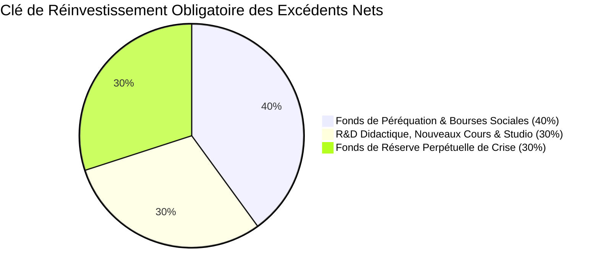
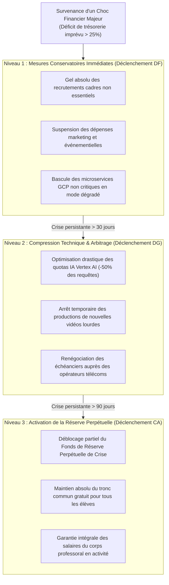

# Module 306 — Politique de réinvestissement et plan de secours financier

> **Positionnement :** Tome 17 — Modèle Économique et Pérennité Financière
> Module 13 sur 15 | Référence : ELLYSIUM-T17-M306
> **Autorité :** Conseil d'Administration / Direction Financière
> **Liaison amont :** Module 305 — Gestion de la trésorerie et audit financier annuel
> **Liaison aval :** Module 307 — Indicateurs financiers et gouvernance

---

## 1. Objet

En sa qualité d'institution éducative d'utilité publique à but non lucratif (ASBL), ELLYSIUM proscrit formellement toute distribution de dividendes à des actionnaires privés. L'intégralité des excédents financiers nets dégagés par l'exploitation des licences B2B et des services premium doit obligatoirement être réinvestie au service exclusif de la mission sociale et de la consolidation de la souveraineté éducative congolaise.

Ce module fixe la **règle d'or de réaffectation des excédents d'exercice**, institue le **Fonds de Dotation Perpétuel (FDP)** et arrête le **Plan de Secours Financier Gradué** garantissant la continuité des services en cas de crise économique majeure.

---

## 2. La Règle d'Or de Réinvestissement des Excédents Nets (40 / 30 / 30)

Tout surplus budgétaire constaté lors de la clôture annuelle certifiée est immédiatement ventilé selon une clé de répartition constitutionnelle inaltérable :



| Destination du Réinvestissement | Part | Affectation Budgétaire Précise |
|---|---|---|
| **1. Fonds de Péréquation & Bourses** | **40 %** | Financement de kits solaires pour écoles rurales, bourses d'examen pour les filles et les déplacés, licences gratuites (K=0) |
| **2. R&D Didactique & Nouveaux Contenus** | **30 %** | Numérisation de nouvelles filières techniques, perfectionnement des outils IA souverains, tournages de vidéos pédagogiques |
| **3. Réserve Perpétuelle de Crise (FDP)** | **30 %** | Capitalisation sur compte bloqué pour porter la réserve de sécurité à 12 mois complets de charges d'exploitation |

---

## 3. Le Plan de Secours Financier en Cas de Crise Majeure

En cas de choc exogène (hyperinflation, embargo bancaire, suspension brutale d'un bailleur de fonds majeur ou crise sécuritaire), le plan de contingence s'active par paliers successifs :



---

## 4. Schéma SQL — Suivi des Fonds de Réserve et Réinvestissements

```sql
-- Cloud SQL PostgreSQL 16 (Schéma finance)
CREATE TABLE schema_finance.fonds_reinvestissements (
    id UUID PRIMARY KEY DEFAULT gen_random_uuid(),
    exercice_origine_annee INTEGER NOT NULL,
    excedent_net_total_usd NUMERIC(12,2) NOT NULL CHECK (excedent_net_total_usd > 0),
    part_perequation_sociale_usd NUMERIC(12,2) GENERATED ALWAYS AS (ROUND(excedent_net_total_usd * 0.40, 2)) STORED,
    part_rd_contenus_usd NUMERIC(12,2) GENERATED ALWAYS AS (ROUND(excedent_net_total_usd * 0.30, 2)) STORED,
    part_reserve_perpetuelle_usd NUMERIC(12,2) GENERATED ALWAYS AS (ROUND(excedent_net_total_usd * 0.30, 2)) STORED,
    date_affectation_ca DATE NOT NULL,
    decision_ca_pv_hash VARCHAR(255) NOT NULL,
    created_at TIMESTAMPTZ DEFAULT NOW()
);

CREATE TABLE schema_finance.reserves_perpetuelles_deblocages (
    id UUID PRIMARY KEY DEFAULT gen_random_uuid(),
    montant_preleve_usd NUMERIC(12,2) NOT NULL,
    motif_crise VARCHAR(100) NOT NULL CHECK (motif_crise IN ('HYPERINFLATION_LOCALE', 'DEFAUT_BAILLEUR', 'CRISE_SECURITAIRE', 'CATASTROPHE_NATURELLE')),
    justification_detaillee TEXT NOT NULL,
    autorisation_ca_unanime BOOLEAN NOT NULL DEFAULT FALSE,
    date_deblocage TIMESTAMPTZ DEFAULT NOW()
);
```

---

## 5. Verrous Fonctionnels

| ID | Règle | Niveau |
|---|---|---|
| VF-306-01 | Il est formellement interdit de distribuer des dividendes ou des parts d'excédents financiers à des personnes privées | CRITIQUE |
| VF-306-02 | Le Fonds de Réserve Perpétuelle ne peut être entamé sans un vote formel favorable à l'unanimité du Conseil d'Administration | CRITIQUE |
| VF-306-03 | Même au niveau le plus sévère de crise financière, l'accès au tronc commun reste gratuit pour tous les apprenants (Art. 3) | CRITIQUE |
| VF-306-04 | 40 % des excédents annuels sont automatiquement virés sur le compte séquestre du Fonds de Péréquation Sociale sous 30 jours | OBLIGATOIRE |
| VF-306-05 | Tout plan de secours activé doit faire l'objet d'un rapport de situation hebdomadaire adressé au Comité de Pilotage | OBLIGATOIRE |

---

*Sous-tome rédigé conformément aux Normes documentaires ELLYSIUM — Fondations 04.*
