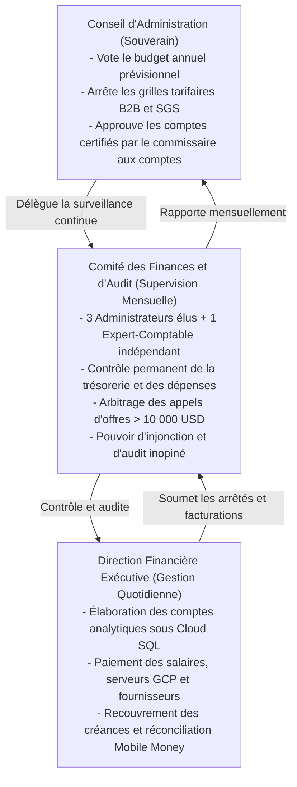
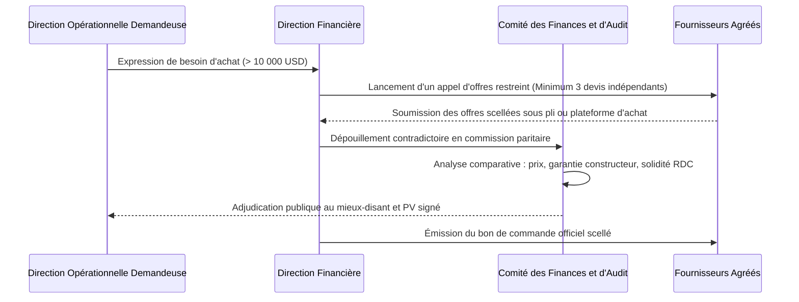

# Module 307 — Indicateurs financiers et gouvernance : conseil d'administration et comité des finances

> **Positionnement :** Tome 17 — Modèle Économique et Pérennité Financière
> Module 14 sur 15 | Référence : ELLYSIUM-T17-M307
> **Autorité :** Conseil d'Administration / Comité des Finances
> **Liaison amont :** Module 306 — Politique de réinvestissement et plan de secours financier
> **Liaison aval :** Module 308 — Dépendances du Tome 17

---

## 1. Objet

L'exemplarité morale et la rigueur de gestion d'ELLYSIUM exigent une gouvernance financière collégiale, transparente et protégée contre tout conflit d'intérêts. Pour prévenir toute gestion opaque ou dérive unilatérale de la direction exécutive, les décisions financières majeures sont encadrées par une séparation des pouvoirs rigoureusement articulée entre la **Direction Financière**, le **Comité des Finances et d'Audit (CFA)** et le **Conseil d'Administration (CA)**.

Ce module détaille l'organisation de la comitologie financière, le tableau de bord des indicateurs de performance (KPI Financiers) supervisé en continu sous Google Cloud Platform, ainsi que les procédures d'adjudication des marchés et appels d'offres.

---

## 2. La Triade de Gouvernance Financière



---

## 3. Tableau de Bord des KPI Financiers Stratégiques (Looker Studio)

Le Comité des Finances suit en temps réel 6 indicateurs maîtres alimentés par les tables financières BigQuery :

| Indicateur Financier | Formule de Calcul | Cible Normative | Seuil d'Alerte CFA |
|---|---|---|---|
| **Ratio d'Autonomie Financière** | (Revenus B2B + Premium) / Total Charges OPEX | >= 100 % (Dès An 3) | < 75 % |
| **Délai Moyen de Recouvrement B2B (DSO)** | (Créances Écoles en attente / Chiffre d'Affaires) * 365 | <= 45 jours | > 60 jours |
| **Coût d'Exploitation par Apprenant** | Total Charges Réelles / Effectif Total Actif | <= 2,80 USD / an | > 3,50 USD / an |
| **Taux d'Écart Budgétaire GCP** | (Facture Google Cloud Réelle - Budget Prévu) / Budget | +/- 5 % max | Dépassement > +10 % |
| **Marge de Sécurité Trésorerie** | Trésorerie Disponible / Dépense Mensuelle Moyenne | >= 3 mois | < 2 mois (Urgence) |
| **Taux d'Exécution Péréquation Sociale** | Dépenses Bourses Rurales / Recettes B2B Privées | >= 15 % | < 12 % |

---

## 4. Règles d'Engagement des Dépenses et Appels d'Offres

Pour bannir tout favoritisme ou surfacturation dans les achats de matériel (kits solaires, tablettes, serveurs) :



---

## 5. Schéma SQL — Délibérations et Alertes du Comité des Finances

```sql
-- Cloud SQL PostgreSQL 16 (Schéma finance)
CREATE TABLE schema_finance.cfa_reunions_mensuelles (
    id UUID PRIMARY KEY DEFAULT gen_random_uuid(),
    session_mois VARCHAR(7) UNIQUE NOT NULL, -- Ex: '2026-10'
    date_reunion DATE NOT NULL,
    ratio_autonomie_pct NUMERIC(5,2) NOT NULL,
    tresorerie_mois_disponibles NUMERIC(4,2) NOT NULL,
    dso_jours INTEGER NOT NULL,
    depassement_gcp_pct NUMERIC(5,2) DEFAULT 0.00,
    nb_marches_adjuges INTEGER DEFAULT 0,
    montant_total_adjudications_usd NUMERIC(12,2) DEFAULT 0.00,
    alertes_emises TEXT[],
    pv_signe_hash_gcs VARCHAR(255) NOT NULL,
    statut_approbation VARCHAR(30) DEFAULT 'VALIDE' CHECK (statut_approbation IN ('VALIDE', 'RESERVES_GRAVES', 'CONVOCATION_CA_EXTRAORDINAIRE')),
    created_at TIMESTAMPTZ DEFAULT NOW()
);

CREATE TABLE schema_finance.appels_offres_marches (
    id UUID PRIMARY KEY DEFAULT gen_random_uuid(),
    numero_dossier VARCHAR(50) UNIQUE NOT NULL,
    objet_marche VARCHAR(255) NOT NULL,
    montant_estime_usd NUMERIC(12,2) NOT NULL CHECK (montant_estime_usd >= 10000.00),
    nb_soumissionnaires INTEGER NOT NULL CHECK (nb_soumissionnaires >= 3),
    attributaire_retenu VARCHAR(200) NOT NULL,
    montant_retenu_usd NUMERIC(12,2) NOT NULL,
    rapport_depouillement_gcs VARCHAR(255) NOT NULL,
    approuve_par_cfa BOOLEAN NOT NULL DEFAULT FALSE,
    date_attribution DATE NOT NULL,
    created_at TIMESTAMPTZ DEFAULT NOW()
);
```

---

## 6. Verrous Fonctionnels

| ID | Règle | Niveau |
|---|---|---|
| VF-307-01 | Tout engagement de dépense supérieur à 10 000 USD exige un appel d'offres avec au moins 3 devis concurrents validé par le CFA | CRITIQUE |
| VF-307-02 | Le Comité des Finances dispose d'un pouvoir d'audit inopiné permanent sur l'ensemble des comptes bancaires et Mobile Money | CRITIQUE |
| VF-307-03 | Les membres du CFA ne peuvent détenir aucun intérêt direct ou indirect dans une entreprise candidate aux marchés d'ELLYSIUM | CRITIQUE |
| VF-307-04 | Une alerte de trésorerie inférieure à 2 mois d'OPEX déclenche automatiquement la convocation d'un Conseil d'Administration extraordinaire | CRITIQUE |
| VF-307-05 | Les procès-verbaux mensuels du CFA sont versés de façon inaltérable sous Google Cloud Storage sous 72 heures ouvrées | OBLIGATOIRE |

---

*Sous-tome rédigé conformément aux Normes documentaires ELLYSIUM — Fondations 04.*
