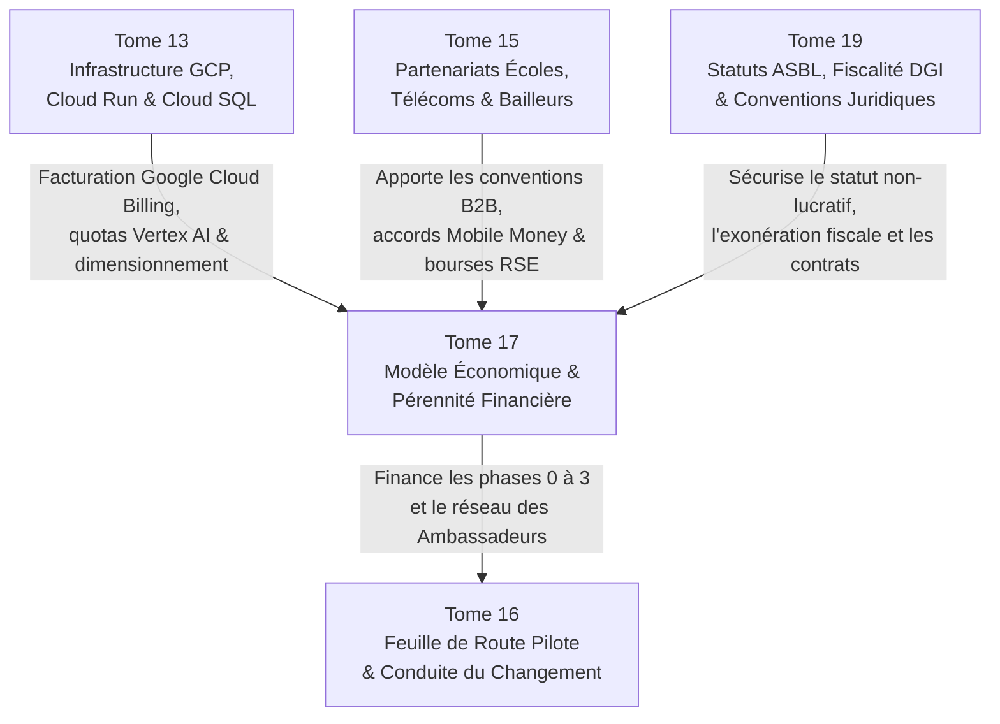

# Module 308 — Dépendances du Tome 17 avec les Tomes 13, 15 et 19

> **Positionnement :** Tome 17 — Modèle Économique et Pérennité Financière
> Module 15 sur 15 | Référence : ELLYSIUM-T17-M308
> **Autorité :** Direction Générale ELLYSIUM / Direction Financière
> **Liaison amont :** Module 307 — Indicateurs financiers et gouvernance (conseil d'administration et comité des finances)
> **Liaison aval :** Tome 18 — Communication et Marketing (M309)

---

## 1. Objet

Ce module de synthèse et de clôture scelle l'achèvement complet du **Tome 17** en remplissant deux fonctions déterminantes :
1. **Établir la matrice des dépendances croisées** reliant l'ingénierie financière et économique aux piliers technologiques Google Cloud (**Tome 13**), aux partenariats institutionnels et télécoms (**Tome 15**), à la feuille de route opérationnelle (**Tome 16**) et au cadre juridique de l'ASBL (**Tome 19**).
2. **Dresser le tableau récapitulatif solennel de complétude** des 15 modules constituant le Tome 17.

---

## 2. Matrice Synoptique des Dépendances Inter-Tomes

---

## 3. Analyse Détaillée des Interfaces Critiques

### 3.1 Dépendances avec le Tome 13 (Infrastructure GCP et Exploitation)
- **Modélisation Budgétaire du Cloud (M296 / M302) :** Les prévisions financières s'appuient sur l'architecture 100 % Google Cloud Platform du Tome 13 (Cloud Run, GKE Autopilot, Cloud SQL et Cloud Storage). Les remises sur engagement (CUD) et l'auto-scaling permettent de garantir un coût marginal technique inférieur à 1,15 USD / élève / an.
- **Monitoring et Alertes Facturation :** L'exportation automatisée des données de facturation GCP vers BigQuery alimente en direct les tableaux de bord Looker Studio du Comité des Finances (M307).

### 3.2 Dépendances avec le Tome 15 (Partenariats, Écoles et Télécoms)
- **Perception des Licences B2B (M273 / M297) :** Les contrats-types d'établissements partenaires conventionnés au Tome 15 intègrent obligatoirement la grille tarifaire SGS (Module 300) et la clause d'étanchéité de l'Article 5.
- **Protocoles Télécoms & Reverse-Billing (M270 / M299) :** La facturation consolidée du zéro-rating data et les taux préférentiels Mobile Money (< 0,8%) s'exécutent selon les accords-cadres signés avec les opérateurs (Vodacom, Airtel, Orange, Africell).

### 3.3 Dépendances avec le Tome 19 (Juridique, Fiscalité et ASBL)
- **Statut Juridique d'Association Sans But Lucratif (ASBL) :** L'interdiction absolue de distribution de bénéfices (Module 306) est ancrée dans les statuts notariés de l'ASBL ELLYSIUM (Tome 19).
- **Conformité Fiscale et Exonérations DGI :** Les règles d'émission des reçus de bourses et des conventions de subventions sont alignées sur le régime fiscal congolais applicable aux organismes éducatifs d'utilité publique.

---

## 4. Tableau Récapitulatif de Complétude — Tome 17

| N° | Titre du Module | Statut |
|---|---|---|
| 294 | Périmètre du Tome 17 – philosophie économique (gratuité pour l'apprenant) | ✅ COMPLET |
| 295 | Conformité avec la Constitution (Art. 3 et 5 – gratuité de l'accompagnement) | ✅ COMPLET |
| 296 | Structure des coûts – infrastructure, RH, développement, marketing, juridique, contenus | ✅ COMPLET |
| 297 | Sources de revenus – licences B2B aux établissements (forfait par élève) | ✅ COMPLET |
| 298 | Sources de revenus – services premium (certificats, proctoring avancé, duplicatas) | ✅ COMPLET |
| 299 | Sources de revenus – partenariats, subventions, Mobile Money | ✅ COMPLET |
| 300 | Grille tarifaire du SGS – forfaits, options, établissements privés/publics | ✅ COMPLET |
| 301 | Politique de tarification sociale et dégressive (petits établissements, zones défavorisées) | ✅ COMPLET |
| 302 | Gestion des coûts variables liés à l'IA (inférence, token) | ✅ COMPLET |
| 303 | Comptabilité analytique et projections financières à 3 et 5 ans | ✅ COMPLET |
| 304 | Seuil de rentabilité et stratégie de financement (levée de fonds, dons) | ✅ COMPLET |
| 305 | Gestion de la trésorerie et audit financier annuel | ✅ COMPLET |
| 306 | Politique de réinvestissement et plan de secours financier | ✅ COMPLET |
| 307 | Indicateurs financiers et gouvernance (conseil d'administration, comité des finances) | ✅ COMPLET |
| 308 | Dépendances – avec les Tomes 15, 19, 13 | ✅ COMPLET |

---

## 5. Prochaine Étape : Franchissement vers le Tome 18

Le Tome 17 étant achevé dans son intégralité (15 modules sur 15), le chantier documentaire aborde le volet de rayonnement et de mobilisation citoyenne :

> **TOME 18 — COMMUNICATION ET MARKETING**
> Modules 309 à 319 (11 modules)
> Objectif : Construire l'identité de marque, la confiance sociétale, la stratégie de contenu pédagogique, la mobilisation sur les réseaux sociaux, les relations presse et le plan de communication de crise d'ELLYSIUM en conformité avec l'éthique constitutionnelle.

---

## 6. Verrous Fonctionnels

| ID | Règle | Niveau |
|---|---|---|
| VF-308-01 | Tout modèle financier opérationnel doit impérativement respecter les interfaces définies avec les Tomes 13, 15, 16 et 19 | CRITIQUE |
| VF-308-02 | Aucune politique tarifaire ne peut entrer en vigueur sans confirmation de sa légalité fiscale au regard du droit de l'ASBL (T19) | CRITIQUE |
| VF-308-03 | L'adéquation entre facturation Cloud GCP réelle et budget d'exploitation est révisée mensuellement par la Direction Financière | OBLIGATOIRE |
| VF-308-04 | L'intégrité de la cartographie des dépendances financières est préservée par un scellement documentaire sous Google Cloud Storage | OBLIGATOIRE |
| VF-308-05 | Ce module constitue la référence officielle d'audit pour l'évaluation de la viabilité économique décennale d'ELLYSIUM | OBLIGATOIRE |

---

*Tome 17 — Modèle Économique et Pérennité Financière — COMPLET ✅ (15 modules, M294–M308)*

*Sous-tome rédigé conformément aux Normes documentaires ELLYSIUM — Fondations 04.*
