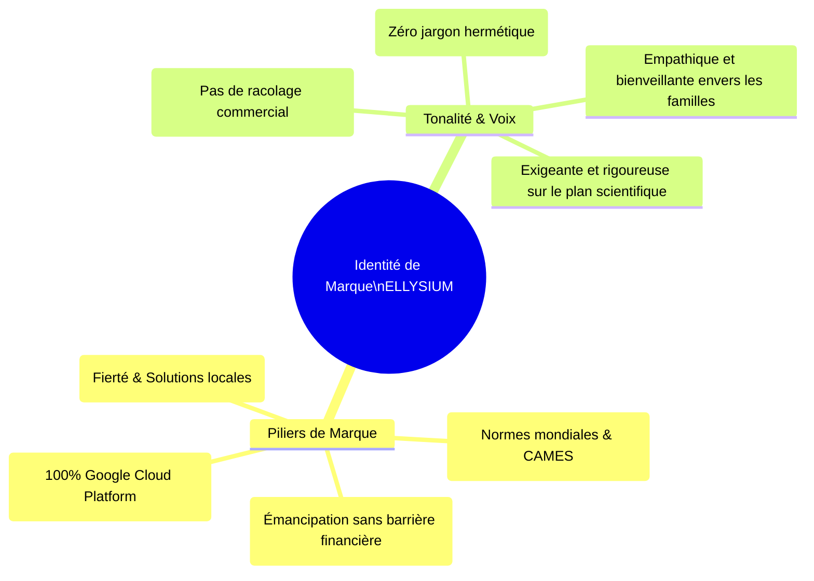
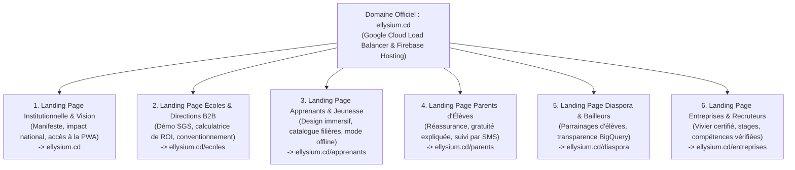
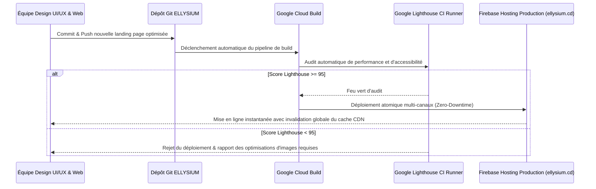

# Module 309 — Périmètre du Tome 18 : identité de marque, positionnement et écosystème de landing pages

> **Positionnement :** Tome 18 — Communication et Marketing
> Module 1 sur 11 | Référence : ELLYSIUM-T18-M309
> **Autorité :** Direction de la Communication et de la Marque / Direction Générale
> **Liaison amont :** Tome 17 complet (M294–M308)
> **Liaison aval :** Module 310 — Conformité avec la Constitution (transparence, éthique)

---

## 1. Objet

Une œuvre de transformation sociétale de l'envergure d'ELLYSIUM ne peut conquérir le cœur et l'esprit des populations sans une identité de marque puissante, inspirante et immédiatement identifiable. Dans un environnement saturé de promesses technologiques éphémères et de désillusions scolaires, la marque ELLYSIUM doit incarner l'excellence académique, la dignité de la jeunesse congolaise et la souveraineté intellectuelle de l'Afrique.

Ce module définit le périmètre d'action du **Tome 18**, pose le **positionnement de marque institutionnel** et structure l'**écosystème de multiples landing pages haut de gamme**, déployées exclusivement sur **Google Firebase Hosting**, conçues pour convertir chaque public cible (élèves, parents, directeurs, employeurs, diaspora) à travers une expérience visuelle et narrative d'exception.

---

## 2. Le Positionnement de Marque : L'Institution de l'Avenir

ELLYSIUM refuse le positionnement étriqué d'une simple « application mobile » ou d'une « startup EdTech » commerciale. La marque s'impose comme :

---

## 3. L'Écosystème des Multiples Landing Pages sur Firebase Hosting

Pour répondre aux attentes radicalement différentes de ses parties prenantes, le site web officiel d'ELLYSIUM n'est pas un portail monolithique confus, mais une **constellation de landing pages thématiques sur-mesure**, toutes servies à très haute vitesse via **Google Firebase Hosting** et le réseau mondial **Google Cloud CDN** :

---

## 4. Spécifications Techniques et Ergonomiques des Landing Pages

Chaque landing page est un chef-d'œuvre de design web moderne, respectant les standards les plus exigeants de Google :

| Attribut Technique | Standard d'Ingénierie Google Exigé | Bénéfice Utilisateur |
|---|---|---|
| **Hébergement & Distribution** | Firebase Hosting + Cloud CDN Edge PoP mondial | Temps de chargement initial < 1,2 seconde, même sur réseau 3G |
| **Performance Core Web Vitals** | Score Lighthouse >= 95/100 (LCP < 1,8s, INP < 100ms, CLS = 0) | Fluidité absolue sans saccade ni saut visuel à l'écran |
| **Design System & Typographie** | Google Material You 3.0 / Typographie Roboto & Inter | Lisibilité parfaite, contrastes accessibles conformes WCAG 2.1 AA |
| **Responsive & PWA Ready** | 100 % adaptative (du smartphone 4,5 pouces à l'écran 4K) | Installation en 1 clic sur l'écran d'accueil du téléphone |
| **Mode Sombre / Lumineux** | Détection automatique des préférences du système d'exploitation | Confort de lecture nocturne préservant la batterie |

---

## 5. Schéma de Déploiement CI/CD des Landing Pages (Google Cloud Build)

---

## 6. Verrous Fonctionnels

| ID | Règle | Niveau |
|---|---|---|
| VF-309-01 | L'ensemble des landing pages et sites web d'ELLYSIUM doit être hébergé exclusivement sur Google Firebase Hosting | CRITIQUE |
| VF-309-02 | Le score de performance Google Lighthouse de chaque landing page doit impérativement être supérieur ou égal à 95/100 | CRITIQUE |
| VF-309-03 | Il est formellement interdit d'afficher de la publicité tierce ou commerciale sur les landing pages d'ELLYSIUM | CRITIQUE |
| VF-309-04 | Chaque landing page doit être accessible en français et comporter un résumé dans les 4 langues nationales congolaises | OBLIGATOIRE |
| VF-309-05 | L'accès à la PWA d'apprentissage doit être directement accessible en 1 clic depuis n'importe quelle landing page | OBLIGATOIRE |
| VF-309-06 | Toute communication institutionnelle porte un identifiant de source vérifiable | OBLIGATOIRE |

---

*Sous-tome rédigé conformément aux Normes documentaires ELLYSIUM — Fondations 04.*
