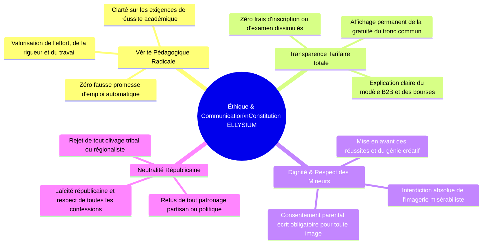
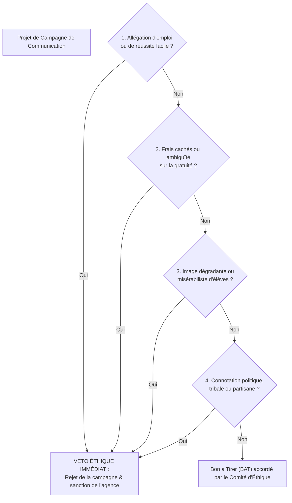

# Module 310 — Conformité avec la Constitution : transparence publicitaire, éthique et dignité des apprenants

> **Positionnement :** Tome 18 — Communication et Marketing
> Module 2 sur 11 | Référence : ELLYSIUM-T18-M310
> **Autorité :** Comité d'Éthique / Direction de la Communication
> **Liaison amont :** Module 309 — Périmètre du Tome 18 : identité de marque et landing pages
> **Liaison aval :** Module 311 — Plateforme de marque : storytelling et récit fondateur

---

## 1. Objet

Le secteur éducatif privé mondial et africain est régulièrement gangrené par des dérives mercantiles destructrices : promesses mensongères d'emplois mirifiques garantis sans effort, diplômes de complaisance bradés au rabais, frais cachés dissimulés sous des slogans de pseudo-gratuité, ou encore exploitation indécente de la misère d'enfants défavorisés pour capter des dons internationaux (misérabilisme publicitaire ou « poverty porn »).

Ce module applique les principes constitutionnels inaliénables d'ELLYSIUM à l'ensemble de ses campagnes de communication, de ses relations publiques et de ses landing pages. Il impose une **doctrine d'honnêteté radicale**, protège la dignité absolue des apprenants congolais et érige des règles intangibles de neutralité politique et confessionnelle.

---

## 2. Déclinaison Constitutionnelle dans la Communication



---

## 3. La Charte de Déontologie Publicitaire ELLYSIUM

Toute prise de parole publique émise par ELLYSIUM (spots radio, réseaux sociaux, affichage, landing pages) respecte 4 interdictions formelles :



---

## 4. Protection Renforcée de l'Image des Enfants et des Mineurs

Pour protéger les élèves contre toute exploitation médiatique abusive :
1. **Consentement Éclairé et Traçable :** Aucune photographie ou vidéo d'un élève mineur ne peut être publiée sans l'autorisation écrite conjointe des parents et de l'élève, archivée sous forme scellée dans Google Cloud Storage.
2. **Valorisation Exclusive :** Les élèves sont toujours photographiés en situation d'apprentissage, de travail intellectuel, d'expérimentation scientifique ou de réussite sportive, vêtus dignement, sans mise en scène larmoyante.
3. **Droit à l'Oubli Garanti :** Tout apprenant ou parent peut exiger le retrait d'une image ou d'un témoignage sous 48 heures via un simple clic sur le portail public.

---

## 5. Schéma SQL — Registre des Autorisations Média et Campagnes

```sql
-- Cloud SQL PostgreSQL 16
CREATE TABLE schema_communication.autorisations_media_mineurs (
    id UUID PRIMARY KEY DEFAULT gen_random_uuid(),
    apprenant_id UUID NOT NULL,
    nom_parent_tuteur VARCHAR(150) NOT NULL,
    piece_identite_parent VARCHAR(100) NOT NULL,
    date_consentement DATE NOT NULL,
    perimetre_diffusion VARCHAR(50) NOT NULL CHECK (perimetre_diffusion IN ('LANDING_PAGE_SEULE', 'RESEAUX_SOCIAUX', 'RAPPORT_ANNUEL_GLOBAL')),
    consentement_pdf_gcs_hash VARCHAR(255) NOT NULL,
    demande_retrait_recue BOOLEAN DEFAULT FALSE,
    date_retrait_effectif TIMESTAMPTZ,
    created_at TIMESTAMPTZ DEFAULT NOW()
);

CREATE TABLE schema_communication.campagnes_publicitaires (
    id UUID PRIMARY KEY DEFAULT gen_random_uuid(),
    intitule_campagne VARCHAR(200) NOT NULL,
    canal VARCHAR(50) NOT NULL CHECK (canal IN ('LANDING_PAGES', 'YOUTUBE_RESEAUX', 'RADIO_NATIONALE', 'AFFICHAGE_ECOLES')),
    budget_usd NUMERIC(10,2) NOT NULL,
    conformite_charte_ethique BOOLEAN NOT NULL DEFAULT FALSE,
    approbateur_ethique_nom VARCHAR(150) NOT NULL,
    date_lancement DATE NOT NULL,
    created_at TIMESTAMPTZ DEFAULT NOW()
);
```

---

## 6. Verrous Fonctionnels

| ID | Règle | Niveau |
|---|---|---|
| VF-310-01 | Il est formellement interdit de promettre un taux d'embauche garanti ou une rémunération automatique post-formation | CRITIQUE |
| VF-310-02 | Toute publication d'image de mineur sans autorisation parentale écrite archivée sous Cloud Storage entraîne le retrait immédiat sous 2h | CRITIQUE |
| VF-310-03 | L'utilisation de visuels misérabilistes ou dégradants pour susciter la pitié est strictement interdite dans toutes les campagnes | CRITIQUE |
| VF-310-04 | La gratuité totale du tronc commun doit être rappelée de manière explicite et lisible sur chaque page publique d'orientation | CRITIQUE |
| VF-310-05 | Toute réclamation citoyenne pour publicité trompeuse est instruite par le Comité d'Éthique sous 7 jours ouvrés avec réponse publique | OBLIGATOIRE |

---

*Sous-tome rédigé conformément aux Normes documentaires ELLYSIUM — Fondations 04.*
