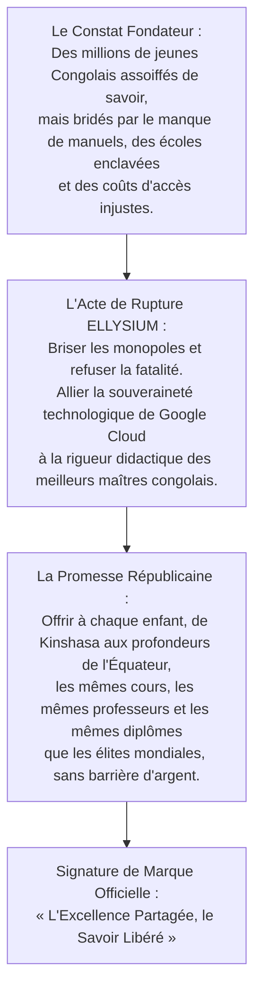
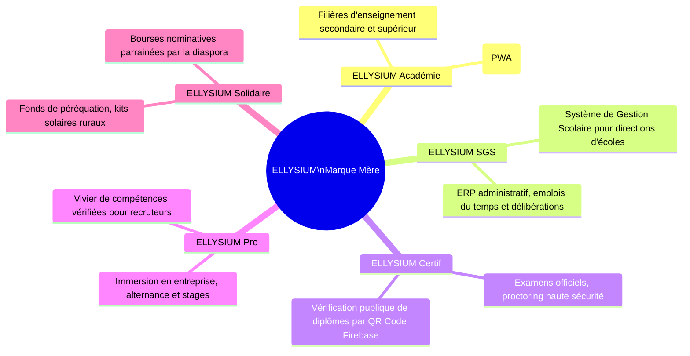

# Module 311 — Plateforme de marque : storytelling, récit fondateur et architecture de marque

> **Positionnement :** Tome 18 — Communication et Marketing
> Module 3 sur 11 | Référence : ELLYSIUM-T18-M311
> **Autorité :** Direction de la Marque / Conseil d'Administration
> **Liaison amont :** Module 310 — Conformité avec la Constitution : transparence et éthique
> **Liaison aval :** Module 312 — Stratégie de communication par public cible

---

## 1. Objet

Une marque éducative d'envergure historique ne se résume pas à un logo ou à une charte graphique : elle porte une vision du monde, un souffle d'émancipation et un récit fondateur capable de fédérer une nation. ELLYSIUM est née du refus viscéral du fatalisme éducatif et de la conviction inébranlable que la République Démocratique du Congo possède en sa jeunesse le plus grand réservoir d'intelligence et de créativité du XXIe siècle.

Ce module formalise la **plateforme de marque officielle d'ELLYSIUM**, son **récit narratif fondateur (Storytelling Institutionnel)**, son **architecture de sous-marques coordonnées** et les canons de son identité visuelle déployée sur l'ensemble de ses landing pages Google Firebase.

---

## 2. Le Récit Fondateur (Brand Storytelling)



---

## 3. Architecture de Marque ELLYSIUM (Branded House)

ELLYSIUM applique une architecture de marque unifiée en ombrelle garantissant une cohérence absolue à travers 5 déclinaisons métiers :



---

## 4. Identité Visuelle et Charte Graphique

La charte graphique est optimisée pour une clarté immédiate sur tous les terminaux mobiles :

| Élément d'Identité | Spécification Technique | Signification Symbolique |
|---|---|---|
| **Couleur Maîtresse : Bleu Nuit Profond** | Hex `#0A192F` / RGB `(10, 25, 47)` | Autorité académique, rigueur scientifique, stabilité institutionnelle |
| **Couleur Lumineuse : Or Rayonnant** | Hex `#F5A623` / RGB `(245, 166, 35)` | Éveil intellectuel, richesse du savoir, espoir de la jeunesse |
| **Couleur d'Action : Vert Espoir Africain** | Hex `#10B981` / RGB `(16, 185, 129)` | Croissance, réussite aux examens, validation de compétences |
| **Typographie Titres** | *Outfit* (Google Fonts) / Graisses Bold & ExtraBold | Modernité épurée, impact visuel fort sur les landing pages |
| **Typographie Corps de Texte** | *Inter* & *Roboto* (Google Fonts) / Graisses Regular & Medium | Lisibilité maximale sur écrans à basse résolution |
| **Emblème Héraldique** | Le Flambeau du Savoir stylisé sous une arche géométrique | Continuité historique et ascension vers l'excellence |

---

## 5. Déploiement des Assets de Marque sur Google Cloud Storage

Tous les composants graphiques (logos vectoriels SVG, favicons PWA, gabarits Google Slides, bannières haute résolution) sont hébergés sur un bucket Cloud Storage public scellé et distribués via Google Cloud CDN :

```typescript
// ellysium/brand/assets.ts
export const ELLYSIUM_BRAND_ASSETS = {
  logoPrincipalSvg:   'https://cdn.ellysium.cd/brand/v1/logo-ellysium-full.svg',
  logoIconeSvg:        'https://cdn.ellysium.cd/brand/v1/logo-flambeau-icon.svg',
  faviconPwa:         'https://cdn.ellysium.cd/brand/v1/favicon-192.png',
  charteGraphiquePdf: 'https://cdn.ellysium.cd/brand/v1/charte-graphique-officielle.pdf',
  signatureOfficielle: 'L\'Excellence Partagée, le Savoir Libéré',
  paletteCouleurs: {
    bleuNuit: '#0A192F',
    orRayonnant: '#F5A623',
    vertSucces: '#10B981',
    blancPur: '#FFFFFF',
    grisFond: '#F8FAFC'
  }
};
```

---

## 6. Verrous Fonctionnels

| ID | Règle | Niveau |
|---|---|---|
| VF-311-01 | La signature de marque « L'Excellence Partagée, le Savoir Libéré » est protégée et inaltérable dans toutes les prises de parole | CRITIQUE |
| VF-311-02 | Aucun tiers ou établissement partenaire ne peut modifier les proportions, couleurs ou typographies du logo officiel | CRITIQUE |
| VF-311-03 | Les 5 déclinaisons de sous-marques (Académie, SGS, Certif, Pro, Solidaire) doivent impérativement conserver le préfixe ELLYSIUM | CRITIQUE |
| VF-311-04 | Tous les assets de marque vectoriels sont obligatoirement servis via Google Cloud CDN avec politique de mise en cache pérenne | OBLIGATOIRE |
| VF-311-05 | La charte graphique officielle fait l'objet d'un scellement juridique à l'Office Congolais de Contrôle (OCC) et à l'OMPI | OBLIGATOIRE |

---

*Sous-tome rédigé conformément aux Normes documentaires ELLYSIUM — Fondations 04.*
