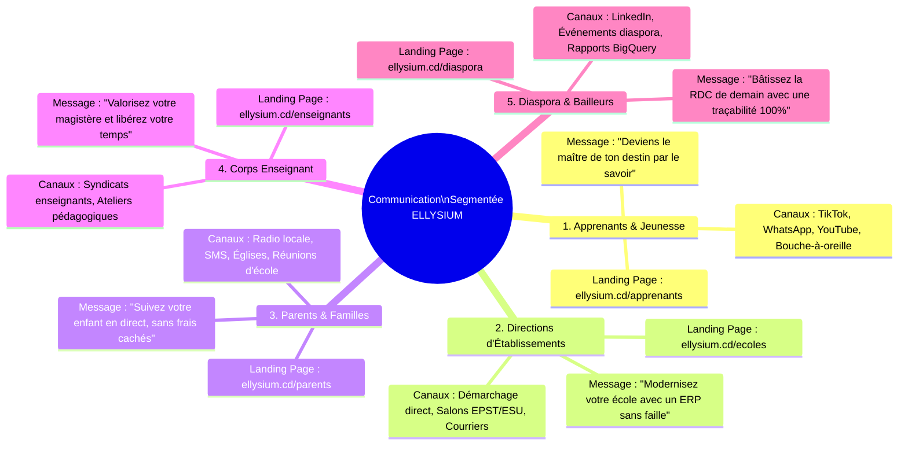
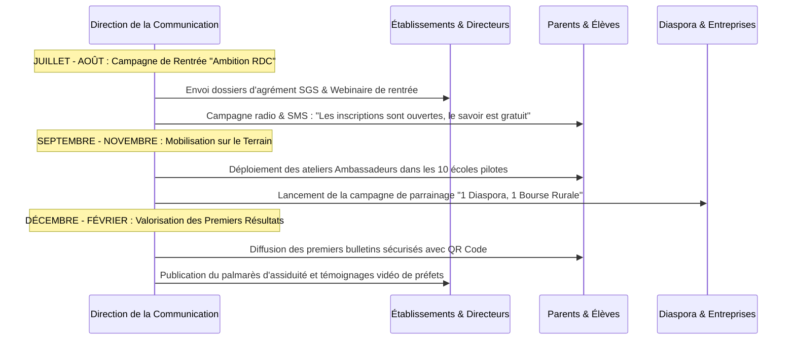

# Module 312 — Stratégie de communication par public : apprenants, établissements, parents, enseignants et diaspora

> **Positionnement :** Tome 18 — Communication et Marketing
> Module 4 sur 11 | Référence : ELLYSIUM-T18-M312
> **Autorité :** Direction de la Communication / Direction des Partenariats
> **Liaison amont :** Module 311 — Plateforme de marque : storytelling et récit fondateur
> **Liaison aval :** Module 313 — Présence sur les réseaux sociaux et relations presse

---

## 1. Objet

Une communication indifférenciée est inopérante : les préoccupations d'un adolescent de 16 ans préparant son Examen d'État à Goma ne croisent en rien celles d'un préfet d'études gérant 800 inscriptions à Lubumbashi, d'une mère commerçante à Kinshasa inquiète pour l'avenir de sa fille, ou d'un ingénieur de la diaspora à Bruxelles désireux de parrainer une bourse d'études.

Ce module structure la **stratégie de communication segmentée d'ELLYSIUM**, définit pour chacun des 5 publics clés le message central, les canaux de diffusion prioritaires, la tonalité d'expression et la landing page Firebase dédiée.

---

## 2. Matrice Stratégique des 5 Publics Cibles



---

## 3. Déclinaison Précise des Messages et Contenus par Cible

| Public Cible | Attente Prioritaire | Message Clé ELLYSIUM | Format Privilégié | Landing Page Dédiée |
|---|---|---|---|---|
| **Apprenants (Élèves & Étudiants)** | Réussir ses examens, trouver un emploi, étudier sans payer de forfait data | *« Révise tes cours même sans Internet, passe tes quiz et décroche des compétences certifiées de niveau mondial. »* | Vidéos courtes TikTok/Reels, défis de code, fiches quiz | [`ellysium.cd/apprenants`](https://ellysium.cd/apprenants) |
| **Directeurs & Préfets (B2B)** | Éliminer les fraudes de notes, gagner du temps administratif, valoriser son école | *« Clôturez vos délibérations en un clic grâce à la formule officielle RDC et offrez à vos élèves des bulletins infalsifiables. »* | Démonstrations interactives en ligne, comparatifs de coûts, webinaires | [`ellysium.cd/ecoles`](https://ellysium.cd/ecoles) |
| **Parents d'Élèves & Tuteurs** | Sérénité, contrôle des absences, garantie que l'école est gratuite | *« Recevez un SMS dès que votre enfant entre en classe et consultez son vrai bulletin sans risque d'arnaque. »* | Spots radio en langues nationales, dépliants illustrés | [`ellysium.cd/parents`](https://ellysium.cd/parents) |
| **Enseignants & Professeurs** | Fin des nuits blanches de calcul de moyennes, respect de leur autorité | *« L'IA vous assiste mais ne vous remplace jamais. Vos cours sont valorisés et vos corrections simplifiées. »* | Témoignages de pairs, tutoriels de prise en main, webinaires DA | [`ellysium.cd/enseignants`](https://ellysium.cd/enseignants) |
| **Diaspora & Mécènes** | Impact concret et traçable, refus de la corruption | *« Chaque dollar investi finance un kit solaire ou une bourse d'élève vérifiable directement sur notre registre public. »* | Rapports analytiques Looker Studio, vidéos documentaires de terrain | [`ellysium.cd/diaspora`](https://ellysium.cd/diaspora) |

---

## 4. Plan de Campagne et Orchestration Multicanale

Les actions de communication s'articulent selon un rythme trimestriel synchronisé avec le calendrier scolaire congolais :



---

## 5. Schéma SQL — Gestion des Campagnes et Segments d'Audience

```sql
-- Cloud SQL PostgreSQL 16
CREATE TABLE schema_communication.segments_audiences_cibles (
    id UUID PRIMARY KEY DEFAULT gen_random_uuid(),
    code_segment VARCHAR(30) UNIQUE NOT NULL CHECK (code_segment IN ('APPRENANTS', 'DIRECTIONS_B2B', 'PARENTS', 'ENSEIGNANTS', 'DIASPORA')),
    landing_page_associee VARCHAR(100) NOT NULL,
    tonalite_editoriale VARCHAR(50) NOT NULL,
    langue_principale VARCHAR(10) DEFAULT 'fr',
    canaux_privilegies TEXT[] NOT NULL,
    created_at TIMESTAMPTZ DEFAULT NOW()
);

CREATE TABLE schema_communication.conversions_landing_pages (
    id UUID PRIMARY KEY DEFAULT gen_random_uuid(),
    segment_code VARCHAR(30) NOT NULL REFERENCES schema_communication.segments_audiences_cibles(code_segment),
    url_provenance VARCHAR(255),
    action_conversion VARCHAR(50) NOT NULL CHECK (action_conversion IN (
        'TELECHARGEMENT_PWA', 'DEMANDE_DEMO_SGS', 'SOUSCRIPTION_NEWSLETTER_SMS',
        'CANDIDATURE_ENSEIGNANT', 'DON_PARRAINAGE_DIASPORA'
    )),
    ip_anonymisee_hash VARCHAR(64) NOT NULL,
    terminal_type VARCHAR(30), -- 'MOBILE_ANDROID', 'DESKTOP', 'TABLETTE'
    date_evenement TIMESTAMPTZ DEFAULT NOW()
);

CREATE INDEX idx_conversion_segment ON schema_communication.conversions_landing_pages(segment_code);
CREATE INDEX idx_conversion_date ON schema_communication.conversions_landing_pages(date_evenement);
```

---

## 6. Verrous Fonctionnels

| ID | Règle | Niveau |
|---|---|---|
| VF-312-01 | Chaque public cible doit disposer d'une landing page dédiée hébergée sur Firebase Hosting sans interférence | CRITIQUE |
| VF-312-02 | Les messages destinés aux parents doivent impérativement être traduits dans la langue nationale de leur province | CRITIQUE |
| VF-312-03 | Il est formellement interdit d'utiliser un ton commercial agressif ou racoleur dans la communication destinée aux élèves | CRITIQUE |
| VF-312-04 | La campagne destinée à la diaspora doit comporter un lien direct vers le registre public d'audit des bourses BigQuery | OBLIGATOIRE |
| VF-312-05 | Les taux de conversion et métriques de chaque landing page sont analysés chaque semaine sous Google Analytics 4 | OBLIGATOIRE |
| VF-312-06 | Toute communication institutionnelle porte un identifiant de source vérifiable | OBLIGATOIRE |

---

*Sous-tome rédigé conformément aux Normes documentaires ELLYSIUM — Fondations 04.*
