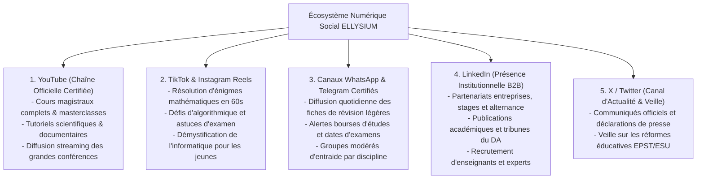
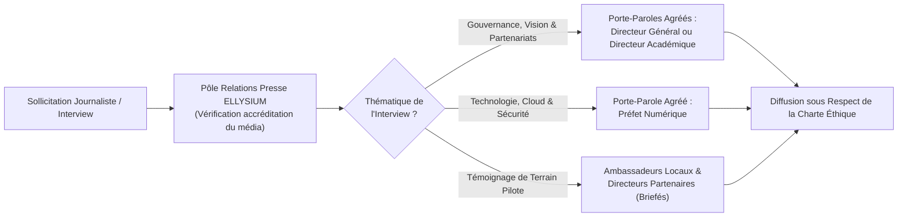

# Module 313 — Présence sur les réseaux sociaux et relations presse

> **Positionnement :** Tome 18 — Communication et Marketing
> Module 5 sur 11 | Référence : ELLYSIUM-T18-M313
> **Autorité :** Responsable Relations Publiques / Direction de la Communication
> **Liaison amont :** Module 312 — Stratégie de communication par public cible
> **Liaison aval :** Module 314 — Marketing de contenu : blogs, vidéos et témoignages

---

## 1. Objet

À l'ère de l'hyper-connectivité mobile, l'opinion publique congolaise et africaine se forge à la croisée des réseaux sociaux numériques et des médias traditionnels (radio, télévision, presse en ligne). Pour asseoir son autorité institutionnelle sans verser dans le sensationnalisme, ELLYSIUM déploie une **stratégie d'influence équilibrée** :
1. Une **présence active et certifiée sur les plateformes numériques majeures** (YouTube, TikTok, WhatsApp, LinkedIn, X/Twitter).
2. Un **dispositif rigoureux de relations presse** tissant des liens de confiance avec les journalistes nationaux, régionaux et les radios communautaires provinciales.

Ce module fixe les lignes éditoriales par plateforme, le protocole de prise de parole médiatique des porte-paroles et les règles d'accréditation des journalistes partenaires.

---

## 2. Cartographie de la Présence sur les Réseaux Sociaux

Chaque plateforme numérique répond à un objectif éditorial et pédagogique exclusif :



---

## 3. Dispositif de Relations Presse et Médias Traditionnels

En République Démocratique du Congo, la **radio demeure le média le plus puissant et le plus universel**, touchant les populations au-delà de toute couverture Internet. ELLYSIUM structure ses relations presse en 3 cercles concentriques :

| Cercle Médiatique | Médias Cibles | Format d'Intervention | Objectif Stratégique |
|---|---|---|---|
| **Radios de Proximité & Communautaires** | Plus de 80 radios associatives et confessionnelles de province | Chronique hebdomadaire de 15 min en langues nationales | Toucher les familles rurales et parents non connectés |
| **Presse d'Actualité Nationale & Web** | *Actualite.cd*, *MediaCongo.net*, *7sur7.cd*, *DeskEco* | Communiqués de presse, tribunes d'experts et points d'étape | Crédibilité intellectuelle et transparence des résultats |
| **Télévision Nationale & Chaînes d'Info** | RTNC, Top Congo FM/TV, Télé 50, B-One | Débats éducatifs, reportages in situ dans les 10 écoles pilotes | Visibilité grand public et solennité institutionnelle |

---

## 4. Protocole de Prise de Parole et Porte-Parolat Agréé

Pour garantir une parole publique irréprochable et cohérente :



---

## 5. Schéma SQL — Suivi des Retombées Presse et Publications Sociales

```sql
-- Cloud SQL PostgreSQL 16
CREATE TABLE schema_communication.publications_reseaux_sociaux (
    id UUID PRIMARY KEY DEFAULT gen_random_uuid(),
    plateforme VARCHAR(30) NOT NULL CHECK (plateforme IN ('YOUTUBE', 'TIKTOK', 'WHATSAPP_CANAL', 'LINKEDIN', 'X_TWITTER')),
    titre_publication VARCHAR(255) NOT NULL,
    url_publication VARCHAR(255) UNIQUE NOT NULL,
    objectif_pedagogique VARCHAR(100) NOT NULL,
    nb_vues INTEGER DEFAULT 0,
    nb_partages INTEGER DEFAULT 0,
    taux_engagement_pct NUMERIC(5,2) DEFAULT 0.00,
    conforme_charte_ethique BOOLEAN NOT NULL DEFAULT TRUE,
    date_publication TIMESTAMPTZ DEFAULT NOW()
);

CREATE TABLE schema_communication.retombees_presse (
    id UUID PRIMARY KEY DEFAULT gen_random_uuid(),
    nom_media VARCHAR(150) NOT NULL,
    type_media VARCHAR(30) NOT NULL CHECK (type_media IN ('RADIO_COMMUNAUTAIRE', 'PRESSE_WEB', 'TELEVISION', 'PRESSE_ECRITE')),
    journaliste_nom VARCHAR(150),
    titre_article_emission VARCHAR(255) NOT NULL,
    tonalite_article VARCHAR(20) NOT NULL CHECK (tonalite_article IN ('TRES_FAVORABLE', 'POSITIF', 'NEUTRE', 'CRITIQUE')),
    url_ou_enregistrement_gcs VARCHAR(255) NOT NULL,
    date_parution DATE NOT NULL,
    created_at TIMESTAMPTZ DEFAULT NOW()
);
```

---

## 6. Verrous Fonctionnels

| ID | Règle | Niveau |
|---|---|---|
| VF-313-01 | Seuls les porte-paroles officiellement mandatés par le Directeur Général sont habilités à s'exprimer devant les médias | CRITIQUE |
| VF-313-02 | Aucun compte sur les réseaux sociaux ne peut être ouvert sous le nom ELLYSIUM sans validation préalable de la Direction de la Marque | CRITIQUE |
| VF-313-03 | Il est strictement interdit de rémunérer des journalistes ou des influenceurs pour publier des avis complaisants sur ELLYSIUM | CRITIQUE |
| VF-313-04 | Tous les commentaires sur les canaux sociaux officiels font l'objet d'une modération active protégeant les mineurs contre le cyberharcèlement | CRITIQUE |
| VF-313-05 | Les vidéos diffusées sur YouTube doivent comporter des sous-titres complets et être hébergées en copie sur Cloud Storage | OBLIGATOIRE |

---

*Sous-tome rédigé conformément aux Normes documentaires ELLYSIUM — Fondations 04.*
