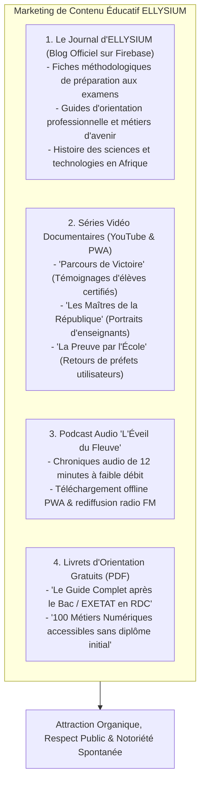
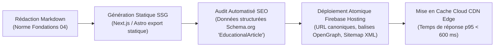

# Module 314 — Marketing de contenu : blogs, vidéos, témoignages et success stories

> **Positionnement :** Tome 18 — Communication et Marketing
> Module 6 sur 11 | Référence : ELLYSIUM-T18-M314
> **Autorité :** Responsable Contenu & Médias / Direction Éditoriale
> **Liaison amont :** Module 313 — Présence sur les réseaux sociaux et relations presse
> **Liaison aval :** Module 315 — Organisation d'événements : webinaires et salons

---

## 1. Objet

À la publicité intrusive et coûteuse, ELLYSIUM préfère le **marketing de contenu éducatif à haute valeur ajoutée (Inbound Educational Marketing)**. En offrant gratuitement des analyses intellectuelles rigoureuses, des fiches méthodologiques de révision, des récits de vie authentiques et des guides d'orientation professionnelle, la plateforme gagne naturellement la confiance des familles, des enseignants et des décideurs scolaires.

Ce module détaille la ligne éditoriale du **Journal Numérique ELLYSIUM**, encadre la production des séries vidéo documentaires de terrain (*Success Stories*), structure le podcast audio éducatif et définit la stratégie d'optimisation pour le moteur de recherche Google (SEO).

---

## 2. Piliers de la Stratégie de Contenu



---

## 3. Série Vidéo « Parcours de Victoire » (Les Success Stories Réelles)

Pour inspirer la jeunesse congolaise sans misérabilisme, les témoignages obéissent à un cahier des charges rigoureux :
1. **Vérité Historique :** Chaque témoignage d'élève relate son parcours réel avec vérification de son relevé de notes sous Cloud SQL.
2. **Focus sur l'Effort Personnel :** La vidéo met en lumière le travail acharné de l'apprenant, le soutien de sa famille et l'accompagnement de ses professeurs, évitant de présenter ELLYSIUM comme une « baguette magique ».
3. **Plein Accord Écrit :** L'apprenant majeur ou les tuteurs légaux du mineur signent une convention de diffusion respectant l'Article 2 du Module 310.

---

## 4. Architecture Technique et SEO du Blog sur Firebase Hosting

Le Journal d'ELLYSIUM est optimisé pour indexation maximale sur Google Search :



---

## 5. Schéma SQL — Catalogue des Contenus Marketing et Articles

```sql
-- Cloud SQL PostgreSQL 16
CREATE TABLE schema_communication.articles_blog_journal (
    id UUID PRIMARY KEY DEFAULT gen_random_uuid(),
    slug VARCHAR(150) UNIQUE NOT NULL, -- Ex: 'reussir-mathematiques-exetat-rdc'
    titre VARCHAR(255) NOT NULL,
    resume_chapeau TEXT NOT NULL,
    contenu_markdown_gcs_uri VARCHAR(255) NOT NULL,
    auteur_nom VARCHAR(150) NOT NULL,
    auteur_titre VARCHAR(150) NOT NULL,
    categorie VARCHAR(50) NOT NULL CHECK (categorie IN ('METHODOLOGIE', 'ORIENTATION', 'SCIENCES_AFRIQUE', 'METIERS_TECH')),
    temps_lecture_minutes INTEGER NOT NULL,
    nb_lectures_uniques INTEGER DEFAULT 0,
    balises_schema_org JSONB NOT NULL,
    date_publication DATE NOT NULL,
    statut VARCHAR(20) DEFAULT 'PUBLIE' CHECK (statut IN ('BROUILLON', 'PUBLIE', 'ARCHIVE')),
    created_at TIMESTAMPTZ DEFAULT NOW()
);

CREATE TABLE schema_communication.series_video_documentaires (
    id UUID PRIMARY KEY DEFAULT gen_random_uuid(),
    code_serie VARCHAR(30) NOT NULL CHECK (code_serie IN ('PARCOURS_VICTOIRE', 'MAITRES_REPUBLIQUE', 'PREUVE_ECOLE')),
    titre_episode VARCHAR(255) NOT NULL,
    temoin_nom_complet VARCHAR(150) NOT NULL,
    etablissement_origine VARCHAR(200) NOT NULL,
    duree_secondes INTEGER NOT NULL CHECK (duree_secondes <= 360), -- Max 6 minutes
    youtube_video_id VARCHAR(50) NOT NULL,
    video_archive_gcs_hash VARCHAR(255) NOT NULL,
    autorisation_diffusion_validee BOOLEAN NOT NULL DEFAULT FALSE,
    date_diffusion DATE NOT NULL,
    created_at TIMESTAMPTZ DEFAULT NOW()
);
```

---

## 6. Verrous Fonctionnels

| ID | Règle | Niveau |
|---|---|---|
| VF-314-01 | Tout témoignage ou success story publié doit faire l'objet d'une vérification académique formelle des résultats sous Cloud SQL | CRITIQUE |
| VF-314-02 | Les articles du Journal d'ELLYSIUM sont publiés sous licence Creative Commons (CC BY-NC-SA) au service du bien public | CRITIQUE |
| VF-314-03 | L'ensemble des articles et pages de blog doit respecter un score de performance SEO Google Lighthouse d'au moins 95/100 | CRITIQUE |
| VF-314-04 | Aucun article ne peut promouvoir de produit commercial payant externe à la plateforme ELLYSIUM | OBLIGATOIRE |
| VF-314-05 | Les podcasts audio doivent être encodés en formats légers (< 10 Mo) pour être téléchargeables sans surconsommation de données | OBLIGATOIRE |
| VF-314-06 | Toute communication institutionnelle porte un identifiant de source vérifiable | OBLIGATOIRE |

---

*Sous-tome rédigé conformément aux Normes documentaires ELLYSIUM — Fondations 04.*
