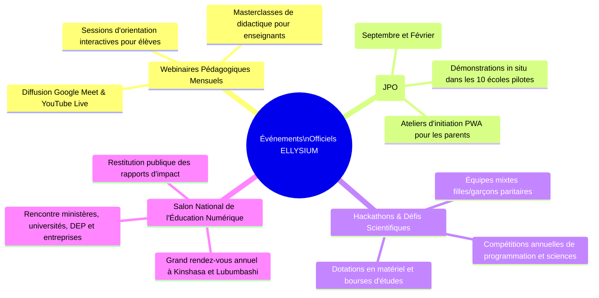
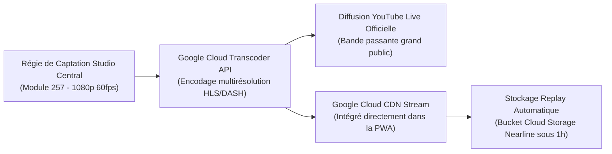

# Module 315 — Organisation d'événements : webinaires, salons éducatifs et journées portes ouvertes

> **Positionnement :** Tome 18 — Communication et Marketing
> Module 7 sur 11 | Référence : ELLYSIUM-T18-M315
> **Autorité :** Pôle Événementiel / Direction de la Communication
> **Liaison amont :** Module 314 — Marketing de contenu : blogs, vidéos et témoignages
> **Liaison aval :** Module 316 — Plan de communication de la phase pilote

---

## 1. Objet

Si l'infrastructure d'ELLYSIUM est 100 % dématérialisée sous Google Cloud, l'adhésion populaire et institutionnelle exige des moments réguliers de rencontre physique et humaine. Les événements publics créent des ponts irremplaçables entre les concepteurs de la plateforme, les enseignants de terrain, les familles d'élèves, les autorités gouvernementales et les recruteurs industriels.

Ce module fixe le calendrier annuel, l'ingénierie logistique et les protocoles techniques régissant les **événements institutionnels d'ELLYSIUM** : webinaires pédagogiques mensuels, Journées Portes Ouvertes (JPO) dans les établissements pilotes, Hackathons inter-écoles et le Salon National Annuel de l'Éducation Numérique.

---

## 2. Le Quadrilatère Événementiel ELLYSIUM



---

## 3. Typologie et Modalités d'Organisation des Événements

| Format d'Événement | Périodicité | Public Cible | Lieu & Canaux | Modalités d'Accès |
|---|---|---|---|---|
| **Webinaires « Cap Réussite »** | Mensuel (Dernier mercredi du mois) | Apprenants, candidats aux examens | En ligne (YouTube Live + streaming CDN) | **100 % Gratuit et sans inscription préalable** |
| **Journées Portes Ouvertes (JPO)** | Bi-annuel (Rentrée & Mi-semestre) | Parents, futurs élèves, enseignants locaux | Dans les 10 Établissements Pilotes | Accès libre dans les salles informatiques |
| **Hackathon National « Code Congo »** | Annuel (Avril - 48h non-stop) | Étudiants en informatique & passionnés | Hybride : Hubs Kinshasa/Goma/L'shi + Cloud | Candidature sur projet, dotation 10 000 USD |
| **Grand Forum de l'Éducation Numérique** | Annuel (Clôture de l'année académique) | Tutelle EPST/ESU, corps diplomatique, bailleurs | Centre de conférences Kinshasa | Sur invitation protocolaire et retransmission web |

---

## 4. Architecture Technique de Diffusion Streaming Hybride

Pour garantir une retransmission fluide même aux spectateurs connectés en 3G instable :



---

## 5. Schéma SQL — Gestion des Inscriptions et Événements

```sql
-- Cloud SQL PostgreSQL 16
CREATE TABLE schema_communication.evenements_officiels (
    id UUID PRIMARY KEY DEFAULT gen_random_uuid(),
    code_evenement VARCHAR(30) UNIQUE NOT NULL, -- Ex: 'JPO-2026-SEP', 'HACK-CODECONGO-2027'
    type_evenement VARCHAR(30) NOT NULL CHECK (type_evenement IN ('WEBINAIRE', 'JPO', 'HACKATHON', 'FORUM_NATIONAL')),
    intitule VARCHAR(255) NOT NULL,
    date_debut TIMESTAMPTZ NOT NULL,
    date_fin TIMESTAMPTZ NOT NULL,
    lieu_physique VARCHAR(200), -- NULL si 100% virtuel
    flux_streaming_url VARCHAR(255),
    nb_participants_estimes INTEGER NOT NULL,
    nb_participants_effectifs INTEGER DEFAULT 0,
    budget_alloue_usd NUMERIC(10,2) NOT NULL,
    statut VARCHAR(20) DEFAULT 'PLANIFIE' CHECK (statut IN ('PLANIFIE', 'EN_COURS', 'CLOTURE', 'ANNULE')),
    created_at TIMESTAMPTZ DEFAULT NOW()
);

CREATE TABLE schema_communication.inscriptions_evenements (
    id UUID PRIMARY KEY DEFAULT gen_random_uuid(),
    evenement_id UUID NOT NULL REFERENCES schema_communication.evenements_officiels(id),
    participant_nom VARCHAR(150) NOT NULL,
    participant_email VARCHAR(200),
    participant_telephone VARCHAR(50) NOT NULL,
    categorie VARCHAR(30) CHECK (categorie IN ('ELEVE', 'PARENT', 'ENSEIGNANT', 'CHEF_ETABLISSEMENT', 'ENTREPRISE')),
    presence_confirmee BOOLEAN DEFAULT FALSE,
    created_at TIMESTAMPTZ DEFAULT NOW()
);
```

---

## 6. Verrous Fonctionnels

| ID | Règle | Niveau |
|---|---|---|
| VF-315-01 | L'accès à tous les webinaires et Journées Portes Ouvertes est strictement gratuit pour le public | CRITIQUE |
| VF-315-02 | Les rediffusions vidéo (Replay) de tous les événements publics doivent être disponibles sous 24h sur YouTube et dans la PWA | CRITIQUE |
| VF-315-03 | Les équipes des hackathons d'élèves doivent obligatoirement respecter une parité filles/garçons d'au moins 40 % de mixité | CRITIQUE |
| VF-315-04 | Tout événement physique accueillant des élèves mineurs doit disposer d'un protocole de sécurité et de secours validé in situ | OBLIGATOIRE |
| VF-315-05 | Le budget événementiel annuel global ne doit jamais dépasser 8 % des charges d'exploitation totales de l'institution | OBLIGATOIRE |

---

*Sous-tome rédigé conformément aux Normes documentaires ELLYSIUM — Fondations 04.*
