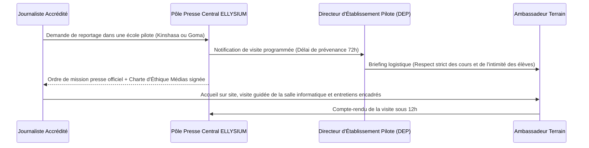

# Module 316 — Plan de communication de la phase pilote (articulation avec le Tome 16)

> **Positionnement :** Tome 18 — Communication et Marketing
> Module 8 sur 11 | Référence : ELLYSIUM-T18-M316
> **Autorité :** Direction de la Communication / Comité de Pilotage (COPIL)
> **Liaison amont :** Module 315 — Organisation d'événements : webinaires et salons
> **Liaison aval :** Module 317 — Gestion de la réputation en ligne et communication de crise

---

## 1. Objet

L'expérimentation pilote dans les 10 établissements partenaires (Phase 1, régie par le **Tome 16**) constitue le banc d'essai décisif de la crédibilité publique d'ELLYSIUM. Une communication mal synchronisée – qu'elle pèche par excès de triomphalisme prématuré ou par opacité face aux inévitables incidents de démarrage – ruinerait la confiance des familles et des autorités scolaires.

Ce module structure le **plan de communication dédié à la Phase Pilote (J-60 à J+180)**, synchronise les prises de parole avec les jalons opérationnels du Comité de Pilotage (Module 290) et encadre le rôle de porte-voix des Ambassadeurs ELLYSIUM sur le terrain.

---

## 2. Chronogramme de Communication Synchronisé (J-60 à J+180)

```mermaid
gantt
    title Plan de Communication de la Phase Pilote ELLYSIUM
    dateFormat X
    axisFormat J%+d

    section Phase 1 : Ancrage & Réassurance (J-60 à J-1)
    Campagne de dialogue avec les parents et églises :crit, p1, 0, 30
    Ateliers d'explication "Pas d'enfants cobayes"    :done, p2, 30, 60
    section Phase 2 : Rentrée Sobre & Responsable (J0 à J+30)
    Point presse solennel de rentrée conjointe      :milestone, j0, 60, 0
    Focus sur l'installation des nœuds de cache      :active, p3, 60, 90
    section Phase 3 : Récits de Terrain Vécus (J+31 à J+150)
    Série documentaire "Journal du Pilote" (Bimensuelle):active, p4, 90, 210
    Mise en avant des réussites et des leçons apprises:active, p5, 120, 210
    section Phase 4 : Restitution & Grand Déploiement (J+151 à J+180)
    Conférence de presse officielle de clôture pilote:milestone, j180, 240, 0
    Annonce du passage à l'échelle Phase 2 (Info)    :crit, p6, 210, 240
```



---

## 3. Les 4 Temps Forts Narratifs de la Phase Pilote

| Période | Intitulé Narratif | Angle Éditorial & Prises de Parole | Actions Concrètes |
|---|---|---|---|
| **J-60 à J-1** | *« Bâtir la Confiance »* | Empathie, désamorçage des rumeurs, affirmation de la gratuité totale | Réunions de quartier, passages sur les radios locales, affichage sobre |
| **J0 à J+30** | *« L'Heure des Pionniers »* | Rigueur, humilité scientifique, écoute active des premiers retours | Couverture médiatique sobre, mise en valeur des 20 premiers Ambassadeurs |
| **J+31 à J+150** | *« La Preuve par la Classe »* | Authenticité, transparence sur les défis surmontés (coupures d'électricité) | Chroniques régulières sur le blog et les réseaux sociaux montrant les solutions locales |
| **J+151 à J+180** | *« Le Pari Réussi »* | Célébration des réussites d'élèves, restitution officielle des chiffres au COPIL | Cérémonie publique de remise des attestations et conférence de presse nationale |

---

## 4. Coordination Opérationnelle entre Ambassadeurs et Relations Presse

Pour éviter que des journalistes ne perturbent le travail scolaire ou ne déforment les faits lors de leurs visites dans les écoles pilotes :



---

## 5. Schéma SQL — Suivi des Couvertures Médias de la Phase Pilote

```sql
-- Cloud SQL PostgreSQL 16
CREATE TABLE schema_communication.couvertures_presse_pilote (
    id UUID PRIMARY KEY DEFAULT gen_random_uuid(),
    code_etablissement_pilote VARCHAR(20) NOT NULL, -- Ex: 'EP-01' à 'EP-10'
    date_visite DATE NOT NULL,
    organe_presse VARCHAR(150) NOT NULL,
    type_reportage VARCHAR(30) CHECK (type_reportage IN ('RADIO_DIRECT', 'REPORTAGE_TV', 'ARTICLE_EN_LIGNE', 'PAPIER_ECRIT')),
    sujet_traite VARCHAR(255) NOT NULL,
    tonalite_observee VARCHAR(20) CHECK (tonalite_observee IN ('TRES_POSITIVE', 'CONSTRUCTIVE', 'SCEPTIQUE', 'HOSTILE')),
    autorisation_parentale_respectee BOOLEAN NOT NULL DEFAULT TRUE,
    lien_archivage_gcs VARCHAR(255) NOT NULL,
    created_at TIMESTAMPTZ DEFAULT NOW()
);

CREATE INDEX idx_presse_etab ON schema_communication.couvertures_presse_pilote(code_etablissement_pilote);
```

---

## 6. Verrous Fonctionnels

| ID | Règle | Niveau |
|---|---|---|
| VF-316-01 | Aucun reportage journalistique in situ ne peut avoir lieu sans l'accord écrit préalable du Directeur de l'école | CRITIQUE |
| VF-316-02 | La communication de la Phase 1 doit proscrire tout triomphalisme avant la clôture officielle à J+180 par le COPIL | CRITIQUE |
| VF-316-03 | Tout incident technique survenant en phase pilote doit être assumé avec transparence et pédagogie | CRITIQUE |
| VF-316-04 | Les Ambassadeurs locaux doivent être briefés sur les messages clés avant toute interaction avec la presse locale | OBLIGATOIRE |
| VF-316-05 | Les retombées presse de la phase pilote sont consolidées chaque mois dans le rapport d'étape remis au COPIL | OBLIGATOIRE |

---

*Sous-tome rédigé conformément aux Normes documentaires ELLYSIUM — Fondations 04.*
