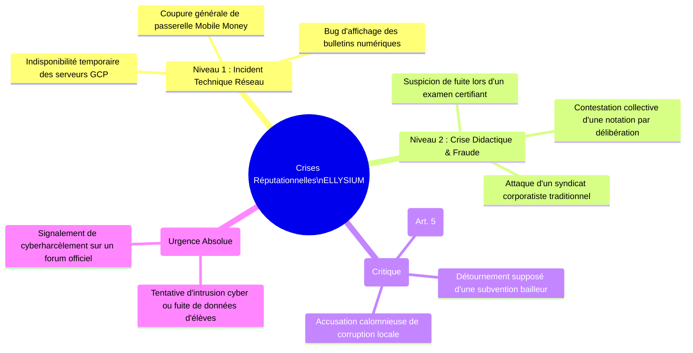
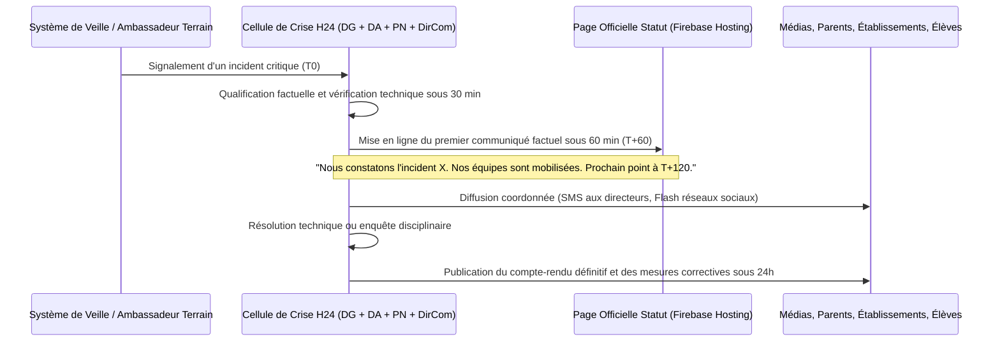

# Module 317 — Gestion de la réputation en ligne et communication de crise

> **Positionnement :** Tome 18 — Communication et Marketing
> Module 9 sur 11 | Référence : ELLYSIUM-T18-M317
> **Autorité :** Direction de la Communication / Secrétariat Général
> **Liaison amont :** Module 316 — Plan de communication de la phase pilote
> **Liaison aval :** Module 318 — Mesure de l'efficacité : ROI, notoriété, NPS et budget marketing

---

## 1. Objet

À l'ère de l'information virale, la réputation d'une institution éducative peut être déstabilisée en quelques heures par une rumeur malveillante, un incident technique mal géré, une fuite de sujet d'examen ou une fausse accusation de marchandage de notes. Dans le contexte sensible de la RDC, où les réseaux sociaux (WhatsApp, TikTok, Facebook) amplifient instantanément les paniques collectives, l'improvisation face à une crise est fatale.

Ce module formalise le **dispositif permanent de veille et de veille d'e-réputation**, structure la **Cellule de Crise Communicationnelle H24**, et arrête le protocole d'intervention d'urgence (**la règle d'or de la première heure**) garantissant transparence, vérité et sang-froid.

---

## 2. Typologie des Crises Majeures et Niveaux de Gravité



---

## 3. Protocole d'Urgence : La Règle d'Or des 60 Minutes

Dès qu'un signal d'alerte critique est détecté, la Cellule de Crise applique une chronologie millimétrée :



---

## 4. La Page Publique d'Incidents et de Transparence (Status Page)

Pour couper court aux rumeurs de panne générale ou de faillite, ELLYSIUM maintient une page d'état public permanente déployée sur Firebase Hosting : [`status.ellysium.cd`](https://status.ellysium.cd).

Cette page affiche en direct l'état des services fondamentaux (SGS, PWA, Passerelles Télécoms, Cloud SQL, Vertex AI), alimentée directement par Google Cloud Monitoring sans intervention humaine modératrice.

---

## 5. Schéma SQL — Registre des Incidents et Crises Médiatiques

```sql
-- Cloud SQL PostgreSQL 16
CREATE TABLE schema_communication.incidents_crises_reputation (
    id UUID PRIMARY KEY DEFAULT gen_random_uuid(),
    code_incident VARCHAR(30) UNIQUE NOT NULL, -- Ex: 'CRISE-2026-11-04'
    typologie VARCHAR(40) NOT NULL CHECK (typologie IN ('TECHNIQUE_GCP', 'FRAUDE_EXAMEN', 'ETHIQUE_FINANCIERE', 'CYBER_SECURITE_MINEURS')),
    gravite INTEGER NOT NULL CHECK (gravite BETWEEN 1 AND 4),
    date_declaration TIMESTAMPTZ DEFAULT NOW(),
    source_alerte VARCHAR(100) NOT NULL,
    resume_faits TEXT NOT NULL,
    delai_premiere_reponse_minutes INTEGER NOT NULL,
    communique_initial_gcs_hash VARCHAR(255) NOT NULL,
    statut_crise VARCHAR(30) DEFAULT 'ACTIVE' CHECK (statut_crise IN ('ACTIVE', 'MAITRISEE', 'CLOTUREE_POST_MORTEM')),
    post_mortem_public_url VARCHAR(255),
    cloture_par_nom VARCHAR(150),
    date_cloture TIMESTAMPTZ
);

CREATE INDEX idx_crise_gravite ON schema_communication.incidents_crises_reputation(gravite);
CREATE INDEX idx_crise_statut ON schema_communication.incidents_crises_reputation(statut_crise);
```

---

## 6. Verrous Fonctionnels

| ID | Règle | Niveau |
|---|---|---|
| VF-317-01 | Tout incident de crise majeur doit recevoir une première réponse publique factuelle en moins de 60 minutes | CRITIQUE |
| VF-317-02 | Il est formellement interdit de masquer, censurer ou minimiser un incident avéré affectant les données d'élèves | CRITIQUE |
| VF-317-03 | La page d'état technique `status.ellysium.cd` doit être alimentée en direct par les API de télémétrie Google Cloud | CRITIQUE |
| VF-317-04 | Tout signalement de violation de l'Article 5 (séparation caisse/pédagogie) déclenche une enquête immédiate de la cellule de crise | CRITIQUE |
| VF-317-05 | Un rapport de retour d'expérience (Post-Mortem) public doit être publié sous 48 heures suivant la résolution de toute crise | OBLIGATOIRE |
| VF-317-06 | Toute communication institutionnelle porte un identifiant de source vérifiable | OBLIGATOIRE |

---

*Sous-tome rédigé conformément aux Normes documentaires ELLYSIUM — Fondations 04.*
