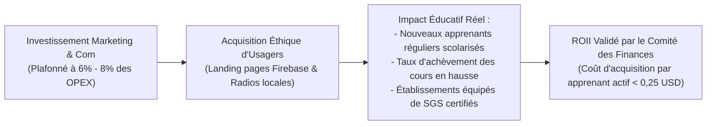
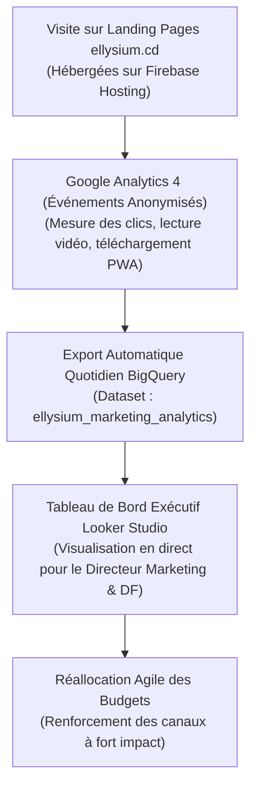

# Module 318 — Mesure de l'efficacité : ROI, notoriété, NPS et budget marketing

> **Positionnement :** Tome 18 — Communication et Marketing
> Module 10 sur 11 | Référence : ELLYSIUM-T18-M318
> **Autorité :** Direction Marketing / Direction Financière
> **Liaison amont :** Module 317 — Gestion de la réputation en ligne et communication de crise
> **Liaison aval :** Module 319 — Dépendances du Tome 18

---

## 1. Objet

L'action de communication d'ELLYSIUM refuse tout gaspillage financier et toute dispersion publicitaire stérile. En tant qu'institution à but non lucratif œuvrant pour le bien public, chaque franc ou dollar investi dans la notoriété de la plateforme doit être mesuré à l'aune de son efficacité réelle : **combien d'apprenants vulnérables ont été sauvés du décrochage, combien d'écoles ont été modernisées et quel est l'indice de confiance publique généré**.

Ce module structure le **cadre d'évaluation de la performance marketing et de communication**, définit les indicateurs clés de retour sur investissement d'impact (ROII), analyse la notoriété sous Google Analytics 4 et BigQuery, et fixe l'encadrement strict du budget marketing annuel.

---

## 2. Le Retour sur Investissement d'Impact (ROII)

Dans une institution éducative républicaine, le « ROI » traditionnel est remplacé par le **Retour sur Investissement d'Impact Sociétal (ROII)** :

$$\text{ROII} = \frac{\text{Nombre d'Apprenants Rétablis / Certifiés} \times \text{Valeur Sociale de Diplomation}}{\text{Dépenses Globales de Communication}}$$



---

## 3. Tableau de Bord Multidimensionnel d'Efficacité

L'efficacité globale est pilotée sous Google Looker Studio à travers 5 indicateurs stratégiques :

| Indicateur | Mode de Mesure & Outil | Cible Annuelle | Tolérance Minimale |
|---|---|---|---|
| **Coût d'Acquisition par Apprenant (CAC)** | Budget com / Nouveaux inscrits actifs | <= 0,20 USD | > 0,35 USD (Alerte) |
| **Taux de Conversion Landing Pages** | Visiteurs uniques / Inscriptions PWA (GA4) | >= 18 % | < 12 % |
| **Notoriété Spontanée de Marque** | Sondage représentatif annuel (Grandes villes) | >= 40 % (An 3) | < 25 % |
| **Net Promoter Score (NPS) Institutionnel** | Enquête semestrielle consolidée BigQuery | >= +50 | < +35 (Revue requise) |
| **Part de Voix Éducative (Share of Voice)** | Citations médias comparées au secteur | >= 60 % en RDC | < 40 % |

---

## 4. Pipeline Analytique Google Analytics 4 et BigQuery

Pour garantir un suivi objectif sans porter atteinte à la vie privée des mineurs :



---

## 5. Schéma SQL — Suivi des Campagnes et Métriques d'Impact

```sql
-- Cloud SQL PostgreSQL 16 (Schéma communication)
CREATE TABLE schema_communication.metriques_campagnes_impact (
    id UUID PRIMARY KEY DEFAULT gen_random_uuid(),
    campagne_code VARCHAR(50) NOT NULL,
    exercice_trimestre VARCHAR(10) NOT NULL, -- Ex: '2026-Q3'
    depenses_totales_usd NUMERIC(10,2) NOT NULL,
    nb_visiteurs_landing_pages INTEGER NOT NULL,
    nb_inscriptions_pwa INTEGER NOT NULL,
    nb_apprenants_actifs_retenus INTEGER NOT NULL,
    cout_acquisition_apprenant_usd NUMERIC(6,3) GENERATED ALWAYS AS (
        CASE WHEN nb_apprenants_actifs_retenus > 0 
        THEN ROUND(depenses_totales_usd / nb_apprenants_actifs_retenus, 3)
        ELSE 0.000 END
    ) STORED,
    score_nps_campagne NUMERIC(4,1),
    roii_calcule NUMERIC(6,2) NOT NULL,
    rapport_evaluation_hash_gcs VARCHAR(255) NOT NULL,
    created_at TIMESTAMPTZ DEFAULT NOW()
);

CREATE INDEX idx_metriques_campagne ON schema_communication.metriques_campagnes_impact(campagne_code);
```

---

## 6. Verrous Fonctionnels

| ID | Règle | Niveau |
|---|---|---|
| VF-318-01 | Le coût moyen d'acquisition par apprenant actif régulier ne doit jamais excéder 0,35 USD | CRITIQUE |
| VF-318-02 | Le budget annuel alloué au marketing et à la communication est strictement plafonné à 8 % des charges OPEX | CRITIQUE |
| VF-318-03 | Les données analytiques Google Analytics 4 doivent être anonymisées conformément au RGPD et à la loi congolaise | CRITIQUE |
| VF-318-04 | Toute campagne générant un ROII jugé insuffisant lors de deux revues trimestrielles consécutives est arrêtée | OBLIGATOIRE |
| VF-318-05 | Les tableaux de bord de performance sont revus mensuellement par le Comité des Finances et d'Audit | OBLIGATOIRE |
| VF-318-06 | Toute communication institutionnelle porte un identifiant de source vérifiable | OBLIGATOIRE |

---

*Sous-tome rédigé conformément aux Normes documentaires ELLYSIUM — Fondations 04.*
