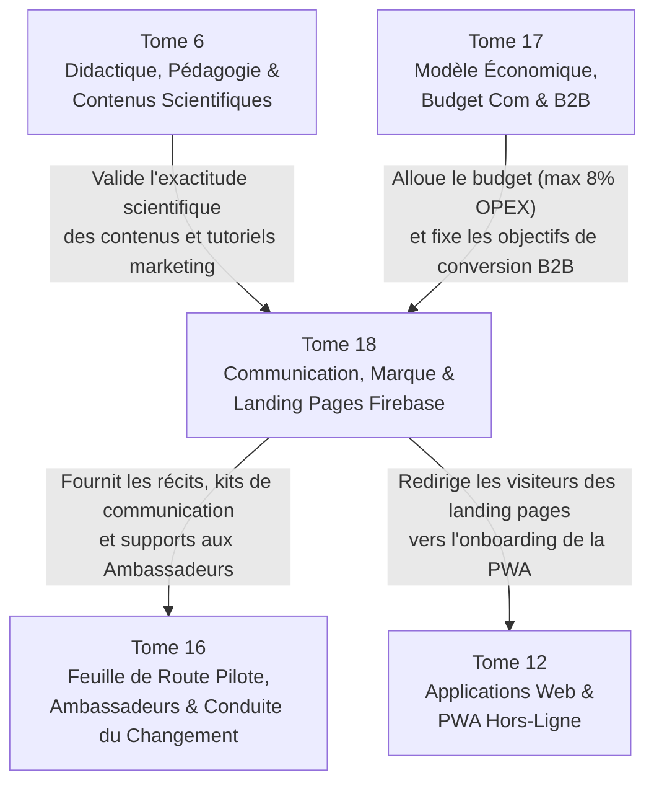

# Module 319 — Dépendances du Tome 18 avec les Tomes 16, 6 et 17

> **Positionnement :** Tome 18 — Communication et Marketing
> Module 11 sur 11 | Référence : ELLYSIUM-T18-M319
> **Autorité :** Direction Générale ELLYSIUM / Direction de la Communication
> **Liaison amont :** Module 318 — Mesure de l'efficacité : ROI, notoriété, NPS et budget marketing
> **Liaison aval :** Tome 19 — Juridique, Conformité et ASBL (M320)

---

## 1. Objet

Ce module de synthèse et de clôture scelle l'achèvement complet du **Tome 18** en remplissant une double mission stratégique :
1. **Établir la cartographie des interdépendances critiques** reliant la communication institutionnelle, la marque et l'écosystème de landing pages aux déploiements opérationnels de terrain (**Tome 16**), aux exigences de rigueur didactique (**Tome 6**), à la soutenabilité financière (**Tome 17**) et à l'architecture applicative PWA (**Tome 12**).
2. **Dresser le tableau récapitulatif solennel de complétude** des 11 modules constituant le Tome 18.

---

## 2. Matrice Synoptique des Dépendances Inter-Tomes

---

## 3. Analyse Détaillée des Interfaces Critiques

### 3.1 Dépendances avec le Tome 16 (Lancement et Pilotes)
- **Coordination avec le Réseau des Ambassadeurs (M285 / M316) :** Les Ambassadeurs de terrain constituent les relais physiques des campagnes de communication. Ils animent les Journées Portes Ouvertes (M315) et font remonter les histoires vécues alimentant le Journal d'ELLYSIUM (M314).
- **Communication de Crise et Signalement :** Toute crise de terrain (Module 289) est immédiatement répercutée vers la Cellule de Crise H24 du Tome 18 (Module 317).

### 3.2 Dépendances avec le Tome 17 (Modèle Économique et B2B)
- **Conversion vers les Licences SGS (M297 / M309) :** La landing page B2B dédiée (`ellysium.cd/ecoles`) est conçue pour convertir les chefs d'établissements solvables vers les licences du SGS, assurant l'autonomie financière d'ELLYSIUM.
- **Rappel Permanent de la Gratuité (M294 / M310) :** Toutes les campagnes respectent rigoureusement les Articles 3 et 5, rappelant la gratuité totale du socle éducatif pour les apprenants.

### 3.3 Dépendances avec le Tome 12 (Applications Numériques et PWA)
- **Continuité de l'Expérience Utilisateur :** Le design system Material You 3.0 des landing pages Firebase est strictement identique à l'interface de la PWA (Module 212) pour éviter toute rupture visuelle lors de l'onboarding.

---

## 4. Tableau Récapitulatif de Complétude — Tome 18

| N° | Titre du Module | Statut |
|---|---|---|
| 309 | Périmètre du Tome 18 – identité de marque et positionnement | ✅ COMPLET |
| 310 | Conformité avec la Constitution (transparence, éthique) | ✅ COMPLET |
| 311 | Plateforme de marque – storytelling, récit fondateur, architecture de marque | ✅ COMPLET |
| 312 | Stratégie de communication – apprenants, établissements, parents, enseignants, diaspora | ✅ COMPLET |
| 313 | Présence sur les réseaux sociaux et relations presse | ✅ COMPLET |
| 314 | Marketing de contenu – blogs, vidéos, témoignages, success stories | ✅ COMPLET |
| 315 | Organisation d'événements – webinaires, salons éducatifs, portes ouvertes | ✅ COMPLET |
| 316 | Plan de communication de la phase pilote (articulation avec Tome 16) | ✅ COMPLET |
| 317 | Gestion de la réputation en ligne et communication de crise | ✅ COMPLET |
| 318 | Mesure de l'efficacité – ROI, notoriété, NPS, budget marketing | ✅ COMPLET |
| 319 | Dépendances – avec les Tomes 16, 6, 17 | ✅ COMPLET |

---

## 5. Prochaine Étape : Franchissement vers le Tome 19

Le Tome 18 étant intégralement achevé (11 modules sur 11), le grand œuvre documentaire aborde son **ultime tome fondateur** :

> **TOME 19 — JURIDIQUE, CONFORMITÉ ET ASBL**
> Modules 320 à 336 (17 modules)
> Objectif : Sécuriser juridiquement l'ensemble de l'édifice ELLYSIUM sous le statut d'ASBL d'utilité publique en RDC, encadrer la protection des données personnelles (Loi n° 15/023 et RGPD), verrouiller la propriété intellectuelle OER, définir les CGU/CGS et établir la pérennité légale de l'institution.

---

## 6. Verrous Fonctionnels

| ID | Règle | Niveau |
|---|---|---|
| VF-319-01 | Toute action de communication doit impérativement respecter les interfaces définies avec les Tomes 6, 12, 16 et 17 | CRITIQUE |
| VF-319-02 | Aucun message marketing ne peut promettre une fonctionnalité non encore validée et déployée dans la PWA (Tome 12) | CRITIQUE |
| VF-319-03 | L'articulation entre communication et gestion des incidents terrain est auditée lors de chaque fin de phase pilote | OBLIGATOIRE |
| VF-319-04 | L'ensemble des spécifications du Tome 18 est scellé avec contrôle d'intégrité cryptographique sous Google Cloud Storage | OBLIGATOIRE |
| VF-319-05 | Ce module constitue la référence pour toute évaluation de l'alignement éthique de la marque ELLYSIUM | OBLIGATOIRE |
| VF-319-06 | Toute communication institutionnelle porte un identifiant de source vérifiable | OBLIGATOIRE |

---

*Tome 18 — Communication et Marketing — COMPLET ✅ (11 modules, M309–M319)*

*Sous-tome rédigé conformément aux Normes documentaires ELLYSIUM — Fondations 04.*
