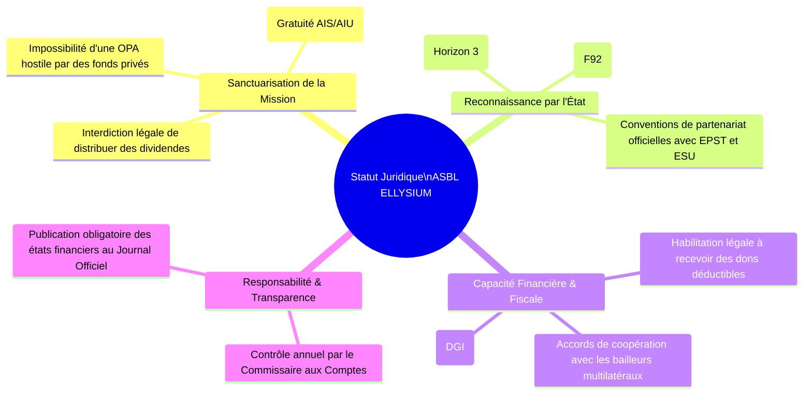
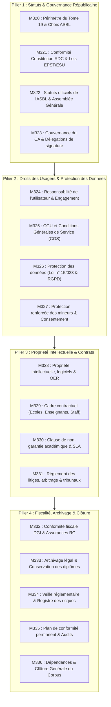

# Module 320 — Périmètre du Tome 19 : statut juridique de l'ASBL et armature légale

> **Positionnement :** Tome 19 — Juridique, Conformité et ASBL
> Module 1 sur 17 | Référence : ELLYSIUM-T19-M320
> **Autorité :** Direction Juridique / Conseil d'Administration
> **Liaison amont :** Tome 18 complet (M309–M319)
> **Liaison aval :** Module 321 — Conformité avec la Constitution de la RDC et lois sectorielles

---

## 1. Objet

Une œuvre intellectuelle et technique de dimension nationale ne peut traverser les décennies si ses fondations juridiques sont vulnérables aux aléas politiques, aux appétits financiers ou aux litiges contractuels. L'institution ELLYSIUM doit être dotée d'un **statut juridique inattaquable en droit congolais et en droit international**, sanctuarisant sa vocation de service public éducatif et son principe de désintéressement matériel absolu.

Ce module d'ouverture délimite le périmètre d'action du **Tome 19**, justifie le choix statutaire fondamental de l'**Association Sans But Lucratif (ASBL d'utilité publique régie par la Loi n° 004/2001)** et structure l'ensemble des 17 modules constituant le bouclier juridique, réglementaire et contractuel d'ELLYSIUM.

---

## 2. Le Choix Doctrinal : L'ASBL d'Utilité Publique

ELLYSIUM a expressément écarté la forme de société commerciale lucrative (SARL ou SA) au profit de l'ASBL :

---

## 3. Périmètre et Architecture des 17 Modules du Tome 19

Le Tome 19 couvre l'intégralité du spectre juridique à travers 4 piliers majeurs :

---

## 4. Cadre Légal National et International de Référence

L'architecture légale d'ELLYSIUM s'articule autour des textes de référence suivants :
1. **Loi n° 004/2001 du 20 juillet 2001 :** Dispositions générales applicables aux ASBL et établissements d'utilité publique en RDC.
2. **Constitution de la RDC du 18 février 2006 (modifiée) :** Articles 43 (Droit à l'éducation) et 44 (Éradication de l'analphabétisme).
3. **Loi-Cadre n° 14/004 du 11 février 2014 :** Organisation de l'Enseignement National (EPST et ESU).
4. **Loi n° 20/017 du 25 novembre 2020 :** Réglementation des Télécommunications et des Technologies de l'Information et de la Communication (TIC) en RDC.
5. **Règlement Général sur la Protection des Données (RGPD) :** Standard d'or appliqué par équivalence pour les flux de données et la diaspora.

---

## 5. Verrous Fonctionnels

| ID | Règle | Niveau |
|---|---|---|
| VF-320-01 | L'institution ELLYSIUM est constituée exclusivement sous le statut d'ASBL d'utilité publique régie par la Loi n° 004/2001 | CRITIQUE |
| VF-320-02 | Les statuts de l'ASBL doivent sanctuariser l'interdiction de distribution de bénéfices et la gratuité pour les apprenants vulnérables | CRITIQUE |
| VF-320-03 | Toute modification des statuts fondamentaux exige un vote à la majorité qualifiée des 3/4 de l'Assemblée Générale Extraordinaire | CRITIQUE |
| VF-320-04 | Le siège social statutaire et le domicile juridique d'ELLYSIUM sont établis à Kinshasa, République Démocratique du Congo | CRITIQUE |
| VF-320-05 | L'ensemble des conventions judiciaires et arrêtés d'agrément est numérisé et conservé de manière inaltérable sous Cloud Storage | OBLIGATOIRE |

---

*Sous-tome rédigé conformément aux Normes documentaires ELLYSIUM — Fondations 04.*
