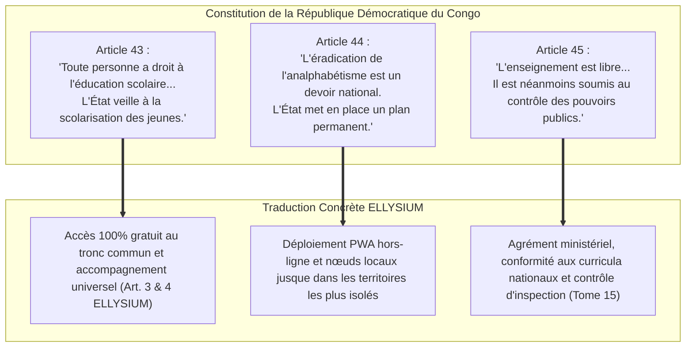
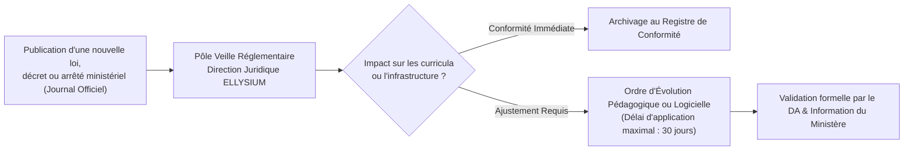

# Module 321 — Conformité avec la Constitution de la RDC et les lois sectorielles (EPST, ESU)

> **Positionnement :** Tome 19 — Juridique, Conformité et ASBL
> Module 2 sur 17 | Référence : ELLYSIUM-T19-M321
> **Autorité :** Direction des Affaires Juridiques / Comité de Conformité
> **Liaison amont :** Module 320 — Périmètre du Tome 19 : statut juridique de l'ASBL
> **Liaison aval :** Module 322 — Statuts officiels de l'ASBL : membres fondateurs et AG

---

## 1. Objet

L'action d'ELLYSIUM s'inscrit au cœur de la souveraineté républicaine de la République Démocratique du Congo. Loin de constituer une initiative isolée ou concurrente des pouvoirs publics, ELLYSIUM se conçoit comme le bras technologique et civique de l'État pour concrétiser les promesses d'émancipation inscrites dans la **Constitution de la RDC du 18 février 2006 (Articles 43 et 44)**.

Ce module détaille l'ancrage constitutionnel d'ELLYSIUM dans l'ordre juridique congolais, démontre son alignement méthodique sur la **Loi-Cadre de l'Enseignement National n° 14/004** et formalise les procédures de conformité réglementaire continue vis-à-vis des ministères de tutelle (EPST et ESU).

---

## 2. Harmonisation avec la Constitution de la RDC

La mission d'ELLYSIUM est l'application directe des droits fondamentaux consacrés par le constituant congolais :



---

## 3. Conformité aux Lois Sectorielles EPST et ESU

### 3.1 Alignement sur la Loi-Cadre n° 14/004 du 11 février 2014

| Article de la Loi-Cadre | Exigence Légale Nationale | Solution & Conformité ELLYSIUM |
|---|---|---|
| **Article 17 & 18** | Obligation de suivre les programmes nationaux homologués | Les modules de cours du secondaire sont strictement calqués sur les référentiels officiels EPST (Module 265) |
| **Article 82** | Reconnaissance de l'enseignement à distance et des technologies éducatives | ELLYSIUM dépose formellement son dossier sous le régime d'opérateur numérique d'enseignement à distance |
| **Article 94** | Modalités de sanction des études et délivrance des diplômes d'État | Les examens finaux préparent directement à l'EXETAT sans délivrance de faux titres concurrents |
| **Article 112** | Respect des conditions d'hygiène, sécurité et déontologie éducative | Les établissements partenaires labellisés sont audités in situ chaque année (Module 275) |

### 3.2 Intégration de la Réforme LMD (Licence - Master - Doctorat) pour l'ESU

Pour ses filières supérieures (notamment la filière Informatique, Module 283) :
- Structuration des unités d'enseignement (UE) en semestres et crédits capitalisables et transférables (ECTS/CAMES).
- Volume horaire conforme : 1 crédit = 25 heures de travail global étudiant (cours, TP sur GCP, travail personnel).
- Contrôle continu formatif et examen terminal surveillé en présentiel agréé.

---

## 4. Protocole de Veille et Contrôle de Légalité Républicaine



---

## 5. Schéma SQL — Registre de Conformité aux Textes Légaux RDC

```sql
-- Cloud SQL PostgreSQL 16
CREATE TABLE schema_juridique.registre_conformite_lois_rdc (
    id UUID PRIMARY KEY DEFAULT gen_random_uuid(),
    reference_texte VARCHAR(100) NOT NULL, -- Ex: 'Loi-Cadre n° 14/004', 'Arrêté Ministériel ESU n° 042/2023'
    titre_loi TEXT NOT NULL,
    ministere_emetteur VARCHAR(100) NOT NULL CHECK (ministere_emetteur IN ('EPST', 'ESU', 'JUSTICE', 'NUMERIQUE', 'FINANCES')),
    date_promulgation DATE NOT NULL,
    date_publication_jo DATE,
    articles_impactants TEXT[] NOT NULL,
    mesures_conformite_prises TEXT NOT NULL,
    statut_conformite VARCHAR(30) DEFAULT 'CONFORME' CHECK (statut_conformite IN ('CONFORME', 'EN_MISE_EN_CONFORMITE', 'AUDIT_EN_COURS')),
    directeur_juridique_signataire VARCHAR(150) NOT NULL,
    texte_integral_gcs_hash VARCHAR(255) NOT NULL,
    created_at TIMESTAMPTZ DEFAULT NOW(),
    updated_at TIMESTAMPTZ DEFAULT NOW()
);

CREATE INDEX idx_loi_ministere ON schema_juridique.registre_conformite_lois_rdc(ministere_emetteur);
CREATE INDEX idx_loi_statut ON schema_juridique.registre_conformite_lois_rdc(statut_conformite);
```

---

## 6. Verrous Fonctionnels

| ID | Règle | Niveau |
|---|---|---|
| VF-321-01 | Les programmes secondaires d'ELLYSIUM doivent respecter à 100 % les référentiels officiels de l'EPST | CRITIQUE |
| VF-321-02 | Tout nouvel arrêté ministériel touchant l'enseignement doit être intégré dans les référentiels sous 30 jours | CRITIQUE |
| VF-321-03 | Les filières supérieures doivent respecter l'architecture LMD et le système de crédits reconnu par l'ESU et le CAMES | CRITIQUE |
| VF-321-04 | Il est formellement interdit de délivrer des titres présentés faussement comme des diplômes d'État sans convention d'homologation | CRITIQUE |
| VF-321-05 | Le registre de conformité légale fait l'objet d'un audit juridique annuel certifié par un avocat au barreau de Kinshasa | OBLIGATOIRE |
| VF-321-06 | Tout document juridique est indexé par un UUID et horodaté par Google Cloud Logging | CONSTITUTIONNEL |

---

*Sous-tome rédigé conformément aux Normes documentaires ELLYSIUM — Fondations 04.*
