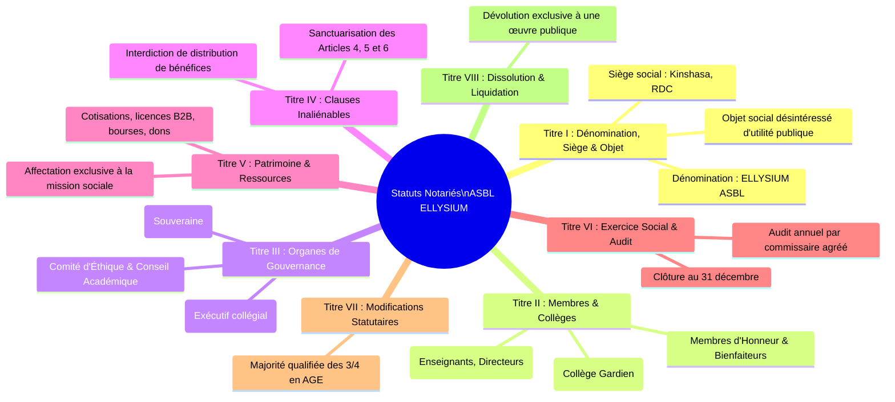
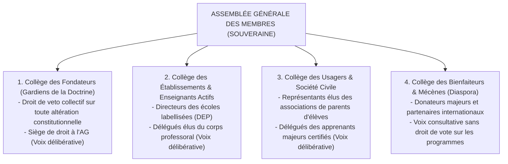

# Module 322 — Statuts officiels de l'ASBL : membres fondateurs, adhésions et assemblée générale

> **Positionnement :** Tome 19 — Juridique, Conformité et ASBL
> Module 3 sur 17 | Référence : ELLYSIUM-T19-M322
> **Autorité :** Direction Juridique / Assemblée Générale des Fondateurs
> **Liaison amont :** Module 321 — Conformité avec la Constitution de la RDC et lois sectorielles
> **Liaison aval :** Module 323 — Gouvernance juridique : conseil d'administration et signatures

---

## 1. Objet

L'armature statutaire d'ELLYSIUM est déposée et enregistrée auprès du Ministère de la Justice de la République Démocratique du Congo conformément à la **Loi n° 004/2001 du 20 juillet 2001**. Pour empêcher que l'institution ne soit un jour dévoyée, privatisée ou détournée de sa mission républicaine par des majorités opportunistes, ses statuts intègrent un dispositif constitutionnel d'auto-défense verrouillant à perpétuité les principes d'accès gratuit et de dignité éducative.

Ce module détaille la structure des **statuts officiels de l'ASBL ELLYSIUM**, définit les collèges de membres, encadre les prérogatives souveraines de l'**Assemblée Générale (AG)** et scelle les clauses statutaires réputées inaliénables.

---

## 2. Structure Canonique des Statuts Notariés de l'ASBL

Les statuts officiels déposés au greffe se composent de 8 titres fondamentaux :



---

## 3. Typologie des Membres et Droits de Vote à l'Assemblée Générale

L'Assemblée Générale préserve un équilibre représentatif entre les fondateurs, le terrain scolaire et la société civile :



---

## 4. Quorums, Majorités et Clauses Statutaires Perpétuelles

| Type de Délibération | Quorum Requis | Majorité Exigée | Dérogation Possible ? |
|---|---|---|---|
| **Assemblée Générale Ordinaire (AGO)** | 50 % + 1 des membres inscrits | Majorité simple (50 % + 1 des votants) | Non |
| **Élection des Membres du CA** | 50 % + 1 des membres inscrits | Majorité absolue au 1er tour, relative au 2nd | Non |
| **Modification des Statuts Ordinaires (AGE)** | 2/3 des membres votants | Majorité qualifiée des 3/4 | Non |
| **Tentative de Révision des Clauses Inaliénables** | - | **INTERDICTION FORMELLE (IRRECEVABLE)** | **VETO ABSOLU FONDATRICES** |

> **La Clause d'Inaliénabilité Perpétuelle (Article 42 des Statuts) :** *« Aucune Assemblée Générale, même unanime, ne peut abroger, suspendre ou modifier les principes de gratuité du tronc commun pour les apprenants vulnérables (Art. 4), d'étanchéité caisse/pédagogie (Art. 5) et de primauté humaine sur les algorithmes (Art. 6). Toute résolution contraire est nulle de plein droit. »*

---

## 5. Dévolution des Biens en Cas de Dissolution

En cas de dissolution anticipée votée par l'Assemblée Générale Extraordinaire :
- **Interdiction de Partage :** Aucun actif mobilier, immobilier ou intellectuel ne peut être réparti entre les membres de l'ASBL.
- **Dévolution d'Utilité Publique :** L'intégralité du patrimoine, des serveurs, des bases de données et des codes sources est obligatoirement dévolue au **Ministère en charge de l'Éducation Nationale (EPST/ESU)** pour être maintenue sous licence libre et publique au profit des enfants congolais.

---

## 6. Schéma SQL — Registre Notarié des Membres et Délibérations

```sql
-- Cloud SQL PostgreSQL 16 (Schéma juridique)
CREATE TABLE schema_juridique.membres_asbl (
    id UUID PRIMARY KEY DEFAULT gen_random_uuid(),
    matricule_membre VARCHAR(30) UNIQUE NOT NULL, -- Ex: 'MBR-FOND-001', 'MBR-ACTIF-2026-089'
    college VARCHAR(40) NOT NULL CHECK (college IN ('FONDATEURS', 'ACTIFS_ENSEIGNANTS', 'ACTIFS_ETABLISSEMENTS', 'SOCIETE_CIVILE_PARENTS', 'BIENFAITEURS')),
    nom_complet VARCHAR(150) NOT NULL,
    qualite_titre VARCHAR(100) NOT NULL,
    date_adhesion DATE NOT NULL,
    statut_adhesion VARCHAR(20) DEFAULT 'ACTIF' CHECK (statut_adhesion IN ('ACTIF', 'SUSPENDU', 'DEMISSIONNAIRE', 'RADIE')),
    droit_vote BOOLEAN NOT NULL DEFAULT TRUE,
    signature_adhesion_hash_gcs VARCHAR(255) NOT NULL,
    created_at TIMESTAMPTZ DEFAULT NOW()
);

CREATE TABLE schema_juridique.assemblees_generales_pv (
    id UUID PRIMARY KEY DEFAULT gen_random_uuid(),
    type_ag VARCHAR(20) NOT NULL CHECK (type_ag IN ('ORDINAIRE_ANNUELLE', 'EXTRAORDINAIRE')),
    date_tenue DATE NOT NULL,
    quorum_atteint_pct NUMERIC(5,2) NOT NULL,
    total_votants INTEGER NOT NULL,
    synthese_resolutions TEXT NOT NULL,
    rapport_commissaire_approuve BOOLEAN NOT NULL DEFAULT TRUE,
    pv_notarie_gcs_hash VARCHAR(255) NOT NULL,
    numero_depot_greffe VARCHAR(100) NOT NULL,
    created_at TIMESTAMPTZ DEFAULT NOW()
);
```

---

## 7. Verrous Fonctionnels

| ID | Règle | Niveau |
|---|---|---|
| VF-322-01 | Les statuts de l'ASBL ELLYSIUM sont enregistrés auprès du Ministère de la Justice avec récépissé officiel F92 | CRITIQUE |
| VF-322-02 | La clause d'inaliénabilité sanctuarisant les Articles 4, 5 et 6 est juridiquement irrévocable par l'Assemblée Générale | CRITIQUE |
| VF-322-03 | En cas de dissolution, l'intégralité des biens et actifs numériques est obligatoirement dévolue à l'Enseignement Public national | CRITIQUE |
| VF-322-04 | Aucun membre bienfaiteur ou donateur privé ne peut détenir une majorité de voix délibératives à l'Assemblée Générale | CRITIQUE |
| VF-322-05 | Les procès-verbaux de chaque AG sont déposés au greffe du Tribunal de Grande Instance de Kinshasa sous 30 jours | OBLIGATOIRE |
| VF-322-06 | Tout document juridique est indexé par un UUID et horodaté par Google Cloud Logging | CONSTITUTIONNEL |

---

*Sous-tome rédigé conformément aux Normes documentaires ELLYSIUM — Fondations 04.*
